# Documentação IoTDoc - Módulo 4 - Inteli

## BIOT Solutions

#### Eduardo Simonis Seabra Martins Ferrari, Henrique Ottoboni Magalhães, João Paulo Santos, Kaylane de Cássia Vasconcelos de Brito, Marcelo Miguel Pereira de Assis, Moyses Birman Anijar e Victor Gabriel Marques

## Sumário

[1. Introdução](#c1)

[2. Metodologia](#c2)

[3. Desenvolvimento e Resultados](#c3)

[4. Possibilidades de Descarte](#c4)

[5. Conclusões e Recomendações](#c5)

[6. Referências](#c6)

 

# 1. Introdução

&nbsp;&nbsp;&nbsp;&nbsp;A Atvos é uma empresa proeminente no agronegócio brasileiro, com forte atuação na produção e comercialização de etanol, açúcar VHP e energia elétrica originados da cana-de-açúcar e sua biomassa [2]. Com sede no Brasil, a empresa se destaca não apenas por sua magnitude operacional, mas também por sua postura inovadora e comprometimento com práticas sustentáveis. Desde sua fundação em 2007, a Atvos consolidou-se como a segunda maior produtora de etanol do país, fortalecendo sua presença e reputação no mercado nacional. A empresa possui uma capacidade impressionante de abastecimento, ilustrada pela sua habilidade de fornecer etanol para 60 milhões de carros compactos, produzir açúcar suficiente para adoçar inúmeras festas e gerar energia elétrica para milhões de pessoas.

&nbsp;&nbsp;&nbsp;&nbsp;Diante deste cenário de produção em larga escala, a Atvos enfrenta desafios significativos na gestão e rastreabilidade de seus insumos, peças e equipamentos rodantes. Estes desafios englobam desde a falta de um controle rigoroso de estoque em trânsito entre o almoxarifado e o campo, até a necessidade de garantir que peças trocadas sejam efetivamente retornadas ao almoxarifado. Além disso, a empresa busca mecanismos eficientes para prevenir possíveis desvios ou roubos de peças e insumos, garantindo assim a integridade e eficácia de suas operações.

&nbsp;&nbsp;&nbsp;&nbsp;Frente a essas dificuldades, o grupo BIOT Solutions visa colaborar com a resolução desses problemas através da construção de um modelo de IoT, capaz de rastrear a localização e o status dos equipamentos rodantes, peças e insumos selecionados, além da interação com uma plataforma web de gerenciamento dessas informações. Tal sistema pode entregar diversos benefícios para a Atvos, como a visualização de informações relevantes de monitoramento e rastreio dos equipamentos, o aumento do controle dos operadores sobre as máquinas e os diversos itens armazenados no almoxarifado e a minimização do prejuízo causado por perdas, roubos e danos.

## 1.1 Objetivos

&nbsp;&nbsp;&nbsp;&nbsp;Dados os problemas enfrentados pela Atvos, é possível segmentar os objetivos do projeto em duas partes: o objetivo geral, que traz de maneira ampla a solução e o resultado final pretendido pelo grupo, e os objetivos específicos, que detalham as metas a serem alcançadas para atingir o objetivo geral. Nesse viés, as subseções seguintes tratam dessa segmentação dos objetivos do projeto.

### 1.1.1 Objetivo Geral

&nbsp;&nbsp;&nbsp;&nbsp;O objetivo geral do projeto é desenvolver uma solução de monitoramento e rastreabilidade de peças e insumos, que permita a visualização de informações relevantes para os operadores, aumentando o controle sobre os equipamentos e minimizando o prejuízo causado por perdas, roubos e danos.

### 1.1.2 Objetivos Específicos

1. Desenvolver dispositivo IoT para rastreio de peças, coleta de dados e envio de alertas;
2. Desenvolver uma plataforma web para o controle dos dispositivos rastreados, de modo a receber,
armazenar e processar os dados coletados;
3. Integrar a plataforma com a solução IoT e realizar deploy na nuvem.

## 1.2 Proposta da solução

&nbsp;&nbsp;&nbsp;&nbsp;Para atender às metas estabelecidas pela Atvos, propomos a implementação da solução. Esta solução busca revolucionar a forma como a Atvos gerencia seus insumos e equipamentos, incorporando tecnologia IoT para proporcionar um monitoramento em tempo real ao longo de todo o ciclo operacional. Uma plataforma em nuvem, parte integrante desta solução, será desenvolvida para processar, armazenar e disponibilizar as informações coletadas de maneira intuitiva para os gestores. Com a capacidade de enviar alertas instantâneos e notificações, a solução identificará rapidamente qualquer atividade incomum ou desvio, garantindo a segurança dos ativos e a continuidade das operações, tudo por um preço acessível que possibilitará uma redução expressiva do prejuízo da empresa. Ao mesmo tempo, as análises e insights gerados pela solução permitirão a otimização de rotas, ações de manutenção preventiva e uma gestão de estoques mais ágil e precisa, cumprindo assim todos os objetivos traçados pela Atvos.

## 1.3 Justificativa

&nbsp;&nbsp;&nbsp;&nbsp;No cenário atual do agronegócio, a otimização e eficiência dos processos são essenciais para garantir a competitividade e sustentabilidade das operações. Destarte, uma notícia publicada pelo Estadão (2023) [1], em complemento ao evento Summit Agro, destaca que, cada vez mais, a tecnologia está sendo usada para a inovação no agronegócio brasileiro, por meio de soluções com Ciência de dados, Inteligência Artificial (IA) e Internet das Coisas (IoT).

&nbsp;&nbsp;&nbsp;&nbsp;Nesse sentido, a empresa Atvos, enquanto uma das principais produtoras de etanol do Brasil, a qual possui uma vasta operação que envolve a gestão de inúmeros equipamentos rodantes, peças e insumos distribuídos em uma área significativa, busca se aprofundar no uso da tecnologia em suas operações.

&nbsp;&nbsp;&nbsp;&nbsp;Sendo assim, foram identificados três desafios primordiais: a falta de controle no transporte de peças entre o almoxarifado e as áreas de campo, a inexistência de um sistema que assegure o retorno das peças trocadas ao almoxarifado e, crucialmente, o desvio e roubo de peças e insumos. Essas lacunas nos processos não apenas representam um risco financeiro direto, devido à perda e ao desvio de ativos, mas também podem comprometer a eficiência operacional, resultando em atrasos e custos adicionais.

&nbsp;&nbsp;&nbsp;&nbsp;Por conseguinte, a implementação de um sistema de monitoramento baseado em IoT é, portanto, uma resposta estratégica a esses desafios. Ao introduzir esse sistema, a Atvos não apenas abordará os problemas identificados, mas também se posicionará na vanguarda da inovação tecnológica no setor agrícola. A capacidade de rastrear e monitorar equipamentos e insumos em tempo real oferecerá uma visibilidade sem precedentes sobre as operações, permitindo uma tomada de decisão mais informada e ágil.

&nbsp;&nbsp;&nbsp;&nbsp;Além dos benefícios diretos em termos de gestão de ativos, a solução proposta também proporcionará uma série de benefícios secundários. A redução de desvios e roubos não apenas economizará custos, mas também fortalecerá a reputação da empresa como uma entidade que leva a sério a segurança e a integridade de seus ativos e operações. A capacidade de tomar decisões baseadas em dados, graças ao rico histórico e às análises fornecidas pela plataforma, permitirá uma operação mais enxuta e eficiente, levando a economias substanciais a longo prazo.

&nbsp;&nbsp;&nbsp;&nbsp;Em resumo, a justificativa para a implementação deste projeto é clara. Diante dos desafios operacionais enfrentados e do potencial de melhorias significativas em eficiência, segurança e tomada de decisão, investir em uma solução baseada em IoT é não apenas desejável, mas essencial para garantir a prosperidade contínua da Atvos no cenário competitivo do agronegócio brasileiro.

# 2. Metodologia

&nbsp;&nbsp;&nbsp;&nbsp;A metodologia utilizada no projeto foi a RM-ODP (Reference Model of Open Distributed Processing), sendo um padrão para coordenar e projetar sistemas distribuídos, ou seja, um conjunto de computadores interconectados que trabalham juntos para realizar uma tarefa comum, trabalhando como se fossem um único sistema. Essa metodologia é fundamental para apoiar a distribuição, interação, independência tanto de plataforma quanto de tecnologia, portabilidade e também fornece uma estrutura de arquitetura empresarial para a especificação de sistemas distribuídos. Os sistemas distribuídos, devido à sua complexidade e variedade de componentes, podem ser mais eficientemente entendidos e projetados ao serem analisados através de diferentes pontos de vista. Cada ponto de vista foca em um aspecto específico do sistema, permitindo uma análise mais detalhada e especializada [8]. O processo de análise descrito é iterativo, sendo repetido em momentos diferentes conforme o desenvolvimento do projeto, buscando o refinamento de cada uma das visões. As 5 visões arquiteturais da metodologia RM-ODP são:

- **Visão de negócios**

&nbsp;&nbsp;&nbsp;&nbsp;A visão voltada a negócios tem como principal objetivo analisar todas as questões que influenciam no êxito financeiro do projeto. Essa análise tem como foco a identificação dos problemas que o sistema irá resolver e a definição de objetivos claros medidos por métricas como desempenho do sistema, custos dentro do orçamento e eficiência operacional da equipe, por exemplo. 

&nbsp;&nbsp;&nbsp;&nbsp;A análise também envolve avaliar o impacto do sistema nos processos de negócios existentes e seus potenciais benefícios, reconhecer os stakeholders e suas necessidades específicas relacionadas ao sistema e justificar o projeto ao destacar seu valor e a relação entre os custos e os benefícios esperados.

&nbsp;&nbsp;&nbsp;&nbsp;Em suma, todas essas atividades são direcionadas para planejar gestão empresarial do projeto, tendo como foco alcançar o sucesso do seu desenvolvimento e da sua aplicação na prática. Além da questão operacional, o cálculo do orçamento e a projeção dos lucros ou diminuição de prejuízos é fundamental para avaliar se o projeto é financeiramente viável ou não.

- **Requisitos funcionais:**

&nbsp;&nbsp;&nbsp;&nbsp;Segundo o artigo de Fernando Cunha em "Requisitos funcionais e não funcionais: o que são?", no site "Mestres da Web", Requisitos funcionais referem-se às funcionalidades específicas que um modelo IoT deve disponibilizar para abordar as necessidades e desafios dos usuários por meio de funções ou serviços dedicados. Esses requisitos não apenas delineiam as ações e operações que o sistema precisa executar, mas também desempenham um papel crucial no direcionamento do desenvolvimento, assegurando que os dispositivos integrados satisfaçam plenamente as expectativas dos stakeholders. Essenciais para alinhar o projeto às demandas do usuário e garantir a eficácia do sistema, esses requisitos funcionais desempenham um papel fundamental na criação de soluções IoT robustas e centradas nas necessidades do usuário. 

&nbsp;&nbsp;&nbsp;&nbsp;São exemplos de requisitos funcionais: inserir dados em um formulário; consultar o status de um pedido; realizar compras; comunicar-se com um atendente; alterar informações de um registro; elaborar relatórios, entre outros.

&nbsp;&nbsp;&nbsp;&nbsp;Portanto, os requisitos funcionais desempenham um papel indispensável na elaboração de um projeto, pois elucidam minuciosamente as características de um sistema com o propósito de atender às expectativas do consumidor.

- **Requisitos não funcionais:**

&nbsp;&nbsp;&nbsp;&nbsp;Requisitos não funcionais referem-se a critérios que não estão diretamente relacionados às funcionalidades específicas do sistema, mas como o software tornará realidade os requisitos funcionais. Eles definem qualidades, características e restrições do sistema, influenciando sua arquitetura, design e implementação. Estes requisitos, então, são cruciais para avaliar o sucesso global de um sistema, pois não apenas consideram o que sistema faz, mas também como ele realiza essas funções em uma variedade de condições e cenários. Além disso, são vitais para garantir que um sistema atenda não apenas aos requisitos específicos de funcionalidade, mas também às expectativas e padrões de desempenho mais amplos.

&nbsp;&nbsp;&nbsp;&nbsp;São exemplos de requisitos: tipo de sistema operacional, hardware a ser utilizado, processamento, consumo de memória, conexão, banco de dados, tipos de dispositivos em que o software pode ser usado, entre outros.

&nbsp;&nbsp;&nbsp;&nbsp;Assim, atender a esses requisitos, por exemplo, são fundamentais para alcançar níveis adequados de desempenho, segurança, usabilidade e outros aspectos importantes para os usuários e para o ambiente operacional em que o sistema será implantado.

- **Arquitetura**

&nbsp;&nbsp;&nbsp;&nbsp;A arquitetura é um dos cinco pontos de vista que compõem o modelo RM-ODP. Abrange a descrição de como os elementos do sistema distribuído estão organizados e interagem entre si. Além disso, fornece um modelo abstrato para entender a estrutura e o comportamento do sistema distribuído.

&nbsp;&nbsp;&nbsp;&nbsp;O Ponto de Vista de Arquitetura é dividido em quatro perspectivas principais: perspectiva de informação, detalhando como a informação é representada, incluindo formatos de dados e esquemas; perspectiva de computação, descrevendo como os componentes de software, como módulos, processos e suas interações e como esses componentes se comportam e colaboram para realizar as funções do sistema. Além disso, a perspectiva de engenharia, informando os componentes e relações de hardware e software do sistema. Por fim, a perspectiva de interação humana, descrevendo como os usuários interagem com o sistema, além de detalhar aspectos como interfaces de usuário, tarefas e comportamento humano.

&nbsp;&nbsp;&nbsp;&nbsp;Portanto, a arquitetura é de extrema importância visto que permite aos integrantes do projeto compreenderem como os diferentes elementos do sistema se relacionam e trabalham juntos para alcançar os objetivos do sistema. A arquitetura facilita a comunicação e análise na construção durante o processo de desenvolvimento.

- **Tecnologia**

&nbsp;&nbsp;&nbsp;&nbsp;A definição e especificação das tecnologias utilizadas no sistema é um fator importantíssimo no seu planejamento. Diferentes tecnologias servem para diferentes propósitos, ou seja, dependendo do projeto, serão necessários diferentes tipos de linguagens de programação, bancos de dados, frameworks e sistemas operacionais, por exemplo. A seleção de quais ferramentas serão utilizadas é feita conforme as necessidades de performance, escalabilidade e integração com o sistema, tudo isso levando em consideração o orçamento disponível. 

&nbsp;&nbsp;&nbsp;&nbsp;A segurança do sistema é um fator extremamente necessário para que haja confiabilidade no seu uso. A adoção de medidas de segurança robustas, como criptografia e autenticação diminuem drasticamente o risco de acessos por pessoas não autorizadas ou vazamentos de dados. Além das medidas de proteção, é crucial que o sistema esteja em conformidade com normas e regulamentações governamentais específicas, a LGPD (Lei Geral de Proteção de Dados) no Brasil [3], por exemplo. 

&nbsp;&nbsp;&nbsp;&nbsp;Estas regulamentações estabelecem diretrizes sobre como os dados pessoais devem ser coletados, processados e armazenados, garantindo a privacidade e os direitos dos indivíduos que possuem suas informações registradas no banco de dados. A conformidade com essas normas é essencial para evitar violações legais e preservar a confiança dos usuários no sistema.

&nbsp;&nbsp;&nbsp;&nbsp;Portanto, é essencial projetar cautelosamente todas as tecnologias que serão utilizadas no sistema, bem como os custos de desenvolvimento e manutenção. Dessa forma, é possível garantir que todas as necessidades de escalabilidade, desempenho e segurança sejam atendidas, além de evitar com que seja necessário realizar mudanças futuras no sistema, o que causaria mais atrasos e custos no desenvolvimento.

# 3. Desenvolvimento e Resultados 

## 3.1. Domínio de Fundamentos de Negócio

### 3.1.1. Contexto da Indústria

&nbsp;&nbsp;&nbsp;&nbsp;A Atvos, fundada em 2007, é uma empresa de grande relevância no cenário do agronegócio brasileiro, atuando de forma expressiva na produção e comercialização de etanol, açúcar VHP e energia elétrica - todos derivados da cana-de-açúcar e sua biomassa. Com presença nas regiões de São Paulo, Mato Grosso e Mato Grosso do Sul, a empresa se destaca não apenas por seu tamanho, mas também por seu compromisso notável com práticas sustentáveis e capacidade inovadora.

&nbsp;&nbsp;&nbsp;&nbsp;A Atvos consolidou sua posição como a segunda maior produtora de etanol no Brasil, evidenciando sua impressionante capacidade de abastecimento. Essa capacidade se manifesta na sua habilidade de fornecer etanol para uma frota de 60 milhões de veículos de passeio, produzir açúcar em quantidades suficientes para adoçar diversas comemorações e gerar energia elétrica para atender às necessidades de eletricidade de milhões de pessoas. É uma corporação com nove unidades agroindustriais e tem capacidade de moer 36 milhões de toneladas de cana-de-açúcar. Outro ponto é que, ao produzir etanol e energia a partir da biomassa de cana-de-açúcar, a Atvos contribui com a agenda climática global, pois o uso de seus produtos em substituição aos combustíveis fósseis evita emissões de gases do efeito estufa. A empresa tem o potencial para emitir mais de 2 milhões de créditos de descarbonização por safra.

&nbsp;&nbsp;&nbsp;&nbsp;Sendo assim, em meio a um cenário competitivo e com grandes corporações no mercado, como a Raízen, São Martinho e uisa, a Atvos se destaca por seu firme compromisso com a sustentabilidade e sua busca incessante por práticas ambientalmente responsáveis em todas as suas operações, contribuindo ativamente para a redução da pegada de carbono e o uso eficiente dos recursos naturais.

#### 3.1.1.1. 5 Forças de Porter

&nbsp;&nbsp;&nbsp;&nbsp;Define-se 5 Forças de Porter uma ferramenta de análise setorial que permite ter uma visão ampla da competitividade da empresa e compreender o ambiente em que está inserida. Esta ferramenta apresenta os concorrentes, fornecedores, compradores, novos entrantes e produtos substitutos; e como todos estes se relacionam e como influenciam o sucesso do negócio [4]. Assim, entender a competitividade do mercado é essencial para definir as melhores estratégias de marketing. Neste tópico, apresentaremos a análise e aplicação desse conceito no projeto desenvolvido pela BIOT Solutions.

Figura 1: 5 Forças de Porter

Fonte: Material produzido pelos autores (2023)

- Concorrentes:

&nbsp;&nbsp;&nbsp;&nbsp;De início, destaca-se os concorrentes analisados, os quais mostram a intensidade da competição entre as empresas já estabelecidas em uma indústria. Em relação à empresa Atvos, citamos como principais concorrentes: Raízen, São Martinho e uisa.

&nbsp;&nbsp;&nbsp;&nbsp;A Raízen é uma empresa brasileira cujo nome remete à "raiz e energia". Além do Brasil, também atua na Argentina e no Paraguai. A companhia, então, produz e vende energia renovável e açúcar a partir da cana-de-açúcar, tendo uma forte atuação em Mobilidade. Está presente ao longo de todo território brasileiro e argentino distribuindo combustíveis e levando energia por meio dos Postos Shell. Tratando-se de números, a Raízen produz cerca de 2,5 bilhões de litros de etanol por ano, além de produzir esse biocombustível em escala comercial a partir do reaproveitamento de subprodutos do processo produtivo. O etanol é utilizado nos combustíveis, na indústria farmacêutica e química, nos cosméticos, nas bebidas alcoólicas e na exportação.

&nbsp;&nbsp;&nbsp;&nbsp;Já a São Martinho, iniciada no final do século XIX, produz açúcar, etanol e energia elétrica a partir da cana-de-açúcar. Com quatro usinas e mais de 350 mil hectares para colheita, a São Martinho processa em média 22,6 milhões de toneladas de cana-de-açúcar e mais de 1 bilhão de litros de etanol por ano. Sendo assim, mais uma grande concorrente da Atvos.

&nbsp;&nbsp;&nbsp;&nbsp;A uisa, inicialmente chamada de Usina Itamarati, atua fortemente nas regiões Centro-Oeste e Norte do Brasil e possui cerca de 90 mil hectares de terras, além de ter um modelo de negócio que permite a transformação da cana-de-açúcar em biocombustíveis, energia limpa, saneantes, alimentos, fertilizantes orgânicos e ingredientes para nutrição e saúde e animal. Com quatro centros de distribuição e capacidade de processamento de 6,3 milhões de toneladas de cana-de-açúcar, a uisa também é uma grande concorrente da Atvos.

&nbsp;&nbsp;&nbsp;&nbsp;Em síntese, ao analisar os principais concorrentes da Atvos, destacamos a intensidade da competição nesse segmento da indústria sucroenergética. A Raízen, com sua atuação multifacetada e presença internacional, a São Martinho, com suas extensas operações e capacidade de processamento considerável, e a uisa, com sua abordagem diversificada de negócios, todos se posicionam como competidores formidáveis. Essas empresas estabelecidas representam desafios notáveis para a Atvos, à medida que a organização busca consolidar sua posição no mercado competitivo.

- Fornecedores:

&nbsp;&nbsp;&nbsp;&nbsp;Os fornecedores referem-se à influência e ao controle que os fornecedores têm sobre as empresas que compram seus produtos ou serviços. Segundo o site da Atvos, no relatório anual da safra 2021/2022, houve o Programa Parceiros Mais fortes, reforçando o relacionamento e diálogo com produtores e arrendatários de terra; também houve a compra de cana-de-açúcar de 42 fornecedores, que entregaram 10 milhões de toneladas nesta safra e, 100% deles passaram por homologação documental e assinaram o Compromisso com a Sustentabilidade na Cadeia de Cana-de-Açúcar. Por fim, tiveram 2456 fornecedores de materiais e serviços, totalizando a movimentação de R$ 2,3 bilhões.

&nbsp;&nbsp;&nbsp;&nbsp;Em resumo, a análise das fontes de suprimento da Atvos revela a importância estratégica dessas relações na cadeia de abastecimento da empresa. O Programa Parceiros Mais Fortes e os compromissos com a sustentabilidade demonstram o esforço contínuo da Atvos em fortalecer laços com seus parceiros. Além disso, a extensa rede de 2.456 prestadores de materiais e serviços desempenha um papel vital no suporte das operações da Atvos, evidenciando a influência significativa que esses atores exercem sobre a empresa. Portanto, o gerenciamento eficaz dos relacionamentos com essas fontes de suprimento é essencial para a estratégia e sucesso contínuo da Atvos na indústria sucroenergética.

- Compradores:

&nbsp;&nbsp;&nbsp;&nbsp;Os compradores referem-se à influência e ao controle que os compradores têm sobre as empresas que vendem produtos ou serviços. Novamente no relatório anual da safra 2021/2022, destaca-se a receita líquida obtida de R$ 6,87 bilhões, um EBITDA ajustado de R$ 2,2 bilhões e também uma geração de caixa de R$ 1,34 bilhão. Com isso, relaciona-se com os compradores, os quais são: para o etanol, os compradores são as distribuidoras de combustíveis brasileiras que, por sua vez, fornecem etanol aos postos. Para o açúcar VHP, os clientes são tradings que vendem o açúcar para refinarias, que por sua vez processam o produto com destino ao mercado internacional. Já a energia elétrica, além de parte da energia produzida abastecer as unidades da empresa, o excedente é exportado ao Sistema Interligado Nacional (SIN) para atender a contratos firmados no Ambiente de Comercialização Regulado (ACR) e no Ambiente de Comercialização Livre (ACL). Nisso, contribui na garantia de segurança energética do país.

&nbsp;&nbsp;&nbsp;&nbsp;Em síntese, a análise dos compradores na cadeia de valor da Atvos destaca a relevância crítica dessas relações para o desempenho financeiro e estratégico da empresa. Os resultados sólidos apresentados no relatório anual da safra 2021/2022 ressaltam a influência significativa dos compradores nas operações da empresa, especialmente no que se refere à distribuição do etanol, ao mercado internacional do açúcar VHP e à exportação de energia elétrica. A gestão eficaz dessas relações com os compradores não apenas é essencial para os resultados da Atvos, mas também desempenha um papel importante na contribuição para a segurança energética do país. Dessa forma, a empresa deve continuar aprimorando suas estratégias de relacionamento com os compradores para sustentar seu sucesso na indústria sucroenergética.

- Novos entrantes:

&nbsp;&nbsp;&nbsp;&nbsp;Também conhecido como "ameaça de novos entrantes", refere-se à probabilidade de que novas empresas entrem no mercado existente, competindo com as empresas já estabelecidas. Em relação ao setor de atuação da Atvos, destaca-se como novos entrantes a empresa GranBio, no qual apresenta como uma de suas tecnologias a AVAP+, sendo o principal pré-tratamento de biomassa para nanocelulose tipo Cristal. A cana-de-açúcar é coletada e, após uma série de procedimentos, é transformada em bioquímicos, em combustível sustentável de aviação e também o etanol 2G. A empresa foi fundada em 2011. Outra empresa recente no mercado é a BP Bunge Bioenergia. Criada no final de 2019, a empresa atua no processo produtivo e venda de bioenergia e açúcar a partir da cana-de-açúcar e está presente em cinco estados. Considerando, assim, uma ameaça para a Atvos nascida há poucos anos.

&nbsp;&nbsp;&nbsp;&nbsp;Em suma, a análise da ameaça de novos entrantes no setor de atuação da Atvos destaca a presença de empresas recentes, como a GranBio e a BP Bunge Bioenergia. Essas organizações, embora ainda relativamente jovens no mercado, apresentam tecnologias e operações que podem representar uma ameaça para a Atvos. A GranBio, com sua abordagem inovadora para a produção de bioquímicos e combustíveis sustentáveis a partir da cana-de-açúcar, e a BP Bunge Bioenergia, com sua expansão geográfica significativa, demonstram um potencial concorrencial que a Atvos deve levar em consideração. Portanto, a empresa deve permanecer vigilante e adaptável em face dessas novas entradas no mercado para garantir sua posição competitiva contínua.

- Produtos substitutos:

&nbsp;&nbsp;&nbsp;&nbsp;Os produtos substitutos referem-se à probabilidade de que os produtos de outras empresas ou setores possam substituir os produtos ou serviços da empresa em questão. Como a Atvos produz açúcar, etanol e energia elétrica a partir da biomassa da cana-de-açúcar, pode-se citar como produtos substitutos em relação a açúcar os diferentes tipos de adoçantes, como açúcar proveniente da beterraba, adoçantes artificiais, xarope de milho, entre outros. Já em relação ao etanol, pode-se citar a gasolina e demais combustíveis fósseis, biodiesel e também o surgimento de veículos elétricos, que não requerem combustíveis líquidos. Para a energia elétrica, destaca-se a geração a partir de outras fontes renováveis, como energia solar, eólica e hidrelétrica, além de também promover a energia elétrica provenientes de fontes não renováveis.

&nbsp;&nbsp;&nbsp;&nbsp;Por fim, a análise das ameaças de produtos substitutos no setor de atuação da Atvos destaca a variedade de alternativas disponíveis para os produtos da empresa. No que diz respeito ao açúcar, a concorrência surge não apenas dos diferentes tipos de adoçantes, mas também de fontes de produção alternativas, como o açúcar de beterraba e adoçantes artificiais. Quanto ao etanol, a ameaça provém de combustíveis fósseis como a gasolina, biodiesel e até a crescente popularidade de veículos elétricos. Além disso, a energia elétrica produzida a partir de fontes renováveis, como energia solar e eólica, bem como fontes não renováveis, também representa uma concorrência potencial. A Atvos deve continuar a inovar e adaptar suas estratégias para enfrentar a concorrência de produtos substitutos, mantendo sua posição competitiva no mercado de açúcar, etanol e energia elétrica.

### 3.1.2. Análise SWOT

&nbsp;&nbsp;&nbsp;&nbsp;A priori, é válido ressaltar que a matriz SWOT trata-se de uma ferramenta gerencial de análise estratégica, a qual é capaz de explorar os potenciais, tanto internos quanto externos, da empresa ou organização analisada. Posto isso, essa matriz é composta de 4 principais conceitos, os quais estão representados em cada letra da palavra SWOT, sendo eles: Forças (Strengths), Fraquezas (Weaknesses), Oportunidades (Opportunities) e Ameaças (Threats) [11]. Dessa forma, a figura a seguir (figura 2) expõe a análise do cenário externo e interno da organização parceira deste projeto (a Atvos).  

Figura 2 - Matriz SWOT da Atvos
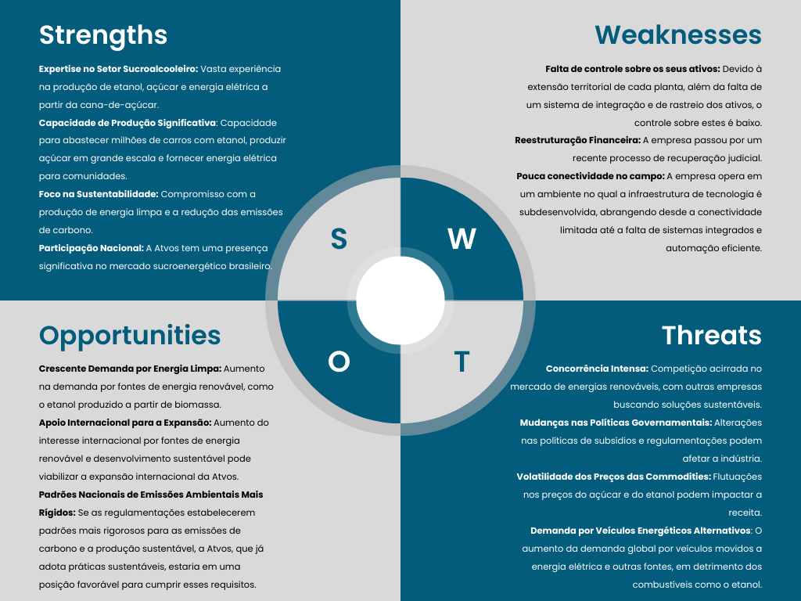
Fonte: Material produzido pelos autores (2023)

&nbsp;&nbsp;&nbsp;&nbsp;A seguir, são justificados cada um dos quatro pontos elucidados na figura acima, de modo a aprofundar a análise da parceira deste projeto. 

#### Forças

* **Expertise no Setor Sucroalcooleiro**: Vasta experiência na produção de etanol, açúcar e energia elétrica a partir da cana-de-açúcar. Destarte, a Atvos se destaca por sua ampla experiência e conhecimento no desenvolvimento sustentável desses produtos.

* **Capacidade de Produção Significativa**: A Atvos destaca-se por sua notável capacidade de produção de etanol, um biocombustível altamente demandado em todo o mundo. Sua produção em larga escala possibilita o abastecimento de milhões de carros, contribuindo para a redução das emissões de gases do efeito estufa e atendendo à crescente demanda por fontes de energia mais limpas. Além disso, a produção em grande volume permite à empresa ser um importante fornecedor de etanol para mercados nacionais e internacionais. A Atvos não se limita apenas à produção de etanol, mas também é uma produtora de açúcar em grande escala. Seu alcance abrange a fabricação de açúcar branco e refinado, atendendo a uma variedade de indústrias, incluindo alimentos, bebidas e farmacêutica. A capacidade de produção de açúcar em grande volume coloca a Atvos em uma posição sólida no mercado global de commodities, onde a demanda por produtos açucareiros continua a crescer.

* **Foco na Sustentabilidade**: A Atvos demonstra um compromisso sólido com a sustentabilidade, destacando-se na produção de energia limpa e na redução das emissões de carbono. Isso se reflete em suas práticas de produção e operações, que buscam constantemente minimizar o impacto ambiental. A empresa investe em tecnologias de ponta, como a geração de energia a partir da biomassa, que não apenas atendem às crescentes demandas por fontes de energia mais limpas, mas também alinham a Atvos com regulamentações ambientais rigorosas. Esse foco na sustentabilidade não apenas fortalece sua posição no mercado de energias renováveis, como também a coloca na vanguarda da responsabilidade ambiental e na mitigação das mudanças climáticas.

* **Participação Nacional**: A Atvos mantém uma presença robusta no mercado sucroenergético brasileiro, desempenhando um papel fundamental na indústria nacional. Sua participação abrangente e influente nesse setor é evidenciada pela capacidade de abastecer o mercado interno com etanol, açúcar e energia elétrica em grande escala. 

#### Fraquezas

* **Falta de controle sobre os seus ativos**: Devido à extensão territorial de cada planta, além da falta de um sistema de integração e de rastreio dos ativos, o controle sobre estes é baixo - o que, inclusive, fundamenta esse projeto.

* **Reestruturação Financeira**: A empresa passou por um recente processo de recuperação judicial, resultando na venda de dívidas e na concessão de um grande número de ações para a Soneva Energias Renováveis.

* **Pouca conectividade no campo**: A empresa opera em um ambiente no qual a infraestrutura de tecnologia é subdesenvolvida, abrangendo desde a conectividade limitada até a falta de sistemas integrados e automação eficiente.

#### Oportunidades

* **Crescente Demanda por Energia Limpa**: Aumento na demanda por fontes de energia renovável, como o etanol produzido a partir de biomassa.

* **Apoio Internacional para a Expansão**: Aumento do interesse internacional por fontes de energia renovável e desenvolvimento sustentável pode viabilizar a expansão internacional da Atvos.

* **Padrões Nacionais de Emissões Ambientais Mais Rígidos**: Caso as regulamentações governamentais  estabelecerem padrões mais rigorosos para as emissões de carbono e a produção sustentável, a Atvos, que já adota práticas sustentáveis, estaria em uma posição favorável para cumprir esses requisitos, se destacando no mercado pelo seu renome e experiência na área de produção de biocombustíveis.

#### Ameaças

* **Concorrência Intensa**: A indústria de energias renováveis enfrenta uma concorrência acirrada, com várias empresas buscando soluções sustentáveis. A competição por participação de mercado e inovações constantes representa uma ameaça para a Atvos.

* **Mudanças nas Políticas Governamentais**: Alterações nas políticas de subsídios e regulamentações governamentais podem ter um impacto significativo na indústria de energias renováveis. A adaptação às mudanças regulatórias e a incerteza associada podem representar desafios.

* **Volatilidade dos Preços das Commodities**: A Atvos está suscetível às flutuações nos preços do açúcar e do etanol, que podem impactar sua receita. A volatilidade dos mercados de commodities é uma ameaça financeira que requer estratégias de gerenciamento de risco.

* **Demanda por Veículos Energéticos Alternativos**: O aumento da demanda global por veículos movidos a energia elétrica e outras fontes alternativas, em detrimento dos biocombustíveis tradicionais, como o etanol, representa uma ameaça significativa. Isso pode reduzir a demanda por produtos da Atvos e exigir adaptações estratégicas.

### 3.1.3. Descrição da Solução a ser Desenvolvida

#### 3.1.3.1 Qual é o problema a ser resolvido

&nbsp;&nbsp;&nbsp;&nbsp;A Atvos apresenta como problema a falta de controle e monitoramento sobre os equipamentos rodantes, peças e insumos, os quais são distribuídos em uma área significativa e não possuem nenhuma forma de supervisão. Sem esse rastreamento, roubos e perdas acontecem sem que possam ser tomadas as devidas providências.

* **Falta de Supervisão Adequada**: Essa ausência de supervisão adequada levanta várias preocupações. Primeiro, a Atvos não tem uma maneira eficaz de rastrear o movimento desses ativos, o que torna difícil determinar sua localização exata em um determinado momento. Isso resulta em desafios significativos relacionados ao controle de estoque e à rastreabilidade dos ativos, bem como à prevenção de desvios e roubos.

* **Desafios com Desvios e Roubos**: Além disso, a falta de controle sobre os equipamentos, peças e insumos cria um ambiente propício para desvios e roubos. Sem um sistema de monitoramento adequado, é difícil identificar e responder prontamente a atividades incomuns, como movimentações não autorizadas de peças ou insumos. Isso afeta a eficiência operacional e pode resultar em perdas financeiras substanciais.

* **Necessidade de Tomada de Decisões Informadas**: A ausência de dados precisos e em tempo real também limita a capacidade da empresa de tomar decisões informadas. Com informações detalhadas sobre a localização e o status dos ativos, os operadores teriam a capacidade de otimizar rotas, implementar manutenção preventiva e gerenciar estoques de forma mais eficaz. Portanto, a resolução desse problema é crucial para aprimorar a eficiência operacional e a tomada de decisões estratégicas na Atvos.

#### 3.1.3.2 Qual a solução proposta (visão de negócios)

&nbsp;&nbsp;&nbsp;&nbsp;A solução proposta pela BIOT Solutions é o desenvolvimento de um sistem IoT que permita com que os operadores da Atvos realizem o monitoramento de maneira rápida, simples e eficiente, acessando as informações do estado atual dos equipamentos através de uma plataforma cloud integrada ao sistema IoT. Nesse sentido, é possível citar as seguintes características da solução:

* **Plataforma IoT na Nuvem**: A peça central dessa solução é uma plataforma em nuvem que servirá como o epicentro das operações de monitoramento. Essa plataforma permitirá que os operadores de almoxarifado e de tecnologia acessem dados precisos sobre a localização e o status dos ativos, tornando a supervisão mais eficiente.

* **Facilidade de Acesso e Monitoramento**: Com a solução IoT, os operadores da Atvos poderão acessar informações cruciais de maneira rápida e descomplicada. Eles terão visibilidade completa das operações, podendo verificar o estado dos equipamentos e tomar decisões informadas com base em dados em tempo real.

* **Maior Controle e Eficiência**: Além disso, a solução proporcionará um maior controle sobre o estoque, facilitando o acompanhamento das peças e insumos. A rastreabilidade melhorada também ajudará a prevenir desvios e roubos, otimizando a eficiência operacional.

* **Histórico e Análise de Dados**: A plataforma em nuvem não apenas fornecerá dados em tempo real, mas também permitirá a análise de dados históricos. Isso possibilitará a identificação de padrões de uso, otimização de rotas e sugestões de gerenciamento de estoque. A inteligência automatizada é um componente adicional desejável que pode ser explorado no futuro.

#### 3.1.3.3 Como a solução proposta deverá ser utilizada

&nbsp;&nbsp;&nbsp;&nbsp;A solução deverá ser utilizada pelos operadores da Atvos responsáveis pelos itens do almoxarifado, os quais deverão acoplar o dispositivo IoT nos equipamentos rodantes, peças e insumos. Após isso, os operadores deverão utilizar a plataforma web para monitorar a localização e o status dos itens rastreados. Portanto, as principais formas de utilização são:

* **Acoplamento de Dispositivos IoT**: Para iniciar o processo de monitoramento, os operadores serão responsáveis por acoplar dispositivos IoT aos equipamentos rodantes, peças e insumos que precisam ser rastreados. Esses dispositivos serão equipados com tags de rastreamento baseadas em RFID ou QR codes, permitindo que sejam identificados e rastreados de maneira única e precisa.

* **Monitoramento Através da Plataforma Web**: Após a instalação dos dispositivos IoT, os operadores do almoxarifado e da equipe de monitoramento terão acesso a uma plataforma web dedicada. Nessa plataforma, eles poderão acompanhar em tempo real a localização e o status dos itens rastreados. Isso fornecerá uma visão abrangente das operações, permitindo que os operadores tomem decisões informadas e ajam prontamente em caso de eventos incomuns.

#### 3.1.3.4 Quais os benefícios trazidos pela solução proposta

&nbsp;&nbsp;&nbsp;&nbsp;A solução trará como benefícios a visualização de informações relevantes de monitoramento e rastreio dos equipamentos, o aumento do controle dos operadores sobre as máquinas e os diversos itens armazenados no almoxarifado, a minimização do prejuízo causado por perdas, roubos e danos e o aumento da eficácia operacional como um todo. Destarte, a seguir, tais benefícios estão melhor detalhados.

* **Visualização de Informações Relevantes**: A solução permitirá que os operadores acessem informações relevantes de monitoramento e rastreamento de equipamentos em tempo real. Isso significa que terão uma visão completa das operações, facilitando a tomada de decisões informadas e a supervisão eficaz.

* **Controle Ampliado dos Operadores**: Os operadores terão um maior controle sobre as máquinas e os diversos itens armazenados no almoxarifado. Isso se traduz em uma gestão mais eficiente de recursos, otimização de rotas e manutenção preventiva, contribuindo para a eficácia das operações.

* **Minimização de Perdas, Roubos e Danos**: A solução abordará diretamente o problema de perdas, roubos e danos de ativos. A capacidade de rastrear cada item de forma precisa ajudará a prevenir desvios, reduzindo consideravelmente a incidência desses eventos indesejados.

* **Aumento da Eficácia Operacional**: Ao fornecer informações detalhadas sobre o estado e a localização dos ativos, a solução permitirá uma gestão mais eficaz dos recursos. Isso se traduz em otimização de rotas, manutenção programada e uma gestão mais eficiente dos estoques, contribuindo para a eficácia operacional global da Atvos.

* **Histórico para Tomada de Decisões Estratégicas**: Os dados históricos e as análises fornecidas pela plataforma de monitoramento serão uma fonte valiosa para a tomada de decisões estratégicas. Isso possibilitará a identificação de tendências, padrões de uso e áreas de melhoria.

#### 3.1.3.5 Qual será o critério de sucesso e qual medida será utilizada para o avaliar

&nbsp;&nbsp;&nbsp;&nbsp;Para avaliar o sucesso da solução, será calculada a redução do prejuízo causado por perdas, roubos e danos, o qual será avaliado através da comparação entre o prejuízo antes e depois da implementação da solução. Além da redução do prejuízo, o feedback dos usuários também será utilizado para avaliar o sucesso da solução, já que a facilidade do uso da plataforma e do sistema como um todo está diretamente ligada à eficiência operacional. Por fim, a análise de dados históricos e comparações com o desempenho anterior à implementação da solução também serão usadas como medida de sucesso. A capacidade de identificar tendências positivas e áreas de melhoria com base em dados anteriores é fundamental para avaliar o progresso alcançado.
	
### 3.1.4. Value Proposition Canvas

&nbsp;&nbsp;&nbsp;&nbsp;O Value Proposition Canvas (Canvas da Proposta de Valor) é uma ferramenta utilizada para ajudar empresas, organizações e até mesmo projetos como este da *BIOT Solutions* a criar uma proposta de valor convincente para seus clientes ou usuários finais. Consiste em um modelo visual que permite a identificação dos elementos fundamentais que compõem a proposta de valor, tais como os benefícios oferecidos ao cliente, as dores e necessidades do cliente, as soluções oferecidas, dentre outros fatores [7]. Por essa razão, para melhor apresentar a proposta de valor deste projeto, foi desenvolvido o canvas da proposta de valor da solução desenvolvida, o qual está evidenciado na figura a seguir (figura 3).

Figura 3 - Canvas da Proposta de Valor do Projeto
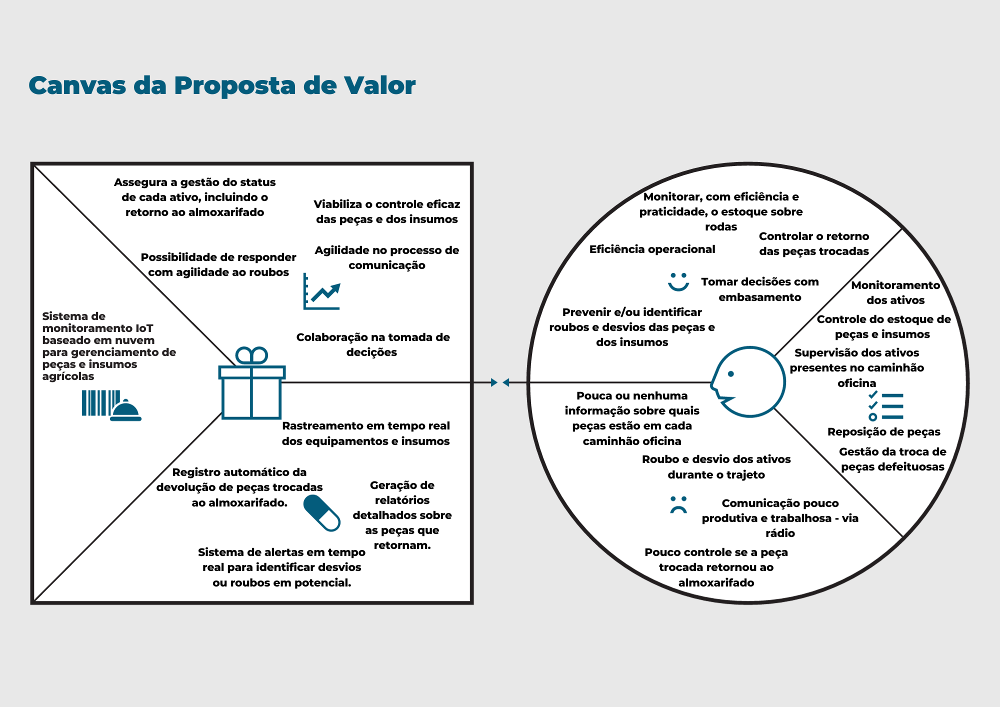
Fonte: Material produzido pelos autores (2023)

&nbsp;&nbsp;&nbsp;&nbsp;Nesse viés, as **tarefas dos usuários**, localizadas no centro direito da figura acima, representam as tarefas funcionais que os clientes estão tentando realizar, problemas que precisam solucionar ou tarefas que precisam completar. Tais tarefas são: Monitoramento dos ativos, Controle do estoque de peças e insumos, Supervisão dos ativos presentes no caminhão oficina, Reposição de peças e Gestão da troca de peças defeituosas.

&nbsp;&nbsp;&nbsp;&nbsp;Ademais, as **dores dos usuários** ocorrem aos usuários a partir da realização das tarefas supracitadas e, para este projeto, foram encontradas as seguintes dores (com base na documentação enviada pela Atvos): Pouca ou nenhuma informação sobre quais peças estão em cada caminhão oficina, Roubo e desvio dos ativos durante o trajeto, Comunicação pouco produtiva e trabalhosa - via rádio e Pouco controle se a peça trocada retornou ao almoxarifado. Sob essa perspectiva, essas dores são algumas das justificativas para a realização do projeto.

&nbsp;&nbsp;&nbsp;&nbsp;Para além, os **ganhos que o usuário espera** também foram informados no canvas supramencionado, os quais são: Monitorar, com eficiência e praticidade, o estoque sobre rodas, Eficiência operacional, Controlar o retorno das peças trocadas, Tomar decisões com embasamento e Prevenir e/ou identificar roubos e desvios das peças e dos insumos.

&nbsp;&nbsp;&nbsp;&nbsp;Além disso, no lado esquerdo do canvas há a parte relacionada à solução, de modo que os criadores de ganhos (como a solução gera os ganhos para o usuário), os aliviadores das dores dos usuários e os produtos/serviços oferecidos. Tais pontos estão detalhados nos parágrafos abaixo.

&nbsp;&nbsp;&nbsp;&nbsp;Dessa forma, foi pensado no **alívio das dores** com base nos seguintes pontos: Rastreamento em tempo real dos equipamentos e insumos, Registro automático da devolução de peças trocadas ao almoxarifado, Geração de relatórios detalhados sobre as peças que retornam e Sistema de alertas em tempo real para identificar desvios ou roubos em potencial. Com esses três princípios, o projeto visa amenizar ou colaborar para o alívio das dores citadas anteriormente.

&nbsp;&nbsp;&nbsp;&nbsp;Além do mais, os **criadores de ganho** demonstram como a solução promove ganhos (esperados ou não) pelos clientes. Sendo assim, os criadores de ganho desta solução são: Garantia da gestão do status de cada ativo, incluindo o retorno ao almoxarifado, Viabilização do controle eficaz das peças e dos insumos, Agilidade no processo de comunicação, Possibilidade de responder com agilidade ao roubos e Colaboração na tomada de decisões.

&nbsp;&nbsp;&nbsp;&nbsp;Por fim, os **produtos e serviços oferecidos** são: IoT e Software na nuvem. O IoT é o dispositivo que será acoplado ao caminhão oficina, o qual será responsável por coletar os dados dos ativos e enviá-los para o software. O software na nuvem é a plataforma que receberá os dados do IoT e os armazenará, além de disponibilizar relatórios e alertas para os usuários.

### 3.1.5. Matriz de Riscos

&nbsp;&nbsp;&nbsp;&nbsp;A priori, a matriz de risco visa identificar os principais riscos para este projeto, bem como os impactos desses riscos, de modo que tal ferramenta colabora com a prevenção e, em casos mais extremos, com o plano de ação para as ameaças encontradas. Outrossim, tal matriz também pode representar as oportunidades para o projeto, classificando-as por ordem de impacto e probabilidade, assim como os riscos são classificados.

&nbsp;&nbsp;&nbsp;&nbsp;Nesse sentido, para construir uma matriz de riscos é necessário listar todas as possíveis ameaças para o projeto, sem considerar, inicialmente, quais são os impactos e as probabilidades de ocorrência de cada um. Logo, os seguintes riscos foram elencados para este projeto:

1. Danificação do IoT ao manusear as peças e insumos que ele será acoplado. [IoT]
2. Equipe não segue o backlog. [equipe]
3. Falta de tempo para diminuir a latência de conexão entre o IoT e o Software na nuvem. [equipe]
4. Tarefas não realizadas por membros do grupo. [equipe]
5. Sistema de localização ineficiente. [IoT]
6. Alteração do hardware escolhido. [IoT]
7. Pode ser complexa a implementação inicial desse IoT no dia a dia dos operadores. [IoT]
8. O software utilizado pode apresentar bugs. [técnico]
9. Alguma peça do IoT estar quebrada. [IoT]
10. O projeto pode não ser viável financeiramente. [projeto]
11. Retirada de um membro do grupo. [equipe]
12. Mau uso do IoT pelos operadores. [IoT]
13. Solução não atende os requisitos/necessidades do projeto. [projeto]
14. Entregas fora dos prazos. [equipe]
15. Operadores não conseguem utilizar a solução. [projeto]

&nbsp;&nbsp;&nbsp;&nbsp;Dessa forma, com base nessa listagem dos riscos para o projeto, é possível estruturar a matriz de risco e o respectivo plano de ação para cada risco. Nesse viés, a figura abaixo (figura 4) ilustra tal ferramenta.

Figura 4 - Matriz de riscos do projeto
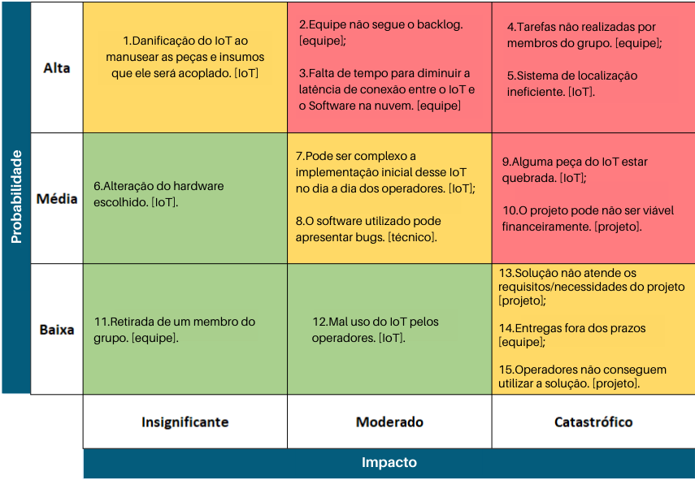
Fonte: Material produzido pelos autores (2023)

&nbsp;&nbsp;&nbsp;&nbsp;Por conseguinte, os riscos supracitados foram dispostos na matriz considerando a probabilidade de ocorrência, análise vertical, e o impacto caso ocorra, análise horizontal.

&nbsp;&nbsp;&nbsp;&nbsp;Nos tópicos a seguir há a descrição de cada risco.

* **Danificação do IoT ao manusear as peças e insumos que ele será acoplado [IoT]** — Esse risco se refere à possibilidade de danos ao dispositivo IoT durante o processo de montagem ou manuseio, o que pode afetar o desempenho geral do sistema.

* **Equipe não segue o backlog [equipe]** — Esse risco está relacionado à falta de aderência da equipe aos planos e prioridades estabelecidos no backlog, o que pode causar atrasos e falta de direção no desenvolvimento do projeto.

* **Falta de tempo para diminuir a latência de conexão entre o IoT e o Software na nuvem [equipe]** — Isso aponta para o risco de não haver tempo suficiente para otimizar a latência na comunicação entre o dispositivo IoT e o software na nuvem, o que pode prejudicar o desempenho.

* **Tarefas não realizadas por membros do grupo [equipe]** — Esse risco está relacionado à possibilidade de membros da equipe não completarem suas tarefas designadas, o que pode levar a atrasos no projeto.

* **Sistema de localização ineficiente [IoT]** — Esse risco indica que o sistema de localização no dispositivo IoT pode não funcionar como o esperado, o que pode afetar a precisão das informações coletadas.

* **Alteração do hardware escolhido [IoT]** — Esse risco se refere à possibilidade de ser necessário alterar o hardware escolhido para o projeto, o que pode causar atrasos e custos adicionais.

* **Pode ser complexa a implementação inicial desse IoT no dia a dia dos operadores [IoT]** — Isso indica que a integração inicial do IoT na rotina dos operadores pode ser complexa, resultando em resistência ou dificuldades na adoção.

* **O software utilizado pode apresentar bugs [técnico]** — Esse risco está relacionado à possibilidade de o software utilizado no projeto conter erros ou bugs, o que pode afetar a funcionalidade geral.

* **Alguma peça do IoT estar quebrada [IoT]** — Aponta para a possibilidade de peças individuais do dispositivo IoT chegarem com defeitos ou danificadas, o que pode impactar a montagem e o funcionamento.

* **O projeto pode não ser viável financeiramente [projeto]** — Esse risco se refere à possibilidade de o projeto não ser economicamente viável devido a custos inesperados ou aumento no orçamento.

* **Retirada de um membro do grupo [equipe]** — Isso indica o risco de perder um membro da equipe, o que pode causar lacunas de conhecimento e habilidades no projeto.

* **Mal uso do IoT pelos operadores [IoT]** — Esse risco aponta para a possibilidade de os operadores não usarem o dispositivo IoT corretamente, o que pode prejudicar os resultados e a eficácia do projeto.

* **Solução não atende os requisitos/necessidades do projeto [projeto]** — Esse risco sugere que a solução final pode não atender aos requisitos ou necessidades do projeto, resultando em um produto final inadequado.

* **Entregas fora dos prazos [equipe]** — Isso indica o risco da equipe não cumprir os prazos estabelecidos para as entregas do projeto, o que pode causar atrasos no cronograma.

* **Operadores não conseguem utilizar a solução [projeto]** — Esse risco se refere à possibilidade de os operadores não serem capazes de utilizar a solução final devido a complexidade ou falta de treinamento adequado.

&nbsp;&nbsp;&nbsp;&nbsp;Por fim, após listar os riscos e classificá-los consoante a probabilidade e o impacto, resta descrever o plano de ação para cada risco, isto é, como a equipe vai se comportar caso algum desses erros ocorra durante o desenvolvimento e implementação do projeto. Sendo assim, os planos de ação estão detalhados nos tópicos abaixo.

**Danificação do IoT ao manusear as peças e insumos que ele será acoplado [IoT]:**
* Plano de Ação: Implementar um treinamento para a equipe envolvida no manuseio do IoT, enfatizando as melhores práticas de montagem e manuseio. Além disso, manter um registro de controle de qualidade para detectar possíveis danos durante o processo.

**Equipe não segue o backlog [equipe]:**
* Plano de Ação: Realizar reuniões de acompanhamento regulares para garantir que a equipe compreenda as prioridades e os objetivos do backlog. Criar incentivos para aderência ao plano, como recompensas por metas cumpridas.

**Falta de tempo para diminuir a latência de conexão entre o IoT e o Software na nuvem [equipe]:**
* Plano de Ação: Revisar o cronograma do projeto para alocar tempo suficiente à otimização da latência. Priorizar o desenvolvimento dessa funcionalidade e, se necessário, adiar outros recursos menos críticos.

**Tarefas não realizadas por membros do grupo [equipe]:**
* Plano de Ação: Monitorar o progresso das tarefas regularmente e manter uma comunicação aberta para entender os motivos por trás de tarefas não realizadas. Reatribuir tarefas ou fornecer suporte adicional quando necessário.

**Sistema de localização ineficiente [IoT]:**
* Plano de Ação: Testar e calibrar o sistema de localização do IoT antes da implementação. Realizar testes piloto e coletar feedback dos usuários para melhorar a precisão.

**Alteração do hardware escolhido [IoT]:**
* Plano de Ação: Realizar uma análise detalhada das razões para a alteração do hardware e avaliar os impactos no cronograma e no orçamento. Se a alteração for necessária, atualizar o plano do projeto.

**Pode ser complexa a implementação inicial desse IoT no dia a dia dos operadores [IoT]:**
* Plano de Ação: Fornecer treinamento abrangente para os operadores e oferecer suporte técnico durante a fase inicial de implementação. Avaliar continuamente a adaptação dos operadores e ajustar o treinamento, conforme necessário.

**O software utilizado pode apresentar bugs [técnico]:**
* Plano de Ação: Realizar testes rigorosos do software, incluindo testes de regressão e testes de estresse. Manter um processo de controle de qualidade eficaz e criar um plano de contingência para correção rápida de bugs quando identificados.

**Alguma peça do IoT estar quebrada [IoT]:**
* Plano de Ação: Implementar verificações de qualidade rigorosas na recepção das peças e insumos. Manter um estoque de peças sobressalentes e fornecedores de backup para minimizar atrasos causados por peças defeituosas.

**O projeto pode não ser viável financeiramente [projeto]:**
* Plano de Ação: Realizar uma análise de custo-benefício detalhada e manter um controle rigoroso dos gastos do projeto. Se necessário, buscar fontes adicionais de financiamento ou ajustar o escopo do projeto.

**Retirada de um membro do grupo [equipe]:**
* Plano de Ação: Documentar todas as responsabilidades e tarefas de cada membro da equipe. Manter um plano de contingência que inclua a redistribuição de tarefas ou a contratação de substitutos qualificados.

**Mal uso do IoT pelos operadores [IoT]:**
* Plano de Ação: Fornecer treinamento detalhado e suporte contínuo aos operadores. Desenvolver manuais de uso claros e instruções passo a passo.

**Solução não atende os requisitos/necessidades do projeto [projeto]:**
* Plano de Ação: Realizar revisões regulares do projeto com os stakeholders para garantir que os requisitos estejam sendo atendidos. Se necessário, realizar ajustes no escopo e na funcionalidade da solução.

**Entregas fora dos prazos [equipe]:**
* Plano de Ação: Implementar uma gestão de projetos eficiente com prazos realistas. Monitorar o progresso regularmente e adotar medidas corretivas imediatas em caso de atrasos.

**Operadores não conseguem utilizar a solução [projeto]:**
* Plano de Ação: Fornecer treinamento adicional, criar guias de uso mais intuitivos e coletar feedback dos operadores para realizar melhorias na solução.

##### 3.1.5.1 Matriz de Oportunidades

&nbsp;&nbsp;&nbsp;&nbsp;Em paralelo à matriz de riscos, a matriz de oportunidades é uma ferramenta que visa identificar as principais oportunidades que podem impactar positivamente o projeto. Ela permite avaliar os potenciais benefícios que podem ser aproveitados, colaborando assim para a maximização dos resultados e o aprimoramento do planejamento. Assim como a matriz de riscos, essa ferramenta classifica as oportunidades por ordem de impacto e probabilidade, permitindo uma abordagem estruturada dessas.

&nbsp;&nbsp;&nbsp;&nbsp;Tal como na matriz de riscos, para construir uma matriz de oportunidades, é necessário listar todas as possíveis oportunidades relevantes para o projeto, sem considerar inicialmente os impactos e as probabilidades de ocorrência de cada uma. Nos tópicos abaixo, estão listadas algumas oportunidades identificadas para este projeto:

1. Feedbacks dos usuários, do parceiro e dos orientadores, após entrega do projeto. [projeto];
2. Parceiro disponibilizar novas informações que tonará nossa solução ainda mais impactante. [projeto];
3. Equipe aprender sobre IoT, Arduino, RFID, cloud e aprofundar seus conhecimentos em negócios e metodologia ágil. [equipe];
4. Possibilidade de estágio em outras empresas. [equipe];
5. Estreitar os laços entre a Atvos e o grupo juntamente com o Inteli. [equipe];
6. Oportunidades profissionais e networking para os envolvidos no projeto. [equipe];
7. Aporte financeiro da empresa parceira no projeto. [projeto];
8. Criação de novos IoT e soluções baseados no nosso. [equipe];
9. Lançamento de uma nova versão da solução com menos falhas e maior adaptabilidade dos usuários. [projeto];
10. Utilização do projeto por algum público não planejado. [projeto];

&nbsp;&nbsp;&nbsp;&nbsp;Sob essa perspectiva, é possível estruturar a matriz de oportunidade para cada um dos itens acima. Posto isso, a figura abaixo (figura 5) ilustra as oportunidades classificadas consoante o impacto e a probabilidade de ocorrência de cada uma.

Figura 5 - Matriz de oportunidades do projeto
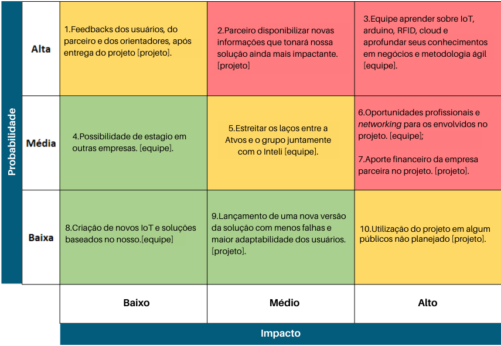
Fonte: Material produzido pelos autores (2023)

&nbsp;&nbsp;&nbsp;&nbsp;Dessa maneira, bem como na matriz de riscos, as probabilidades estão dispostas considerando a probabilidade de ocorrência (horizontal) e o impacto (vertical).

&nbsp;&nbsp;&nbsp;&nbsp;Nos tópicos a seguir há a descrição de cada oportunidade.

* **Feedbacks dos usuários, do parceiro e dos orientadores, após entrega do projeto [projeto]** — Essa oportunidade se refere há chance de receber feedback valioso de diversos stakeholders, incluindo usuários, parceiros e orientadores. Esses insights podem ser usados para aprimorar a solução e direcionar futuros desenvolvimentos.

* **Parceiro disponibilizar novas informações que tornarão nossa solução ainda mais impactante [projeto]** — Nessa oportunidade o parceiro pode fornecer informações adicionais ou recursos que podem aprimorar a solução, tornando-a mais eficaz e impactante. Essa colaboração pode levar a melhorias significativas.

* **Equipe aprender sobre IoT, Arduino, RFID, cloud e aprofundar seus conhecimentos em negócios e metodologia ágil [equipe]** — O projeto oferece à equipe a oportunidade de adquirir conhecimentos e experiência em tecnologias de ponta, bem como no desenvolvimento de negócios e metodologia ágil. Isso pode enriquecer as habilidades da equipe e seu valor no mercado.

* **Possibilidade de estágio em outras empresas [equipe]** — A equipe pode ter a oportunidade de realizar estágios em outras empresas como resultado do sucesso do projeto, o que pode proporcionar experiência adicional e crescimento profissional.

* **Estreitar os laços entre a Atvos e o grupo juntamente com o Inteli [equipe]** — O projeto pode fortalecer as relações entre a equipe, a Atvos e o grupo Inteli, criando mais oportunidades futuras de colaboração e parcerias.

* **Oportunidades profissionais e networking para os envolvidos no projeto [equipe]** — Os membros da equipe podem se beneficiar de oportunidades profissionais e de networking, à medida que se envolvem em um projeto de destaque que atrai a atenção de outros profissionais e empresas.

* **Aporte financeiro da empresa parceira no projeto [projeto]** — A empresa parceira pode contribuir financeiramente para o projeto, o que pode melhorar a sustentabilidade financeira do projeto e permitir expansões adicionais.

* **Criação de novos IoT e soluções baseados no nosso [equipe]** — O conhecimento e a experiência adquiridos durante o projeto podem servir como base para a criação de novos dispositivos IoT e soluções, expandindo o portfólio da equipe.

* **Lançamento de uma nova versão da solução com menos falhas e maior adaptabilidade dos usuários [projeto]** — A equipe pode usar as lições aprendidas e os feedbacks recebidos para lançar uma nova versão da solução que seja mais estável, com menos falhas e melhor adaptada às necessidades dos usuários.

* **Utilização do projeto em algum público não planejado [projeto]** — A solução pode ser adotada por públicos não inicialmente planejados, ampliando o alcance e o impacto do projeto, bem como as oportunidades de mercado.

### 3.1.6. Política de Privacidade de acordo com a LGPD

&nbsp;&nbsp;&nbsp;&nbsp;A priori, a presente Política e Privacidade, escrita de acordo com a LGPD (Lei Geral de Proteção de Dados) [3], elucida as formas de coleta, tratamento, utilização, acesso e compartilhamento de dados pessoais pela solução desenvolvida pelo grupo BIOT Solutions, do Instituto de Tecnologia e Liderança, em parceria com a empresa Atvos. O grupo é formado por universitários do 4º módulo de 2023 dos cursos de Sistemas de Informação, Engenharia de Software, Ciência da Computação e Engenharia da Computação.

#### 3.1.6.1 Definições

&nbsp;&nbsp;&nbsp;&nbsp;Para fins de melhor compreensão, a presente política adota as seguintes definições:

* **Banco de dados**: conjunto estruturado de dados pessoais, estabelecido em um ou em vários locais, em suporte eletrônico ou físico;
* **Consentimento**: manifestação livre, informada e inequívoca pela qual o titular concorda com o tratamento de seus dados pessoais para uma finalidade determinada;
* **Controlador**: pessoa natural ou jurídica, de direito público ou privado, a quem competem as decisões referentes ao tratamento de dados pessoais;
* **Dados pessoais**: qualquer informação relacionada a pessoa natural identificada ou identificável;
* **Dados pessoais sensíveis**: dado pessoal sobre origem racial ou étnica, convicção religiosa, opinião política, filiação a sindicato ou a organização de caráter religioso, filosófico ou político, dado referente à saúde ou à vida sexual, dado genético ou biométrico, quando vinculado a uma pessoa natural;
* **Encarregado De Proteção de Dados**: pessoa indicada pelo Controlador e Operador para atuar como canal de comunicação entre o Controlador, os Titulares de Dados e a Autoridade Nacional de Proteção de Dados (ANPD);
* **Eliminação**: exclusão de dado ou de conjunto de dados armazenados em banco de dados, independentemente do procedimento empregado;
* **LGPD**: legislação brasileira n.º 13.709/2018, comumente conhecida como Lei Geral de Proteção de Dados Pessoais, que regula as atividades de Tratamento de Dados Pessoais e que também altera os artigos 7º e 16 do Marco Civil da Internet.
* **Operador**: pessoa natural ou jurídica, de direito público ou privado, que realiza o tratamento de dados pessoais em nome do controlador;
* **Titular**: pessoa natural a quem se referem os dados pessoais que são objeto de tratamento;
* **Tratamento**: toda operação realizada com dados pessoais, como as que se referem a coleta, produção, recepção, classificação, utilização, acesso, reprodução, transmissão, distribuição, processamento, arquivamento, armazenamento, eliminação, avaliação ou controle da informação, modificação, comunicação, transferência, difusão ou extração;
* **Tratamento de Dados Pessoais**: qualquer atividade executada por um responsável pelo processamento dos dados;
* **Usuário**: pessoa física que utiliza o sistema web de gerenciamento.

#### 3.1.6.2 Informações gerais sobre a empresa / organização

&nbsp;&nbsp;&nbsp;&nbsp;No que diz respeito à *BIOT Solutions* - grupo responsável por este projeto -, há 7 integrantes: Eduardo Simonis Seabra Martins Ferrari, Henrique Ottoboni Magalhães, João Paulo Santos, Kaylane de Cássia Vasconcelos de Brito, Marcelo Miguel Pereira de Assis, Moyses Birman Anijar e Victor Gabriel Marques. Nesse sentido, a equipe, no momento da criação deste documento, está no segundo semestre da graduação em tecnologia no Inteli, especialmente no último módulo do primeiro ano, no qual o objetivo é construir uma solução que envolva *IoT* ("Internet das Coisas") para a localização de ativos, resolução de problemas de controle de estoque, devolução de peças e bens, e eventual prevenção de desvio/roubo.

&nbsp;&nbsp;&nbsp;&nbsp;Ademais, no que tange à empresa Atvos, parceira e cliente deste projeto, ela é responsável pela produção e comercialização de etanol, açúcar e energia elétrica a partir da cana-de-açúcar e de sua biomassa. Em suma, a colaboração entre a *BIOT* e a Atvos se fundamenta no objetivo de construir uma solução que possa localizar e rastrear os ativos da empresa. Tal colaboração envolve tanto a criação do modelo baseado em *IoT* quanto a criação de um sistema web de gerenciamento, o qual será responsável por receber e processar os dados coletados.

#### 3.1.6.3 Informações sobre o tratamento de dados

&nbsp;&nbsp;&nbsp;&nbsp;O tratamento dos dados para a solução final será necessário para ser possível a localização e rastreamento dos ativos da empresa Atvos. Os dados coletados serão referentes à localização dos ativos, como, por exemplo, a posição geográfica e informações sobre o estado dos equipamentos. Esses dados serão coletados por meio de sensores e dispositivos IoT instalados nos ativos da empresa. Os dados serão utilizados para gerar informações relevantes para a tomada de decisão da empresa, como, por exemplo, a otimização do uso dos equipamentos e a prevenção de falhas. Os dados coletados serão armazenados em servidores baseados em nuvem, preferencialmente em serviços AWS, os quais já fornecem uma política de segurança consolidada, seguindo as normas e regulamentações da LGPD [3]. O período de armazenamento dos dados será definido pela empresa Atvos, de acordo com as suas necessidades e obrigações legais. A solução desenvolvida pelo grupo *BIOT Solutions* seguirá as orientações da LGPD e adotará medidas de segurança adequadas para garantir a proteção dos dados dos usuários.

&nbsp;&nbsp;&nbsp;&nbsp;Ademais, o tratamento dos dados é requerido para possibilitar o cadastro dos responsáveis pelo uso do sistema web de gerenciamento, bem como para garantir a segurança e privacidade dos dados dos usuários. Para o cadastro, serão coletados dados pessoais dos responsáveis, como nome, e-mail e telefone, os quais serão armazenados em um banco de dados seguro e acessível apenas por usuários autorizados. Além disso, serão adotadas medidas de segurança para garantir a integridade e confidencialidade desses dados, como a criptografia de senhas e a autenticação de usuários. Já em relação aos dados disponibilizados para os usuários, apenas informações relevantes para o gerenciamento dos ativos serão compartilhadas, como a localização e o estado dos equipamentos.

#### 3.1.6.4 Quais são os dados coletados

&nbsp;&nbsp;&nbsp;&nbsp;Acerca dos dados coletados nesta solução, destacam-se informações sobre a localização dos ativos, como a posição geográfica e informações sobre o estado dos equipamentos. Tais dados, de acordo com a empresa, não são considerados sigilosos.

&nbsp;&nbsp;&nbsp;&nbsp;Destarte, o sistema web de gerenciamento carece de dados para a identificação dos usuários e, para isso, serão coletados: nome, email, telefone e outros dados para personalização: como área, foto de perfil e cargo.

#### 3.1.6.5 Onde os dados são coletados 

&nbsp;&nbsp;&nbsp;&nbsp;Os dados serão coletados por meio de sensores e dispositivos IoT instalados nos ativos da empresa Atvos. Esses dispositivos serão responsáveis por coletar informações sobre a localização e o estado dos equipamentos, as quais serão enviadas para o sistema web de gerenciamento. Além disso, os dados pessoais dos usuários serão coletados por meio do sistema web de gerenciamento, no momento do cadastro.

&nbsp;&nbsp;&nbsp;&nbsp;Já os dados relacionados ao cadastro dos usuários, tais como nome, email e dados afins, do sistema de gerenciamento, estes serão coletados via formulário de inscrição no sistema web, o qual estará rodando em um servidor baseado em nuvem. 

#### 3.1.6.6 Para quais finalidades os dados serão utilizadas

&nbsp;&nbsp;&nbsp;&nbsp;Os dados coletados serão utilizados para gerar informações relevantes para a tomada de decisão da empresa, como, por exemplo, a otimização do uso dos equipamentos e a prevenção de falhas. Além disso, os dados serão utilizados para possibilitar o cadastro dos responsáveis pelo uso do sistema web de gerenciamento, bem como para garantir a segurança e privacidade dos dados dos usuários.

#### 3.1.6.7 Onde os dados ficam armazenados

&nbsp;&nbsp;&nbsp;&nbsp;Os dados coletados serão armazenados em servidores baseados em nuvem, preferencialmente em serviços AWS, os quais já fornecem uma política de segurança consolidada, seguindo as normas e regulamentações da LGPD. Além disso, serão adotadas medidas de segurança para garantir a integridade e confidencialidade desses dados, como a criptografia de senhas e a autenticação de usuários.

&nbsp;&nbsp;&nbsp;&nbsp;Os dados relacionados ao cadastro dos usuários, tais como nome, email e dados afins, do sistema de gerenciamento, estes serão armazenados em um banco de dados seguro e acessível apenas por usuários autorizados.

&nbsp;&nbsp;&nbsp;&nbsp;No tocante aos dados de localização, a Atvos já possui um sistema de armazenamento, o qual está sob controle dos colaboradores da própria empresa e não representam informações sigilosas.

#### 3.1.6.8 Qual o período de armazenamento dos dados (retenção)

&nbsp;&nbsp;&nbsp;&nbsp;O período de armazenamento dos dados será definido pela empresa Atvos, de acordo com as suas necessidades e obrigações legais. A solução desenvolvida pelo grupo *BIOT Solutions* seguirá as orientações da LGPD e adotará medidas de segurança adequadas para garantir a proteção dos dados dos usuários.

&nbsp;&nbsp;&nbsp;&nbsp;No que tange ao ambiente de desenvolvimento da solução, nele os dados são retidos por um período de aproximadamente 8 semanas, de modo a abranger o período do módulo no Inteli. Após essa etapa, os dados são prontamente eliminados de todas as bases, de acordo com as disposições legais aplicáveis. Este procedimento garante a conformidade com os requisitos de retenção de dados e reforça o compromisso da *BIOT Solutions* com a proteção e privacidade dos dados coletados.

#### 3.1.6.9 Uso de cookies e/ou tecnologias semelhantes

&nbsp;&nbsp;&nbsp;&nbsp;A solução desenvolvida pelo grupo *BIOT Solutions* não utilizará cookies ou tecnologias semelhantes para coletar dados dos usuários. Ademais, a depender das preferências da Atvos, o sistema web de gerenciamento poderá utilizar cookies para armazenar informações sobre as preferências dos usuários, a fim de personalizar a experiência de uso, para esse caso, a presente política será atualizada, conforme convenções da LGPD [3].

#### 3.1.6.10 Com quem esses dados são compartilhados (parceiros, fornecedores, subcontratados)

&nbsp;&nbsp;&nbsp;&nbsp;Os dados coletados serão compartilhados apenas com os usuários autorizados, os quais serão responsáveis pelo gerenciamento dos ativos da empresa Atvos. Além disso, os dados poderão ser compartilhados com os colaboradores da empresa Atvos, os quais serão responsáveis pela manutenção e atualização do sistema web.

#### 3.1.6.11 Informações sobre medidas de segurança adotadas pela empresa

&nbsp;&nbsp;&nbsp;&nbsp;A solução desenvolvida pelo grupo *BIOT Solutions* seguirá as orientações da LGPD e adotará medidas de segurança adequadas para garantir a proteção dos dados dos usuários. Além disso, serão adotadas medidas de segurança para garantir a integridade e confidencialidade desses dados. Entre essas medidas, pode-se citar:

* Criptografia dos dados dos usuários;
* Autenticação no sistema web;
* Autorização baseada em permissões e cargos;
* Comunicação criptografada entre os dispositivos IoT e o sistema de gerenciamento.

#### 3.1.6.12 Orientações sobre como a empresa/organização atende aos direitos dos usuários

&nbsp;&nbsp;&nbsp;&nbsp;A *BIOT Solutions* está comprometida em desenvolver uma solução viável e passível de ser implementada pela Atvos. A partir daí, a empresa parceira poderá alterar o tratamento, a coleta e a retenção dos dados de acordo com as necessidade e os direitos legais dos usuários.

#### 3.1.6.13 Informações sobre como o titular de dados pode solicitar e exercer os seus direitos

&nbsp;&nbsp;&nbsp;&nbsp;O titular dos dados poderá solicitar a exclusão dos seus dados pessoais do sistema web de gerenciamento, bem como a exclusão dos dados coletados pelos dispositivos IoT. Para isso, o titular deverá entrar em contato com a empresa Atvos, a qual será responsável por atender a solicitação do titular.

#### 3.1.6.14 Informações de contato do Data Protection Officer (DPO) ou encarregado de proteção de dados da organização

&nbsp;&nbsp;&nbsp;&nbsp;Os encarregados da proteção dos dados usados nessa solução são todos os integrantes da *BIOT Solutions*. Quanto a Atvos, o encarregado é o Daniel Camargo Marcondes, cujo e-mail para contato é: privacidade@atvos.com.

### 3.1.7. Bill of Material (BOM)

&nbsp;&nbsp;&nbsp;&nbsp;O BOM (Bill of Material) trata-se de uma lista de materiais, a qual detalha todos os elementos que serão usados para a criação, a fabricação e o reparo de um produto. Destarte, tal lista abrange o detalhamento dos materiais, das suas quantidades e o custo de cada um [6]. Sendo assim, a figura a seguir expõe o BOM deste projeto. É válido considerar a versão do documento informada na imagem, haja vista que, durante o desenvolvimento deste projeto, tal documento será atualizado, sobretudo com a inserção dos dados sobre as referências na PCI.

Figura 6: Bill of Material do Projeto
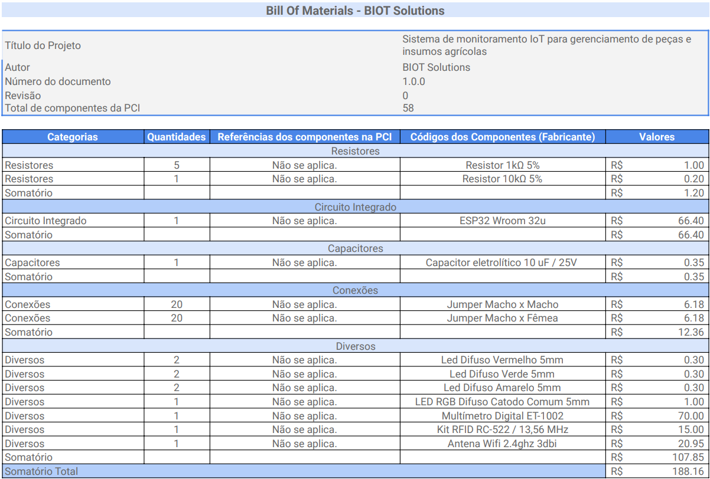
Fonte: Material produzido pelos autores (2023)

## 3.2. Domínio de Fundamentos de Experiência de Usuário 

### 3.2.1. Personas

&nbsp;&nbsp;&nbsp;&nbsp;Uma persona é um elemento essencial na criação e desenvolvimento de qualquer projeto, pois representa a personificação de um público-alvo específico [9]. É uma encarnação fictícia de um usuário típico que ajuda a equipe do projeto a compreender melhor quem são os destinatários de seus esforços e a criar produtos ou serviços mais alinhados com suas necessidades e expectativas. 

&nbsp;&nbsp;&nbsp;&nbsp;Neste contexto, a criação de personas é uma prática vital para o sucesso de qualquer empreendimento, pois fornece um guia importante para tomar decisões estratégicas, orientar o design, a comunicação e a experiência do usuário. Neste tópico, apresentaremos em detalhes nossa persona, abordando informações pessoais e acadêmicas além de suas dores e expectativas.

Figura 7: Persona: Paulo Santos, 38 anos

Fonte: Material produzido pelos autores (2023)

#### Informações Demográficas:

* Gênero: Masculino
* Localização: São Paulo, Brasil
* Estado Civil: Casado
* Filhos: Dois filhos pequenos
* Educação: Graduado em Engenharia de Controle e Automação
* Emprego: Engenheiro de Automação na equipe CUBO da empresa Atvos

#### Background:

&nbsp;&nbsp;&nbsp;&nbsp;Paulo é um engenheiro de controle e automação com uma carreira de 8 anos na Atvos, onde ele se concentra em melhorar a eficiência dos processos de produção de etanol, açúcar VHP e energia elétrica. Ele é casado e tem dois filhos pequenos. Em seu tempo livre, Paulo gosta de viajar com a família para ter novas experiências gastronômicas, e também realiza trabalho voluntário ensinando programação para crianças de escolas públicas. Além disso, ele está sempre em busca de soluções inovadoras para melhorar os processos em sua usina.

#### Dores, Necessidades e Desejos:

* Ele deseja um sistema que forneça uma rastreabilidade detalhada, permitindo monitorar cada recurso na operação..

* Ele deseja tomar decisões mais informadas sobre otimização de rotas, manutenção preventiva e gerenciamento de estoques.

* Ele quer um sistema que forneça dados históricos e análises para tomada de decisões estratégicas na usina.

#### Cenários de Interação:

* Na usina, durante as operações diárias, ao monitorar o transporte de peças e insumos entre o almoxarifado e as áreas de campo.

* Durante as reuniões de equipe, onde discutem estratégias de otimização de processos e redução de desvios e roubos.

* Em casa, por meio de um aplicativo ou plataforma online, para acompanhar relatórios e análises.

* Durante visitas às áreas de campo para inspecionar operações e manutenção.

#### Interesses e Hábitos Relacionados ao Sistema ou Produto:

&nbsp;&nbsp;&nbsp;&nbsp;Paulo tem experiência em automação industrial e entende a importância da tecnologia IoT.
Ele é proativo e sempre em busca de soluções inovadoras para os desafios da usina.
Usa dispositivos móveis e computadores com frequência para acessar informações e dados relacionados ao seu trabalho.
Valoriza a segurança e a eficiência nas operações da usina.

#### Nível de Letramento Digital:

&nbsp;&nbsp;&nbsp;&nbsp;Paulo tem um alto nível de letramento digital, sendo capaz de compreender e utilizar tecnologias avançadas, incluindo sistemas de IoT, para melhorar os processos da usina.

#### Citações Diretas:

* "Seria aliviante saber que podemos rastrear nossas peças e insumos em tempo real, especialmente na sede da empresa em São Paulo. Isso evitaria muitos problemas relacionados ao controle de estoque."

* “Não é só sobre o roubo das peças e insumos na sede da empresa. Precisamos de uma solução que coloque um fim nisso, cortando o mal pela raiz”

Figura 8: Persona: Maria Rita, 45 anos

Fonte: Material produzido pelos autores (2023)

#### Informações Demográficas:

* Gênero: Feminino
* Localização: São Paulo, Brasil
* Estado Civil: Viúva
* Filhos: Dois filhos adultos
* Educação: Ensino Médio Completo
* Emprego: Almoxarife na equipe CUBO da empresa Atvos

#### Background:
&nbsp;&nbsp;&nbsp;&nbsp;Maria trabalha há 15 anos na Atvos, desempenhando a função de almoxarife no almoxarifado da usina. Ela é viúva e tem dois filhos adultos que já saíram de casa. Maria possui um ensino médio completo e tem se dedicado ao seu trabalho para garantir a estabilidade financeira de sua família. Em seu tempo livre, gosta de ler e cultivar plantas.

#### Dores, Necessidades e Desejos:

* Maria enfrenta dificuldades no controle de estoque de peças e insumos no almoxarifado, com entradas e saídas constantes.

* Maria está preocupada com a segurança das peças e insumos no almoxarifado.

* Ela deseja um sistema intuitivo e fácil de usar, considerando seu nível de formação.

#### Cenários de Interação:

* No almoxarifado, ao registrar a entrada e saída de peças e insumos.

* Durante as entregas e devoluções de peças junto aos operadores de campo.

* Durante reuniões de equipe para discutir problemas de controle de estoque e segurança.

#### Interesses e Hábitos Relacionados ao Sistema ou Produto:

&nbsp;&nbsp;&nbsp;&nbsp;Maria não tem um histórico de uso de tecnologias avançadas e possui um nível médio de formação.
Ela valoriza a simplicidade e facilidade de uso em ferramentas de trabalho.
Utiliza computadores e dispositivos móveis de forma limitada em suas atividades diárias.

#### Nível de Letramento Digital:

&nbsp;&nbsp;&nbsp;&nbsp;Maria possui um nível de letramento digital limitado, com pouca experiência em tecnologias avançadas.

#### Citações Diretas:

* "Garantir que as peças trocadas voltem ao almoxarifado é um desafio. Um sistema que simplificasse esse processo seria de grande ajuda."

* "Espero que qualquer sistema que venha a ser implementado seja simples de usar. Não tenho muita experiência com tecnologia, então a facilidade de uso é crucial para mim."

Figura 9: Persona: Carlos Pereira, 40 anos
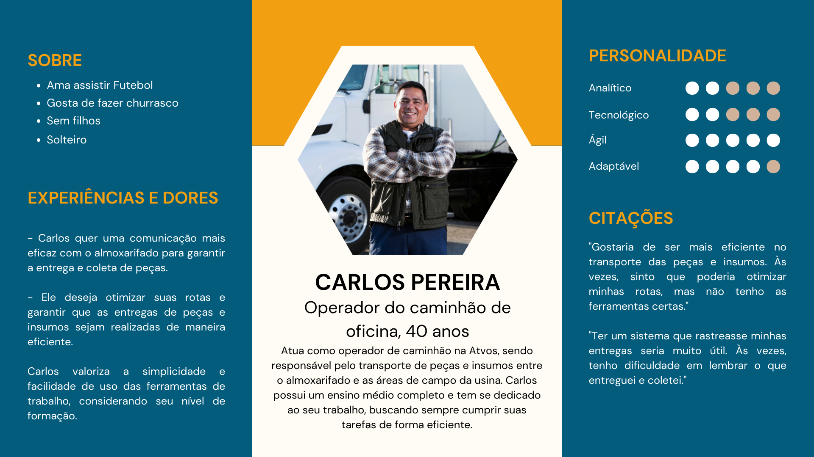
Fonte: Material produzido pelos autores (2023)

#### Informações Demográficas:

* Gênero: Masculino
* Localização: São Paulo, Brasil
* Estado Civil: Solteiro
* Filhos: Sem filhos
* Educação: Ensino Médio Completo
* Emprego: Operador de Caminhão na equipe CUBO da empresa Atvos

#### Background:

&nbsp;&nbsp;&nbsp;&nbsp;Carlos atua como operador de caminhão na equipe CUBO da Atvos, sendo responsável pelo transporte de peças e insumos entre o almoxarifado e as áreas de campo da usina. Ele é solteiro e não tem filhos. Carlos possui um ensino médio completo e tem se dedicado ao seu trabalho, buscando sempre cumprir suas tarefas de forma eficiente. Em seu tempo livre, gosta de assistir a jogos de futebol e passar tempo com seus amigos.

#### Dores, Necessidades e Desejos:

* Carlos quer uma comunicação mais eficaz com o almoxarifado para garantir a entrega e coleta de peças.

* Ele deseja otimizar suas rotas e garantir que as entregas de peças e insumos sejam realizadas de maneira eficiente.

* Carlos valoriza a simplicidade e facilidade de uso das ferramentas de trabalho, considerando seu nível de formação.

#### Cenários de Interação:

* Durante as operações diárias de transporte de peças e insumos.

* Ao comunicar-se com o almoxarifado para coordenar entregas e coletas.

* Por meio de um dispositivo móvel ou sistema no caminhão para receber informações em tempo real.

#### Interesses e Hábitos Relacionados ao Sistema ou Produto:

Carlos não possui um histórico de uso de tecnologias avançadas e possui um nível médio de formação.
Usa dispositivos móveis e computadores de forma limitada em suas atividades diárias.
Valoriza a eficiência e a colaboração no ambiente de trabalho.

#### Nível de Letramento Digital:

&nbsp;&nbsp;&nbsp;&nbsp;Carlos possui um nível de letramento digital limitado, com pouca experiência em tecnologias avançadas.

#### Citações Diretas:

* "Gostaria de ser mais eficiente no transporte das peças e insumos. Às vezes, sinto que poderia otimizar minhas rotas, mas não tenho as ferramentas certas."

* "Ter um sistema que rastreasse minhas entregas seria muito útil. Às vezes, tenho dificuldade em lembrar o que entreguei e coletei."

### 3.2.2. Jornadas do Usuário e Storyboard

#### 3.2.2.1 Jornada do Usuário

Figura 10: Mapa da Jornada do Usuário

Fonte: Material produzido pelos autores (2023)

&nbsp;&nbsp;&nbsp;&nbsp;A jornada do usuário, também conhecida como "User Journey" ou "Customer Journey", é uma representação visual ou narrativa das etapas pelas quais um indivíduo passa ao interagir com um produto, serviço ou sistema, desde o primeiro ponto de contato até o desfecho final [5]. Essa jornada descreve as experiências, ações, pensamentos e sentimentos do usuário em cada etapa do processo, permitindo uma compreensão profunda de como eles interagem com o que é oferecido. Neste tópico, apresentaremos em detalhes a jornada do usuário da persona do projeto da BIOT Solutions.

#### Início da jornada

* Reconhecimento da necessidade de otimizar o controle de equipamentos rodantes, peças e estoque.

#### Responsabilidades:

* Garantir a pesquisa de mercado abrangente para identificar soluções de monitoramento IoT adequadas às necessidades da empresa.
* Coordenar a implementação do sistema IoT, incluindo a integração com a frota de equipamentos e o sistema de gerenciamento de estoque.
* Monitorar e relatar os resultados do uso do sistema, identificando quaisquer problemas ou desafios.

#### Expectativas:

* A persona espera que a solução de monitoramento IoT da BIOT Solutions resolva os desafios identificados, reduza as perdas e melhore o controle de estoque.
* Espera ver melhorias tangíveis na eficiência operacional e economia de custos.
* Espera que a equipe da Atvos forneça suporte contínuo e esteja disposta a ouvir o feedback para melhorias contínuas.

#### Etapa de Interação:

_Fase de Conscientização:_

* Ações: Realiza uma análise de perdas no último trimestre e identifica perdas significativas de peças e equipamentos rodantes.
* Pensamentos: "As perdas estão afetando nossa eficiência. Precisamos agir."
* Sentimentos: Preocupação com as perdas, motivação para buscar uma solução.
* Oportunidades: Identificar o impacto das perdas e a urgência de ação.

_Fase de Consideração:_

* Ações: Inicia uma pesquisa de mercado para identificar soluções de monitoramento IoT de ativos.
* Pensamentos: "Vamos encontrar a melhor solução para evitar perdas e melhorar o controle de estoque."
* Sentimentos: Curiosidade, determinação em encontrar a solução certa.
* Oportunidades: Analisar as opções disponíveis e comparar os recursos.

_Fase de Decisão:_

* Ações: Após a pesquisa, escolhe a solução da Atvos com base em uma demonstração personalizada.
* Pensamentos: "Recorrer ao Inteli parece mais adequado para as nossas operações."
* Sentimentos: Satisfação com a escolha, desejo de resolver o problema.
* Oportunidades: Facilitar a aquisição do sistema e coordenar a implementação.

_Fase de Uso:_

* Ações: Inicia a implementação, integrando o sistema IoT com a frota de equipamentos e o sistema de gerenciamento de estoque.
* Pensamentos: "Como o sistema se adapta aos nossos processos? Está melhorando nossa eficiência?"
* Sentimentos: Expectativa, desejo de ver resultados tangíveis.
* Oportunidades: Garantir a integração e treinamento eficazes para os usuários.

_Fase de Defesa:_

* Ações: À medida que o sistema é usado, compartilha os primeiros resultados positivos com a equipe.
* Pensamentos: "Estamos evitando perdas e otimizando nosso estoque. Devemos continuar a usar o sistema."
* Sentimentos: Satisfação, motivação para compartilhar experiências positivas.
* Oportunidades: Reforçar a importância do sistema e coletar feedback para melhorias contínuas.

#### Touchpoints:

* Pesquisa de mercado online.
* Análise personalizada do sistema da Atvos.
* Implementação do sistema IoT com suporte da Atvos.
* Treinamento para a equipe.
* Uso contínuo do sistema para monitoramento e controle.

#### Picos e Vales:

* Pico: Quando a implementação é concluída com sucesso e as perdas são significativamente reduzidas.
* Vale: Desafios iniciais na integração do sistema com os equipamentos existentes.

#### Final da Jornada:

Implementação bem-sucedida do sistema de monitoramento IoT, melhoria no controle de ativos e estoque, redução de perdas e otimização de processos.

#### Feedbacks e Insights:

* Insights: Os usuários reconhecem o valor do sistema IoT da Atvos na melhoria do controle de ativos e estoque.
* Feedback: Importância de fornecer suporte eficaz durante a implementação e as fases iniciais de uso.
* Aprendizados: A necessidade de manter o sistema atualizado e ouvir o feedback dos usuários para melhorias contínuas.
Potencial para expandir o uso do sistema IoT em outras áreas operacionais.

Figura 11: Mapa da Jornada do Usuário
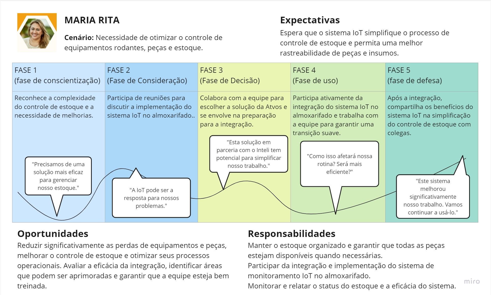
Fonte: Material produzido pelos autores (2023)

#### Início da jornada

* Reconhecimento da necessidade de melhorar o controle de estoque e a segurança dos equipamentos no almoxarifado.

#### Responsabilidades:

* Manter o estoque organizado e garantir que todas as peças estejam disponíveis quando necessárias.
* Participar da integração e implementação do sistema de monitoramento IoT no almoxarifado.
* Monitorar e relatar o status do estoque e a eficácia do sistema.

#### Expectativas:

* Espera que o sistema IoT simplifique o processo de controle de estoque e permita uma melhor rastreabilidade de peças e insumos.

#### Etapa de Interação:

_Fase de Conscientização:_

* Ações: Participa de reuniões para discutir a implementação do sistema IoT no almoxarifado.
* Pensamentos: "A IoT pode ser a resposta para nossos problemas."
* Sentimentos: Preocupação com os desvios e perdas frequentes.
* Oportunidades: Identificar o impacto das perdas e a urgência de ação.

_Fase de Consideração:_

* Ações: Inicia uma pesquisa de mercado para identificar soluções de monitoramento IoT de ativos.
* Pensamentos: "Vamos encontrar a melhor solução para evitar perdas e melhorar o controle de estoque."
* Sentimentos: Esperançoso em encontrar a solução certa.
* Oportunidades: Comparar diferentes fornecedores e seus recursos.

_Fase de Decisão:_

* Ações: Colabora com a equipe para escolher a solução da Atvos e se envolve na preparação para a integração.
* Pensamentos: "Esta solução em parceria com o Inteli tem potencial para simplificar nosso trabalho."
* Sentimentos: Satisfação com a decisão tomada.
* Oportunidades: Garantir que todas as partes interessadas estejam alinhadas com a decisão.

_Fase de Uso:_

* Ações: Participa ativamente da integração do sistema IoT no almoxarifado e trabalha com a equipe para garantir uma transição suave.
* Pensamentos: ""Como isso afetará nossa rotina? Será mais eficiente?"
* Sentimentos: Expectativa de ver resultados positivos.
* Oportunidades: Treinamento adequado para a equipe e monitoramento contínuo.

_Fase de Defesa:_

* Ações: Após a integração, compartilha os benefícios do sistema IoT na simplificação do controle de estoque com colegas.
* Pensamentos: "Este sistema melhorou significativamente nosso trabalho. Vamos continuar a usá-lo."
* Sentimentos: Satisfação, motivação para compartilhar experiências positivas.
* Oportunidades: Oferecer feedback para melhorias contínuas.

#### Touchpoints:

* Pesquisa na web para encontrar fornecedores.
* Reuniões com representantes dos fornecedores.
* Reuniões internas para discussão e aprovação do projeto.
* Treinamento da equipe na utilização do sistema.
* Uso diário do sistema no almoxarifado.

#### Picos e Vales:

* Picos: Seleção do fornecedor adequado.
Implementação bem-sucedida do sistema.
Melhorias visíveis no controle de estoque e segurança.

* Vales: Dificuldades na seleção do fornecedor.
Problemas iniciais de implementação.
Respostas iniciais insatisfatórias do sistema.
#### Final da Jornada:

Solução bem-sucedida dos problemas de controle de estoque e segurança.
Redução de desvios e perdas.

#### Feedbacks e Insights:

* A jornada mapeada destaca a importância de uma cuidadosa seleção de fornecedores, treinamento adequado da equipe e monitoramento contínuo.
* Insights sobre os pontos de dor e satisfação do usuário podem ser usados para otimizar o sistema e melhorar a experiência geral no futuro.
* A implementação bem-sucedida do sistema mostra que a solução de monitoramento baseada em IoT é eficaz e valiosa para a empresa.

Figura 12: Mapa da Jornada do Usuário
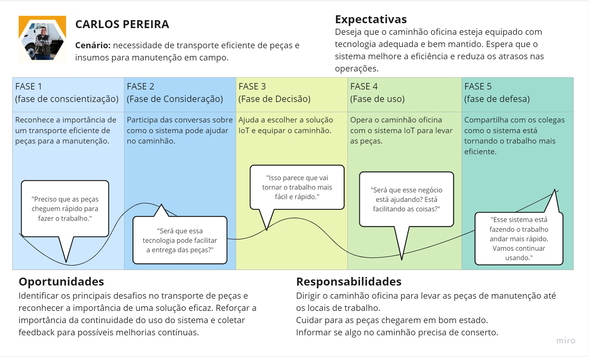
Fonte: Material produzido pelos autores (2023)

#### Início da jornada

* Reconhecimento da necessidade de monitorar o estado dos caminhões e otimizar as operações de manutenção e reparo.

#### Responsabilidades:

* Cuidar para as peças chegarem em bom estado.
Informar se algo no caminhão precisa de conserto.
* Dirigir o caminhão oficina para levar as peças de manutenção até os locais de trabalho.
* Comunicar quaisquer problemas, anomalias ou necessidades de melhorias no sistema aos supervisores ou à equipe de manutenção.

#### Expectativas:

* Deseja que o caminhão oficina esteja equipado com tecnologia adequada e bem mantido. 
* Espera que o sistema melhore a eficiência e reduza os atrasos nas operações.

#### Etapa de Interação:

_Fase de Conscientização:_

* Ações: Reconhece a importância de um transporte eficiente de peças para a manutenção.
* Pensamentos: "Preciso que as peças cheguem rápido para fazer o trabalho."
* Sentimentos: Preocupação com paradas inesperadas e custos de manutenção.
* Oportunidades: Identificação da necessidade de um sistema de monitoramento baseado em IoT.

_Fase de Consideração:_

* Ações: Participa das conversas sobre como o sistema pode ajudar no caminhão.
* Pensamentos: "Será que essa tecnologia pode facilitar a entrega das peças?"
* Sentimentos: Esperançoso em encontrar uma solução confiável.
* Oportunidades: Comparar diferentes fornecedores e suas características.

_Fase de Decisão:_

* Ações: Ajuda a escolher a solução IoT e equipar o caminhão.
* Pensamentos: "Isso parece que vai tornar o trabalho mais fácil e rápido."
* Sentimentos: Satisfação com a decisão tomada.
* Oportunidades: Garantir que todas as partes interessadas estejam alinhadas com a decisão.

_Fase de Uso:_

* Ações: Opera o caminhão oficina com o sistema IoT para levar as peças.
* Pensamentos: "Será que esse negócio está ajudando? Está facilitando as coisas?"
* Sentimentos: Expectativa de ver resultados positivos.
* Oportunidades: Treinamento adequado para a equipe de operadores de caminhões.

_Fase de Defesa:_

* Ações: Compartilha com os colegas como o sistema está tornando o trabalho mais eficiente.
* Pensamentos: "Esse sistema está fazendo o trabalho andar mais rápido. Vamos continuar usando."
* Sentimentos: Satisfação e orgulho pela eficácia do sistema.
* Oportunidades: Compartilhar histórias de sucesso e melhores práticas com outros operadores de caminhões na oficina.

#### Touchpoints:

* Pesquisa na web para encontrar fornecedores de soluções de monitoramento.
* Reuniões com representantes dos fornecedores.
* Reuniões internas para discussão e aprovação do projeto.
* Treinamento da equipe de operadores de caminhões na utilização do sistema.
* Uso diário do sistema nos caminhões durante as operações de manutenção e reparo.

#### Picos e Vales:

* Picos: Seleção do fornecedor adequado.
Implementação bem-sucedida do sistema.
Melhorias visíveis no desempenho e eficiência dos caminhões.

* Vales: Dificuldades na seleção do fornecedor.
Problemas iniciais de implementação.
Respostas iniciais insatisfatórias do sistema.

#### Final da Jornada:

Melhoria significativa no desempenho e eficiência dos caminhões na oficina de manutenção.

#### Feedbacks e Insights:

* A jornada mapeada destaca a importância de uma seleção cuidadosa de fornecedores, treinamento adequado da equipe e monitoramento contínuo.
* Insights sobre os pontos de dor e satisfação do operador de caminhão podem ser usados para otimizar o sistema e melhorar a experiência geral no futuro.
* A implementação bem-sucedida do sistema mostra que a solução de monitoramento baseada em IoT é eficaz e valiosa para melhorar o desempenho e a manutenção dos caminhões na oficina da Atvos.

#### 3.2.2.2 Storyboards

&nbsp;&nbsp;&nbsp;&nbsp; A convergência da Internet das Coisas (IoT) e a experiência do usuário (UX) estão redefinindo a forma como interagimos com o mundo digital e físico. No coração desse avanço está o nosso projeto de monitoramento IoT, uma inovação que promete revolucionar a maneira como interagimos com dispositivos, sensores e dados em tempo real. Este storyboard é uma janela para o futuro, um vislumbre das possibilidades emocionantes que o nosso projeto oferece.

&nbsp;&nbsp;&nbsp;&nbsp;No cenário de constante evolução da IoT, a UX desempenha um papel crucial na criação de experiências significativas e intuitivas para os usuários. Este storyboard não é apenas uma representação visual de nossa visão, mas também uma ferramenta que nos permite explorar como o design e a funcionalidade se unem para aprimorar a vida cotidiana.

&nbsp;&nbsp;&nbsp;&nbsp;Através dessas narrativas visuais, vamos explorar como nossa solução de monitoramento IoT pode proporcionar comodidade, eficiência e segurança. Convidamos você a mergulhar nessa jornada conosco, enquanto compartilhamos uma história envolvente que ilustra o impacto que nossa inovação terá no mundo real.

&nbsp;&nbsp;&nbsp;&nbsp;Nestes storyboards, serão encontradas cenas que demonstram como nossos dispositivos IoT interagem com o ambiente e respondem às necessidades dos usuários de maneira fluida e intuitiva. Esperamos que esta apresentação desencadeie discussões estimulantes e inspiradoras, à medida que trabalhamos juntos para tornar a IoT uma parte integrante do nosso cotidiano.

Figura 13: Storyboard do Paulo Santos - Técnico
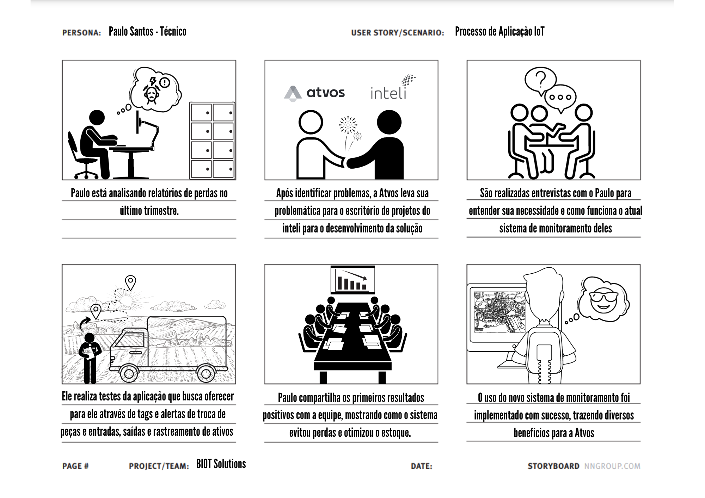
Fonte: Material produzido pelos autores (2023)

Figura 14: Storyboard da Maria Rita - Almoxarifado
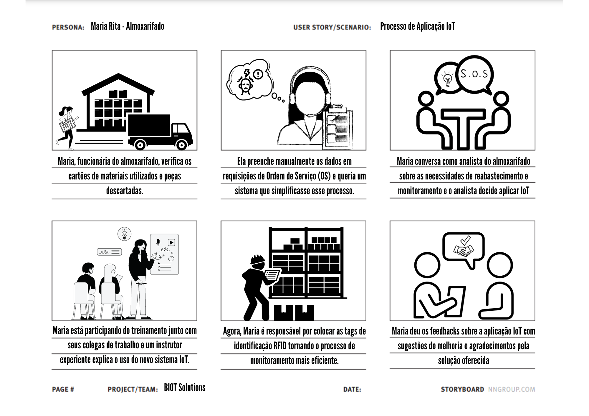
Fonte: Material produzido pelos autores (2023)

Figura 15: Storyboard do Carlos Pereira - Oficina

Fonte: Material produzido pelos autores (2023)

&nbsp;&nbsp;&nbsp;&nbsp; Cada cena e quadro nesses storyboards nos mostrou a promessa de dispositivos conectados, sensores inteligentes e dados em tempo real, tudo isso projetado com a experiência do usuário em mente. Vimos como nossos produtos podem se integrar perfeitamente às rotinas diárias, tornando-as mais convenientes e eficazes. Observamos como a UX pode transformar dados complexos em informações úteis e acessíveis, capacitando os usuários a tomar decisões informadas.

&nbsp;&nbsp;&nbsp;&nbsp;O futuro do monitoramento IoT é emocionante, e esses storyboards servem como um vislumbre inspirador desse futuro. À medida que continuamos a desenvolver e refinar nossa solução, lembramos que a essência de nosso projeto é melhorar a vida das pessoas. Com a colaboração contínua e um compromisso inabalável com a qualidade da experiência do usuário, estamos confiantes de que podemos transformar nossa visão em realidade.

### 3.2.3. User Stories

&nbsp;&nbsp;&nbsp;&nbsp;A partir das perspectivas de diferentes personas envolvidas na operação da Atvos, criamos as seguintes user stories, que representam necessidades específicas de cada tipo de usuário. Essas histórias não só refletem a complexidade e amplitude das operações da Atvos, mas também definem os critérios de aceitação, prioridades e estimativas de esforço necessários para a concretização bem-sucedida desse projeto.

&nbsp;&nbsp;&nbsp;&nbsp;Cada história aborda um aspecto fundamental do sistema de monitoramento IoT, que, quando implementado, não apenas aprimorará a eficiência operacional da Atvos, mas também reforçará a segurança, a agilidade e a capacidade de adaptação da empresa em um ambiente em constante evolução.

&nbsp;&nbsp;&nbsp;&nbsp;A seguir, apresentamos cinco user stories que detalham as expectativas e necessidades dos usuários envolvidos no projeto, incluindo técnicos de TI, almoxarifados e operadores de caminhões de oficina. Cada história oferece um cenário específico relacionado ao uso da aplicação IoT e às problemáticas enfrentadas.

&nbsp;&nbsp;&nbsp;&nbsp;1 - Como um técnico de TI (Paulo), quero ter acesso em tempo real à localização e status dos equipamentos rodantes, para melhorar a eficiência na manutenção e resolução de problemas técnicos.

&nbsp;&nbsp;&nbsp;&nbsp;Critérios de Aceitação: O sistema fornece atualizações de localização e status em tempo real, com uma precisão de pelo menos 95%. As informações são acessíveis via aplicativo móvel ou interface web.

&nbsp;&nbsp;&nbsp;&nbsp;2 - Como um almoxarifado (Maria), quero um sistema que me notifique quando os níveis de estoque de peças e bens atingirem um nível crítico, para garantir que nunca faltem itens essenciais.

&nbsp;&nbsp;&nbsp;&nbsp;Critérios de Aceitação: O sistema envia notificações por e-mail ou mensagem de texto quando os níveis de estoque atingem um limite pré-definido. As notificações são claras e fáceis de entender, mesmo para usuários com baixo letramento digital.

&nbsp;&nbsp;&nbsp;&nbsp;3 - Como um operador de caminhão de oficina (Carlos), quero poder relatar a devolução de peças e bens de forma simples e rápida, para garantir que o controle de estoque seja preciso.

&nbsp;&nbsp;&nbsp;&nbsp;Critérios de Aceitação: O sistema permite que Carlos registre devoluções de peças e bens com no máximo três etapas, com uma interface de usuário intuitiva. Os registros são armazenados e atualizados no sistema de estoque.

&nbsp;&nbsp;&nbsp;&nbsp;4 - Como um operador de caminhão de oficina (Carlos), quero um sistema fácil de usar, com treinamento mínimo, para que eu possa adotá-lo rapidamente e continuar com minhas tarefas diárias.

&nbsp;&nbsp;&nbsp;&nbsp;Critérios de Aceitação: O sistema possui uma interface intuitiva e requer no máximo uma hora de treinamento para que Carlos possa usá-lo efetivamente. O sistema fornece suporte online e recursos de ajuda para facilitar o aprendizado.

&nbsp;&nbsp;&nbsp;&nbsp;5 - Como um técnico de TI (Paulo), quero que o sistema de monitoramento seja altamente seguro e protegido contra desvio/roubo de informações, para garantir a integridade dos dados.

&nbsp;&nbsp;&nbsp;&nbsp;Critérios de Aceitação: O sistema implementa autenticação de dois fatores para acessar informações críticas. Os dados de localização e status são criptografados e protegidos contra acesso não autorizado.

&nbsp;&nbsp;&nbsp;&nbsp;Cada história aborda desafios específicos e apresenta critérios de aceitação que estabelecem medidas claras para o sucesso da implementação. Com base nessas user stories, a Atvos pode priorizar suas ações e alocar recursos de forma estratégica, garantindo que o sistema de monitoramento IoT atenda às necessidades da empresa de forma eficaz.

&nbsp;&nbsp;&nbsp;&nbsp;Essas histórias não apenas delineiam os requisitos técnicos do sistema, mas também enfatizam a importância de tornar a tecnologia acessível e amigável para usuários com diferentes níveis de habilidades digitais. Isso demonstra o compromisso da BIOT Solutions em envolver todos os funcionários no processo de implementação, garantindo que a tecnologia seja uma aliada para a equipe em todas as etapas do projeto.

### 3.2.4. Protótipo de interface com o usuário

&nbsp;&nbsp;&nbsp;&nbsp;A interface com o usuário é um componente crucial de qualquer sistema, pois serve como a ponte entre o usuário e a tecnologia. Nesta seção, será explorado o protótipo de interface com o usuário para a solução IoT deste projeto, focando em dois aspectos principais: o desenho esquemático da solução IoT - o qual expõe os dispositivos, os sensores e as ações do sistema em resposta às ações do usuário - e o wireframe da interface do dashboard - o qual demonstra uma representação de baixa fidelidade da plataforma web que será desenvolvida para integrar o sistema por completo, disponibilizando seções gráficas e interativas aos usuários finais.

#### 3.2.4.1 Desenho esquemático da solução IoT

Figura 16: Desenho esquemático da solução física IoT

Fonte: Material produzido pelos autores (2023)

&nbsp;&nbsp;&nbsp;&nbsp;O desenho esquemático da solução IoT apresentado acima, na figura 16, representa de forma gráfica o funcionamento do dispositivo físico e o fluxo de funcionamento dele conforme as ações do usuário. Essa representação visual permite visualizar a infraestrutura e a lógica de funcionamento de um sistema IoT. No caso específico do sistema de registro de peças e operadores da oficina, o desenho esquemático IoT apresentaria os componentes-chave, como o caminhão da oficina, onde seria feito o registro, o display LCD, o sensor RFID, as tags/cartões RFID e os LEDs, demonstrando como eles se interligam para possibilitar a operação eficiente e intuitiva do sistema. Essa representação gráfica é essencial para compreender o funcionamento da solução, fornecendo uma visão clara do funcionamento geral e dos feedbacks que o sistema entrega para o usuário. Abaixo, será detalhado o fluxo de funcionamento do sistema para cada etapa do processo.

&nbsp;&nbsp;&nbsp;&nbsp;O processo de operação do sistema inicia-se quando o operador do caminhão da oficina ativa o sistema pressionando um botão. Essa ação aciona o display LCD, que sinaliza a inicialização do sistema. Uma vez que o sistema está ativo, um LED azul se ilumina de forma constante, indicando que o sistema está pronto para uso. Nesse estado, o display LCD orienta o operador a aproximar sua TAG ao sensor RFID para efetuar o registro.

&nbsp;&nbsp;&nbsp;&nbsp;Quando o operador posiciona a TAG próximo ao sensor RFID, o sistema realiza o processo de registro. Durante esse período, um LED amarelo permanece aceso, orientando o operador a aguardar a finalização do processamento. Após a conclusão bem-sucedida do registro do operador, o display LCD apresenta uma mensagem confirmando o sucesso da operação e um LED verde se acende continuamente, simbolizando o registro efetivado.

&nbsp;&nbsp;&nbsp;&nbsp;Posteriormente, com o registro do usuário realizado, um LED vermelho se acende, indicando que o sistema está pronto para iniciar o registro das peças. O operador deve então aproximar uma peça com uma TAG própria ao sensor RFID. O sistema, ao reconhecer a peça, ativa um LED amarelo durante o processo de registro, da mesma forma que no registro do funcionário.

&nbsp;&nbsp;&nbsp;&nbsp;Em casos de erro, se o registro da peça falhar, o operador é notificado por uma mensagem de erro no display LCD e um LED laranja piscante é acionado para indicar a falha no processo. Neste ponto, o sistema reativa o LED vermelho, sinalizando que está pronto para tentar registrar uma nova peça.

&nbsp;&nbsp;&nbsp;&nbsp;Para registros bem-sucedidos de peças, o procedimento é similar ao do registro do operador: o display LCD confirma a operação e um LED verde se mantém aceso, demonstrando o registro bem-sucedido da peça. Após cada peça registrada, o LED vermelho é novamente aceso, indicando que o sistema está disponível para o registro da próxima peça, mantendo a abordagem de processar uma peça por vez até que o operador decida encerrar o processo desligando o dispositivo.

&nbsp;&nbsp;&nbsp;&nbsp;Dessa forma, o fluxo de funcionamento do sistema IoT demonstra-se intuitivo para um operador do caminhão oficina como a persona Carlos Pereira, já que além do processo de registro para a retirada de peças ser simples, o sistema também fornece feedbacks visuais com as cores dos LEDs e das mensagens do display LCD para o operador, de modo a facilitar a interação com o sistema.

#### 3.2.4.2 Wireframe da interface da dashboard

&nbsp;&nbsp;&nbsp;&nbsp;O wireframe é uma representação visual esquemática e simplificada da interface de um projeto, desprovida de cores, estilos e elementos gráficos refinados. Ele desempenha um papel crucial na fase inicial de desenvolvimento de um projeto, como o que estamos propondo para a Atvos, cujo objetivo é criar uma solução de monitoramento e rastreabilidade de peças e insumos.

&nbsp;&nbsp;&nbsp;&nbsp;O wireframe é importante para o projeto por várias razões. Primeiramente, ele serve como um guia visual que ajuda a equipe a planejar a disposição de elementos na interface, como botões, gráficos e informações cruciais para os operadores. Isso permite a organização e a visualização eficiente das informações relevantes. Além disso, o wireframe ajuda a identificar erros de usabilidade e a garantir que a interface seja intuitiva e amigável para os usuários finais.

&nbsp;&nbsp;&nbsp;&nbsp;A figura abaixo (figura 17), apresenta as principais telas que teremos na interface do usuário em formato Desktop.

Figura 17 - Wireframe da Interface do Usuário
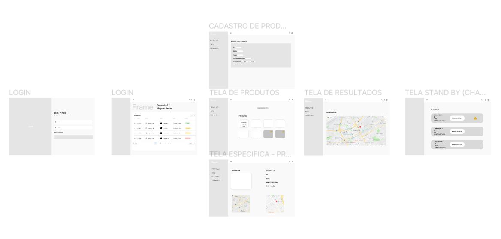
Fonte: Material produzido pelos autores (2023)

&nbsp;&nbsp;&nbsp;&nbsp;O Wireframe da nossa aplicação, presente [neste link](https://abrir.link/ytNdx), é formado pelas seguintes telas:

- Tela de login: Será a primeira tela que o usuário irá interagir para poder ter acesso a todas as outras telas e funções da aplicação. Essa tela contém campos para inserção de email e senha do usuário e o logotipo da aplicação.

- Tela principal: Assim que o usuário concluir o login, será redirecionado para a tela principal, onde terá contato com o dashboard, que irá transmitir os dados coletados pela aplicação IoT. Além disso, o usuário terá acesso à barra de navegação, onde poderá acessar as outras telas, ao ícone de notificação, onde poderá receber os chamados dos motoristas, e ao ícone de acesso à página de stand by.

- Tela stand-by: Essa tela apresentará para o usuário chamados abertos e peças suspeitas de roubo.

- Tela de peças e insumos: Através da barra de navegação, o usuário poderá ter acesso à tela de peças e insumos, que mostrará todos os itens cadastrados pelo RFID e permitirá o cadastro de novos itens, que apresentarão um ID, tipo, ID do almoxarifado em que o produto está armazenado e disponibilidade. Além disso, o usuário poderá pesquisar por um item específico através da barra de pesquisa.

- Tela de resultado: Através da barra de pesquisa, o usuário terá acesso a uma tela com a localização do caminhão oficina em que o item está.

- Tela de cadastro de produto: Através do botão de "+" conhecido como "adicionar", que está presente na tela de peças e insumos, o usuário terá acesso a um formulário contendo campos para inserção dos dados de um item, sendo eles o número do RFID ligado a um produto e o nome do produto.

&nbsp;&nbsp;&nbsp;&nbsp;Conforme mencionado anteriormente, a concepção do wireframe desempenha um papel crítico na visualização inicial da interface projetada para atender às necessidades de usuários como Paulo (técnico do Cubo), Maria (almoxarife) e Carlos (responsável pelo caminhão oficina) na Atvos. Essa etapa fundamental orienta a disposição dos elementos essenciais para otimizar a eficiência operacional, fornecer atualizações em tempo real e garantir a segurança dos dados.

&nbsp;&nbsp;&nbsp;&nbsp;Para Paulo, operador do Cubo, a interface precisa oferecer um painel de controle que fornece atualizações em tempo real sobre a localização e status dos equipamentos. Essas informações são vitais para sua tomada de decisões estratégicas na usina. Além disso, a tela de relatórios e análises permite insights detalhados para melhorias nos processos.

&nbsp;&nbsp;&nbsp;&nbsp;Por sua vez, Maria, como almoxarife, se beneficia do registro de entradas e saídas de peças e insumos no almoxarifado, além de relatórios sobre peças suspeitas de roubo. Esses recursos ajudam a manter um controle mais efetivo do estoque.

&nbsp;&nbsp;&nbsp;&nbsp;Além disso, para Carlos, operador de caminhão oficina, a interface precisa oferecer uma plataforma simplificada para relatar devoluções de peças, garantindo a precisão do controle de estoque. Além disso, a tela atual exibe informações sobre chamados abertos e peças suspeitas.

##### Telas Futuras (Roadmap)

* Tela de Notificações de Estoque Crítico para Maria:
    * Uma interface detalhada será desenvolvida para notificar, de forma clara e imediata, quando os níveis de estoque atingirem pontos críticos. As notificações serão apresentadas de maneira intuitiva, incluindo gráficos visuais que destacarão as áreas de necessidade urgente. Essa tela também oferecerá a opção de visualizar históricos de estoque e tendências.
    
    
* Tela Simplificada de Devolução para Carlos:
    * O planejamento da interface prevê uma tela que permitirá que Carlos relate devoluções de peças com um processo ainda mais simplificado, com um máximo de três etapas. Além disso, essa tela futura será acompanhada por um recurso de reconhecimento automático de itens, agilizando o registro e a atualização do estoque.
    
* Tela de Segurança e Integridade dos Dados para Paulo:
    * Uma tela focada na segurança e proteção dos dados será desenvolvida para atender à demanda de Paulo. Esta tela abrangerá protocolos de segurança avançados, permitindo ao usuário gerenciar permissões de acesso, auditorias de dados e rastreamento de atividades. Além disso, será integrada com alertas de segurança em tempo real.

## 3.3. Solução Técnica	

&nbsp;&nbsp;&nbsp;&nbsp;A Solução abordada neste projeto, conforme mencionado ao decorrer deste documento, trata-se de um **sistema de monitoramento IoT baseado em nuvem para gerenciamento de peças e insumos agrícolas**. Nesse sentido, nesta seção serão abordados detalhes técnicos desse sistema, bem como o levantamento de requisitos funcionais e não funcionais, além dos detalhes técnicos mais aprofundados: a arquitetura da solução, a arquitetura do protótipo e a arquitetura refinada da solução.

### 3.3.1. Requisitos Funcionais

&nbsp;&nbsp;&nbsp;&nbsp;Os requisitos funcionais de um sistema elucidam as funcionalidades que ele deve entregar aos usuários finais, dependendo do tipo de software, dos utilizadores finais e da padronização da escrita desses requisitos escolhida pela organização responsável pelo sistema (Sommerville, 2016, p.89) [10]. 

&nbsp;&nbsp;&nbsp;&nbsp;Nesse sentido, foi estabelecido, em consonância com Sommerville (2016, p.107) [10], um template para listar os requisitos de forma estruturada, o qual está num formato de tabela/formulário, cujos campos estão explicados abaixo.

Quadro 01 - Template para Requisitos Funcionais

| **Código (RF ou RNF) + Número** |  |
|--|--|
| **Título** | Título do requisito funcional |
| **Função** | Descrever, superficialmente, a funcionalidade fornecida aos usuários |
| **Descrição** | Descrição detalhada do requisito|
| **Entradas** | Quais dados de entrada serão fornecidos ao sistema para a função ser excetuada |
| **Origem** | Origem das entradas |
| **Saídas** | Quais dados de saída dessa funcionalidade, o que é retornado ao usuário |
| **Destino** | Destino das saídas |
| **Ação** | Descrição, em detalhes, da ação a ser tomada pelo sistema nesta funcionalidade |
| **Pré-condição** | O que deve ser verdadeiro antes da função ser invocada |
| **Pós-condição** | O que deve ser verdadeiro depois da função ser invocada |
| **Efeitos colaterais** | Descrição dos efeitos colaterais (se houver) das operações |

Fonte: Sommerville, 2016

&nbsp;&nbsp;&nbsp;&nbsp;Destarte, nas tabelas a seguir estão enumerados de forma estruturada os requisitos funcionais deste projeto.

Quadro 02 - Requisito Funcional 01

| RF01 | |
|--|--|
| **Título** | **Rastreamento de Equipamentos no Caminhão Oficina** |
| **Função** | Rastrear a localização e o status das peças e insumos selecionados |
| **Descrição** | O sistema deve permitir o rastreamento em tempo real dos equipamentos transportados pelo caminhão oficina, peças e insumos enquanto estão em trânsito ou em mudança de estado, proporcionando maior visibilidade e controle. |
| **Entradas** | Dados de localização, sensores de status dos equipamentos, informações de peças e insumos selecionados. |
| **Origem** | Equipamentos, peças e insumos do caminhão oficina. |
| **Saídas** | Dados de rastreamento e monitoramento de status em tempo real, alerta de desvio/roubo, status dos equipamentos. |
| **Destino** | Sistema de monitoramento IoT. |
| **Ação** | Monitorar o status das peças e dos insumos no transporte do caminhão oficina por meio de sensores RFIDs, de modo a fornecer tais dados em tempo real ao sistema de gerenciamento, alterando ou não o status conforme alteração nas peças e nos insumos. |
| **Pré-condição** | Equipamentos, peças e insumos selecionados estão em troca ou em trânsito (caminhão oficina). |
| **Pós-condição** | Dados de rastreamento atualizados no sistema, alertas gerados em caso de desvio/roubo. |
| **Efeitos colaterais** | Auxilia no controle das peças e dos insumos. Ajuda na prevenção de roubos e desvios de peças/insumos. Colabora com o programa de conectividade da Atvos. |

Fonte: Material produzido pelos autores (2023)

Quadro 03 - Requisito Funcional 02

| RF02 | |
|--|--|
| **Título** | **Alerta de Mudança de Estado das Peças Valiosas** |
| **Função** | Monitorar e alertar sobre mudanças no estado das peças valiosas durante o transporte. |
| **Descrição** | O sistema deve ser capaz de monitorar continuamente o estado das peças valiosas enquanto estão em trânsito no caminhão oficina e alertar imediatamente sobre qualquer mudança significativa. Isso inclui mudanças de status, danos ou desgaste excessivo das peças. |
| **Entradas** | Dados de sensores que monitoram o estado das peças valiosas. |
| **Origem** | Sensores localizados nas peças valiosas dentro do caminhão oficina. |
| **Saídas** | Alertas em tempo real sobre mudanças no estado das peças valiosas, incluindo descrição das mudanças. |
| **Destino** | Sistema de monitoramento IoT e equipe de manutenção. |
| **Ação** | O sistema deve realizar as seguintes ações de forma contínua: Coletar dados dos sensores em intervalos regulares. Comparar os dados coletados com os dados de referência das peças valiosas armazenados no sistema. Identificar mudanças significativas, como variações de temperatura, vibrações anormais, detecção de impacto ou outros fatores relevantes. Se uma mudança significativa for detectada, o sistema deve: Gerar um alerta imediato, indicando a natureza da mudança. Registrar a mudança e o alerta no sistema de monitoramento IoT para referência futura. Enviar o alerta para a equipe de manutenção responsável, por meio de notificações via aplicativo ou e-mail.
| **Pré-condição** | Sensores de estado das peças valiosas estão ativados e funcionando corretamente. Peças valiosas estão no caminhão oficina em trânsito. |
| **Pós-condição** | Alertas em tempo real sobre mudanças no estado das peças valiosas são gerados e podem ser respondidos pela equipe de manutenção. |
| **Efeitos colaterais** | Melhor controle e preservação das peças valiosas, reduzindo o risco de avarias durante o transporte. |

Fonte: Material produzido pelos autores (2023)

Quadro 04 - Requisito Funcional 03

| RF03 | |
|--|--|
| **Título** | **Coleta de Dados dos Dispositivos IoT para Formatação MQTT** |
| **Função** | Coletar dados dos dispositivos IoT e prepará-los para formatação MQTT. |
| **Descrição** | O sistema deve ser capaz de coletar dados de dispositivos IoT, incluindo informações de localização, status de equipamentos e inventário de peças e insumos, e prepará-los para formatação no protocolo MQTT. Isso é essencial para permitir a transmissão eficaz dos dados para servidores MQTT e posterior integração com o sistema de gerenciamento de almoxarifado. |
| **Entradas** | Dados transmitidos pelos dispositivos IoT, incluindo informações de localização e status dos equipamentos, dados do inventário de peças e insumos. |
| **Origem** | Dispositivos IoT distribuídos em equipamentos, peças e áreas de estoque. |
| **Saídas** | Dados coletados e preparados para formatação MQTT. |
| **Destino** | Sistema de formatação MQTT para posterior transmissão. |
| **Ação** | O sistema deve realizar as seguintes ações para a coleta e preparação dos dados para formatação MQTT: Estabelecer uma conexão com os dispositivos IoT e receber os dados transmitidos. Processar e validar os dados recebidos, assegurando sua integridade e precisão. Preparar os dados para formatação no protocolo MQTT, incluindo a seleção de tópicos e estrutura de payloads.
| **Pré-condição** | Dispositivos IoT estão operacionais e transmitindo dados. |
| **Pós-condição** | Dados estão preparados para formatação no protocolo MQTT e prontos para transmissão. |
| **Efeitos colaterais** | Habilita a integração eficaz com sistemas MQTT para monitoramento e análise de dados em tempo real, sem mencionar a integração com o sistema de gerenciamento. |

Fonte: Material produzido pelos autores (2023)

Quadro 05 - Requisito Funcional 04

| RF04 | |
|--|--|
| **Título** | **Transformação de Dados para Formato MQTT** |
| **Função** | Transformar os dados coletados em um formato compatível com o protocolo MQTT. |
| **Descrição** | O sistema deve ser capaz de formatar os dados coletados, incluindo informações de localização, status dos equipamentos e outras métricas relevantes, de acordo com as diretrizes do protocolo MQTT. Isso é essencial para permitir a transmissão eficaz dos dados para servidores MQTT. A transformação dos dados para o formato MQTT é útil para garantir a comunicação eficiente e padronizada com servidores MQTT, que são amplamente utilizados em sistemas de monitoramento e automação, permitindo que os dados sejam compartilhados e interpretados de maneira consistente e interoperável. Isso possibilita a integração com uma variedade de dispositivos e sistemas que utilizam MQTT como protocolo de comunicação. |
| **Entradas** | Dados coletados dos dispositivos IoT e do sistema de formatação MQTT. |
| **Origem** | Dispositivos IoT e sistema de formatação MQTT. |
| **Saídas** | Dados formatados em um formato compatível com o protocolo MQTT para transmissão. |
| **Destino** | Servidor MQTT para transmissão e integração com sistemas MQTT. |
| **Ação** | O sistema deve realizar as seguintes ações para a transformação de dados para o formato MQTT: Coletar os dados preparados pelo sistema de formatação MQTT. Formatar os dados coletados de acordo com as especificações do protocolo MQTT, incluindo tópicos, payloads e QoS (Qualidade de Serviço). Estabelecer uma conexão com o servidor MQTT e transmitir os dados formatados para publicação.
| **Pré-condição** | Dados coletados estão disponíveis e preparados para formatação no protocolo MQTT. |
| **Pós-condição** | Dados formatados estão sendo transmitidos com sucesso para o servidor MQTT de destino para integração com sistemas MQTT. |
| **Efeitos colaterais** | Habilita a integração eficaz com sistemas MQTT para monitoramento e análise de dados em tempo real, garantindo que os dados estejam em um formato adequado para transmissão e interpretação em servidores MQTT. |

Fonte: Material produzido pelos autores (2023)

Quadro 06 - Requisito Funcional 05

| RF05 | |
|--|--|
| **Título** | **Capacidade de Estabelecer Conexões Wi-Fi** |
| **Função** | O sistema deve estabelecer e gerenciar conexões Wi-Fi para comunicação com dispositivos e redes sem fio. |
| **Descrição** | O sistema deve ser capaz de configurar, estabelecer e manter conexões Wi-Fi de forma eficiente para garantir a comunicação com dispositivos IoT e redes sem fio. Isso é essencial para possibilitar a coleta de dados em tempo real, a transmissão para servidores MQTT e a recepção de atualizações e comandos via redes sem fio. A capacidade de conexão Wi-Fi é fundamental para a operação bem-sucedida do sistema em ambientes onde a conectividade sem fio é a principal opção de comunicação. |
| **Entradas** | Parâmetros de configuração de rede Wi-Fi, como SSID (identificador da rede), senha e configurações de segurança. |
| **Origem** | Configurações de rede e ambiente de operação. |
| **Saídas** | Conexões Wi-Fi estabelecidas e ativas para comunicação com dispositivos e redes sem fio. |
| **Destino** | Dispositivos IoT, servidores MQTT e redes sem fio. |
| **Ação** | O sistema deve executar as seguintes ações para a capacidade de estabelecer conexões Wi-Fi: Permitir que o usuário configure as informações de rede Wi-Fi, incluindo SSID, senha e parâmetros de segurança. Escanear e encontrar redes Wi-Fi disponíveis no ambiente. Estabelecer conexões com a rede Wi-Fi selecionada usando as informações de configuração fornecidas. Monitorar e manter conexões Wi-Fi ativas, reconectando-se automaticamente em caso de desconexão.
| **Pré-condição** | O sistema está configurado com informações de rede Wi-Fi válidas. |
| **Pós-condição** | O sistema está conectado à rede Wi-Fi, permitindo a comunicação sem fio com dispositivos e servidores MQTT. |
| **Efeitos colaterais** | Habilita a capacidade do sistema de coletar e transmitir dados em tempo real por meio de redes sem fio, garantindo uma operação contínua em ambientes com conectividade Wi-Fi. |

Fonte: Material produzido pelos autores (2023)

Quadro 07 - Requisito Funcional 06

| RF06 | |
|--|--|
| **Título** | **Definição de Chave de Identificação de Usuário para Acesso ao Sistema** |
| **Função** | O sistema deve definir uma chave de identificação única para cada usuário do sistema, utilizada para autenticação e acesso. |
| **Descrição** | O sistema deve permitir que os administradores ou responsáveis atribuam uma chave de identificação exclusiva para cada usuário autorizado a acessar o sistema. Essa chave de identificação será utilizada para autenticação e acesso, garantindo que apenas usuários autorizados tenham permissão de entrada. A definição de chaves de identificação é essencial para o controle de acesso e segurança do sistema. |
| **Entradas** | Dados de identificação de usuário, incluindo nome, endereço de e-mail ou outras informações relevantes. |
| **Origem** | Administradores ou responsáveis pelo gerenciamento de usuários do sistema. |
| **Saídas** | Chaves de identificação de usuário atribuídas a cada usuário autorizado. |
| **Destino** | Sistema de autenticação e acesso. |
| **Ação** | O sistema deve realizar as seguintes ações para a definição de chaves de identificação de usuário: Permitir que os administradores ou responsáveis insiram ou gerem chaves de identificação únicas para cada usuário. Associar essas chaves aos perfis de usuário correspondentes, permitindo o acesso com base na chave de identificação correta. Garantir que as chaves de identificação sejam armazenadas com segurança e de forma criptografada.
| **Pré-condição** | O sistema possui um conjunto de usuários autorizados que requerem chaves de identificação. |
| **Pós-condição** | Cada usuário autorizado possui uma chave de identificação definida, permitindo o acesso ao sistema. |
| **Efeitos colaterais** | Melhora a segurança do sistema, garantindo que apenas usuários autorizados tenham acesso e possibilitando a rastreabilidade das ações realizadas por cada usuário. |

Fonte: Material produzido pelos autores (2023)

Quadro 08 - Requisito Funcional 07

| RF07 | |
|--|--|
| **Título** | **Disponibilização de *Dashboards* para os Usuários** |
| **Função** | Sistema deve fornecer *dashboards* personalizáveis e informativos para os usuários, permitindo uma visualização eficaz dos dados coletados. |
| **Descrição** | O sistema deve ser capaz de disponibilizar *dashboards* interativos que ofereçam uma representação visual dos dados coletados, permitindo aos usuários uma visualização eficaz das métricas, status de equipamentos e informações relevantes. Os *dashboards* devem ser personalizáveis, de forma que os usuários possam configurar as informações a serem exibidas de acordo com suas necessidades específicas. A disponibilização de *dashboards* é essencial para fornecer informações em tempo real e facilitar a tomada de decisões informadas pelos usuários. |
| **Entradas** | Dados coletados dos dispositivos IoT e sistema de gerenciamento de almoxarifado. |
| **Origem** | Dados de sensores, equipamentos e sistema de gerenciamento. |
| **Saídas** | *Dashboards* personalizáveis que exibem informações em tempo real. |
| **Destino** | Usuários autorizados que acessam o sistema. |
| **Ação** | O sistema deve realizar as seguintes ações para a disponibilização de *dashboards*: Fornecer uma interface de usuário que permite a configuração de *dashboards* personalizados, incluindo a seleção de métricas, gráficos e widgets a serem exibidos. Coletar dados em tempo real e atualizar os *dashboards* conforme necessário. Garantir que os *dashboards* sejam acessíveis somente por usuários autorizados com as permissões apropriadas.
| **Pré-condição** | O sistema possui dados coletados prontos para exibição nos *dashboards*. |
| **Pós-condição** | Os usuários autorizados podem visualizar e interagir com *dashboards* personalizáveis, proporcionando uma representação visual dos dados em tempo real. |
| **Efeitos colaterais** | Facilita a tomada de decisões informadas, permitindo aos usuários acompanhar o status e as métricas relevantes de forma eficaz, melhorando a usabilidade e a utilidade do sistema. |

Fonte: Material produzido pelos autores (2023)

Quadro 09 - Requisito Funcional 08

| RF08 | |
|--|--|
| **Título** | **Visualização de Dispositivos no Sistema** |
| **Função** | O sistema deve permitir aos usuários a visualização dos dispositivos IoT e seus estados no sistema. |
| **Descrição** | O sistema deve fornecer aos usuários autorizados a capacidade de visualizar uma lista de dispositivos IoT registrados, juntamente com seus estados, informações de identificação e status. Isso é essencial para permitir que os usuários monitorem os dispositivos IoT em tempo real e verifiquem seu status e atividade. A visualização de dispositivos contribui para o controle e gerenciamento eficaz dos ativos de IoT. |
| **Entradas** | Dados de identificação e status dos dispositivos IoT. |
| **Origem** | Registros de dispositivos IoT e informações de sensores. |
| **Saídas** | Lista de dispositivos IoT e seus estados exibidos no sistema. |
| **Destino** | Usuários autorizados que acessam o sistema. |
| **Ação** | O sistema deve realizar as seguintes ações para a visualização de dispositivos: Apresentar uma lista de dispositivos IoT registrados, incluindo informações como nome, identificação, status e métricas relevantes. Atualizar as informações de estado dos dispositivos em tempo real, permitindo aos usuários verificar o status atual. Garantir que somente usuários autorizados tenham acesso a essa visualização de dispositivos.
| **Pré-condição** | O sistema possui registros de dispositivos IoT e informações de estado disponíveis. |
| **Pós-condição** | Os usuários autorizados podem visualizar a lista de dispositivos IoT e seus estados atuais no sistema. |
| **Efeitos colaterais** | Facilita o monitoramento e o gerenciamento eficaz dos dispositivos IoT, permitindo aos usuários verificar o status e a atividade dos ativos em tempo real. |

Fonte: Material produzido pelos autores (2023)

Quadro 10 - Requisito Funcional 09

| RF09 | |
|--|--|
| **Título** | **Visualização de Informações sobre Peças e Insumos Cadastrados** |
| **Função** | O sistema deve permitir aos usuários a visualização das informações detalhadas sobre as peças e insumos cadastrados no sistema de almoxarifado. |
| **Descrição** | O sistema deve fornecer aos usuários autorizados a capacidade de acessar informações detalhadas sobre as peças e insumos cadastrados, incluindo descrição, quantidade em estoque, datas de entrada e saída, fornecedores e outras informações relevantes. Isso é essencial para permitir o controle e gerenciamento eficaz do inventário de peças e insumos, facilitando a tomada de decisões informadas. A visualização de informações sobre peças e insumos contribui para a eficiência operacional. |
| **Entradas** | Dados detalhados sobre peças e insumos cadastrados no sistema. |
| **Origem** | Registros do sistema de almoxarifado, incluindo informações de entrada e saída. |
| **Saídas** | Visualização de informações detalhadas sobre peças e insumos no sistema. |
| **Destino** | Usuários autorizados que acessam o sistema. |
| **Ação** | O sistema deve realizar as seguintes ações para a visualização de informações sobre peças e insumos: Fornecer uma interface que permita aos usuários acessar informações detalhadas sobre as peças e insumos cadastrados. Apresentar informações, como descrição, quantidade em estoque, histórico de entrada e saída, fornecedores e outras métricas relevantes. Garantir que somente usuários autorizados tenham acesso a essas informações detalhadas.
| **Pré-condição** | O sistema possui registros de peças e insumos cadastrados, incluindo informações detalhadas. |
| **Pós-condição** | Os usuários autorizados podem visualizar informações detalhadas sobre as peças e insumos cadastrados no sistema. |
| **Efeitos colaterais** | Facilita o controle e gerenciamento eficaz do inventário de peças e insumos, permitindo aos usuários tomar decisões informadas com base em informações detalhadas. |

Fonte: Material produzido pelos autores (2023)

Quadro 11 - Requisito Funcional 10

| RF10 | |
|--|--|
| **Título** | **Geração de Relatórios** |
| **Função** | O sistema deve relatórios personalizados com base nos dados do sistema. |
| **Descrição** | O sistema deve fornecer aos usuários autorizados a capacidade de gerar relatórios personalizados que contenham informações relevantes sobre o inventário de peças e insumos, status dos dispositivos IoT, atividades de rastreamento e outras métricas. A geração de relatórios permite aos usuários extrair insights, analisar tendências e tomar decisões informadas com base nos dados disponíveis no sistema. Os relatórios devem ser configuráveis e exportáveis em diversos formatos, como PDF, CSV ou Excel. |
| **Entradas** | Parâmetros de configuração de relatório, como intervalo de datas, métricas a serem incluídas e critérios de seleção de dados. |
| **Origem** | Dados do sistema, incluindo registros de peças e insumos, informações de dispositivos IoT e dados de rastreamento. |
| **Saídas** | Relatórios personalizados em formatos configuráveis, como PDF, CSV ou Excel. |
| **Destino** | Usuários autorizados que acessam o sistema. |
| **Ação** | O sistema deve realizar as seguintes ações para a geração de relatórios: Fornecer uma interface de usuário que permita aos usuários configurar parâmetros de relatório, como métricas, intervalo de datas e critérios de seleção. Coletar os dados necessários com base nas configurações do relatório. Gerar relatórios personalizados no formato escolhido pelo usuário. Permitir a exportação de relatórios em diferentes formatos para uso externo, como PDF, CSV ou Excel.
| **Pré-condição** | O sistema contém os dados necessários para a geração de relatórios. |
| **Pós-condição** | Os usuários autorizados podem gerar relatórios personalizados com base nos dados do sistema, permitindo a análise e tomada de decisões informadas. |
| **Efeitos colaterais** | Facilita a análise de dados, possibilitando a extração de insights e a tomada de decisões informadas com base nos relatórios gerados a partir do sistema. |

Fonte: Material produzido pelos autores (2023)

Quadro 12 - Requisito Funcional 11

| RF11 | |
|--|--|
| **Título** | **Registro Automático da Devolução de Peças Trocadas ao Almoxarifado** |
| **Função** | O sistema deve automatizar o registro da devolução das peças substituídas ao almoxarifado após a manutenção ou troca de equipamentos. |
| **Descrição** | O sistema deve ser capaz de registrar automaticamente a devolução das peças substituídas ao almoxarifado, sem a necessidade de intervenção manual. Isso é essencial para garantir o controle de estoque e rastreabilidade, bem como para simplificar o processo de devolução, evitando erros ou omissões. A automação do registro contribui para a eficiência operacional. |
| **Entradas** | Dados de peças substituídas, identificação dos equipamentos relacionados e informações de rastreamento. |
| **Origem** | Processos de manutenção ou troca de equipamentos. |
| **Saídas** | Registros automáticos de devolução de peças no sistema de almoxarifado. |
| **Destino** | Sistema de almoxarifado e controle de estoque. |
| **Ação** | O sistema deve realizar as seguintes ações para o registro automático da devolução de peças trocadas: Monitorar e identificar as peças substituídas durante o processo de manutenção ou troca de equipamentos. Registrar as peças devolvidas no sistema de almoxarifado, atualizando o estoque e as informações de rastreamento. Garantir que o processo de devolução seja automatizado e preciso, eliminando a necessidade de entrada manual de dados.
| **Pré-condição** | O sistema está integrado aos processos de manutenção e troca de equipamentos, e as peças substituídas são identificadas durante esses processos. |
| **Pós-condição** | As peças substituídas são registradas automaticamente como devolvidas ao almoxarifado, garantindo o controle de estoque e rastreabilidade. |
| **Efeitos colaterais** | Melhora a eficiência operacional, evita erros de registro e garante a atualização precisa do estoque de peças no almoxarifado. |

Fonte: Material produzido pelos autores (2023)

Quadro 13 - Requisito Funcional 12

| RF12 | |
|--|--|
| **Título** | **Cadastro de Usuários no Sistema** |
| **Função** | O sistema deve permitir o cadastro de novos usuários. |
| **Descrição** | O sistema deve fornecer aos administradores ou responsáveis a capacidade de cadastrar novos usuários, permitindo o acesso autorizado. O cadastro de usuários é essencial para controlar quem pode acessar o sistema e definir as permissões adequadas para cada usuário. Deve incluir informações como nome, endereço de e-mail, senha e atribuição de funções ou papéis no sistema. |
| **Entradas** | Dados de identificação de usuários, incluindo nome, endereço de e-mail, senha e funções atribuídas. |
| **Origem** | Administradores ou responsáveis pelo gerenciamento de usuários do sistema. |
| **Saídas** | Registros de usuários cadastrados com permissões atribuídas. |
| **Destino** | Sistema de autenticação e acesso. |
| **Ação** | O sistema deve realizar as seguintes ações para o cadastro de usuários: Fornecer uma interface de usuário para inserir dados de identificação, como nome, endereço de e-mail e senha. Permitir a atribuição de funções ou papéis a cada usuário, definindo suas permissões no sistema. Validar a entrada de dados e garantir que as informações do usuário sejam armazenadas com segurança e de forma criptografada.
| **Pré-condição** | O sistema está pronto para receber novos usuários e os administradores ou responsáveis pelo gerenciamento de usuários têm acesso autorizado. |
| **Pós-condição** | Os novos usuários são cadastrados no sistema e têm permissões definidas, permitindo o acesso ao sistema com as funções apropriadas. |
| **Efeitos colaterais** | Facilita o controle de acesso ao sistema, permitindo o registro de novos usuários e a definição precisa de permissões para cada um. |

Fonte: Material produzido pelos autores (2023)

Quadro 14 - Requisito Funcional 13

| RF13 | |
|--|--|
| **Título** | **Registro de Manutenções Realizadas nos Equipamentos** |
| **Função** | O sistema deve permitir o registro de todas as atividades de manutenção realizadas nos equipamentos, incluindo detalhes e documentação das intervenções. |
| **Descrição** | O sistema deve permitir aos técnicos e responsáveis pelo gerenciamento de manutenção registrar todas as atividades de manutenção realizadas nos equipamentos, como trocas de peças, reparos, inspeções e manutenções preventivas. Deve incluir informações detalhadas sobre a natureza da manutenção, datas, técnicos responsáveis e documentação relevante, como fotos ou relatórios de serviço. O registro de manutenções é crucial para a rastreabilidade, histórico e conformidade com as práticas de manutenção. |
| **Entradas** | Dados detalhados sobre a manutenção, incluindo tipo, data, técnicos envolvidos, descrição da atividade e documentação associada. |
| **Origem** | Técnicos de manutenção e pessoal autorizado responsável pelo registro. |
| **Saídas** | Registros de todas as atividades de manutenção realizadas nos equipamentos. |
| **Destino** | Sistema de gerenciamento de manutenção. |
| **Ação** | O sistema deve realizar as seguintes ações para o registro de manutenções: Fornecer uma interface de usuário para inserir informações detalhadas sobre a manutenção realizada, incluindo tipo, data, técnicos envolvidos e descrição. Permitir o anexo de documentação relevante, como fotos, relatórios ou notas de serviço. Garantir que os registros de manutenções sejam organizados e facilmente acessíveis para referência futura.
| **Pré-condição** | O sistema está pronto para receber registros de manutenções, e os técnicos ou pessoal autorizado têm acesso ao sistema. |
| **Pós-condição** | Todas as atividades de manutenção realizadas nos equipamentos são registradas no sistema, proporcionando um histórico completo e documentado. |
| **Efeitos colaterais** | Facilita a rastreabilidade, a manutenção de históricos e a conformidade com as práticas de manutenção, contribuindo para a eficiência operacional e a qualidade dos serviços de manutenção. |

Fonte: Material produzido pelos autores (2023)

Quadro 15 - Requisito Funcional 14

| RF14 | |
|--|--|
| **Título** | **Controle de Acesso Baseado em Funções (RBAC)** |
| **Função** | O sistema deve permitir o gerenciamento de acesso de usuários com base em funções e permissões atribuídas. |
| **Descrição** | O sistema deve oferecer suporte ao Controle de Acesso Baseado em Funções (RBAC) para definir e gerenciar as permissões de cada usuário com base em suas funções ou cargos dentro da organização. Isso é essencial para garantir que os usuários tenham acesso autorizado apenas às partes do sistema necessárias para realizar suas tarefas, mantendo a segurança e a integridade dos dados. O RBAC ajuda a controlar o acesso de maneira granular e eficaz. |
| **Entradas** | Atribuição de funções e permissões a cada usuário, definindo as áreas e ações que podem executar no sistema. |
| **Origem** | Administradores ou responsáveis pelo gerenciamento de permissões dos usuários. |
| **Saídas** | Registros de funções e permissões atribuídas a cada usuário no sistema. |
| **Destino** | Sistema de autenticação e autorização. |
| **Ação** | O sistema deve realizar as seguintes ações para o Controle de Acesso Baseado em Funções (RBAC): Permitir aos administradores atribuir funções específicas a cada usuário, determinando suas permissões. Definir áreas de acesso e ações autorizadas com base nas funções de cada usuário. Garantir que o acesso seja concedido somente a áreas e ações compatíveis com as funções atribuídas.
| **Pré-condição** | O sistema está configurado para suportar o RBAC, e os administradores têm acesso autorizado para atribuir funções e permissões. |
| **Pós-condição** | Os usuários têm acesso autorizado ao sistema, limitado às áreas e ações especificadas por suas funções, mantendo a segurança e a integridade dos dados. |
| **Efeitos colaterais** | Reforça a segurança do sistema, evitando acessos não autorizados e garantindo que os usuários tenham permissões adequadas para suas funções dentro da organização. |

Fonte: Material produzido pelos autores (2023)

Quadro 16 - Requisito Funcional 15

| RF15 | |
|--|--|
| **Título** | **Histórico de Atividades de Usuários (Auditoria de Acesso)** |
| **Função** | O sistema deve registrar e manter um histórico das atividades dos usuários no sistema, incluindo ações de login, logout e acesos a recursos sensíveis. |
| **Descrição** | O sistema deve registrar todas as atividades dos usuários, incluindo datas, horários, endereços IP e detalhes das ações realizadas, como login, logout e acesso a recursos críticos. Essa auditoria de acesso é essencial para monitorar e rastrear ações dos usuários, identificar possíveis atividades suspeitas e manter um registro completo para fins de segurança e conformidade. |
| **Entradas** | Dados de atividades de usuários, incluindo ações, datas, horários e informações de login. |
| **Origem** | Todas as ações realizadas por usuários no sistema. |
| **Saídas** | Histórico detalhado de atividades de usuários, incluindo registros de login, logout e acessos. |
| **Destino** | Mecanismo de auditoria do sistema e registros de segurança. |
| **Ação** | O sistema deve realizar as seguintes ações para o Histórico de Atividades de Usuários (Auditoria de Acesso): Registrar automaticamente as atividades dos usuários, incluindo login, logout e acessos a recursos sensíveis. Armazenar esses registros de maneira segura e acessível para consulta. Oferecer recursos de pesquisa e consulta para revisão de atividades passadas.
| **Pré-condição** | O sistema está configurado para realizar auditoria de acesso e tem recursos de registro de atividades. |
| **Pós-condição** | Um histórico detalhado de todas as atividades dos usuários é mantido no sistema, permitindo monitoramento, rastreabilidade e análise de eventos. |
| **Efeitos colaterais** | Reforça a segurança do sistema, identifica atividades suspeitas e facilita a conformidade com regulamentos de segurança e privacidade. |

Fonte: Material produzido pelos autores (2023)

&nbsp;&nbsp;&nbsp;&nbsp;Portanto, acima foram destacados os principais requisitos funcionais do projeto, de maneira a expor quais serviços serão fornecidos aos utilizadores finais, bem como as entradas necessárias e as saídas esperadas para cada funcionalidade.

### 3.3.2. Requisitos Não Funcionais

&nbsp;&nbsp;&nbsp;&nbsp;Os requisitos não funcionais de um sistema, por sua vez, representam **restrições** ou **especificações** sobre os serviços oferecidos aos usuários. Nesse sentido, incluem restrições de tempo, restrições sobre o processo de desenvolvimento e restrições de padrões, por exemplo. No geral, os requisitos não funcionais se aplicam para todas as partes do sistema, diferentemente dos funcionais, os quais são mais específicos de um serviço ou de uma funcionalidade (Sommerville, 2016, p.92) [10].

&nbsp;&nbsp;&nbsp;&nbsp;Destarte, esses requisitos, inclusive, podem ser usados para medir a qualidade de um sistema, uma vez que esta é avaliada considerando características como: adequação funcional, performance, compatibilidade, usabilidade, confiabilidade, segurança, manutenibilidade, portabilidade, conforme exposto pela [ISO/IEC 25010](https://iso25000.com/index.php/en/iso-25000-standards/iso-25010).

&nbsp;&nbsp;&nbsp;&nbsp;Sob essa perspectiva, Sommerville (2016, p.95) [10], destaca que há três principais tipos de requisitos não funcionais, sendo eles:

* **Requisitos de produto**: Responsáveis por especificar ou restringir o comportamento do software, considerando eficiência, confiança, proteção e usabilidade.
* **Requisitos organizacionais**: São impostos pela organização do cliente, neste projeto são impostos pela Atvos, ou pela organização do desenvolvedor, neste caso, o Inteli. Podem estar relacionados ao ambiente de desenvolvimento, ao modo como o sistema será usado e ao modo como será desenvolvido.
* **Requisitos externos**: Todos os requisitos que surgem de fontes externas ao sistema. Podem ser, éticos, legais, reguladores, etc.

&nbsp;&nbsp;&nbsp;&nbsp;A figura abaixo (figura 18), demonstra um diagrama de classificação dos requisitos não funcionais, destacando graficamente os três blocos supracitados.

Figura 18 - Classificação de Requisitos Não Funcionais
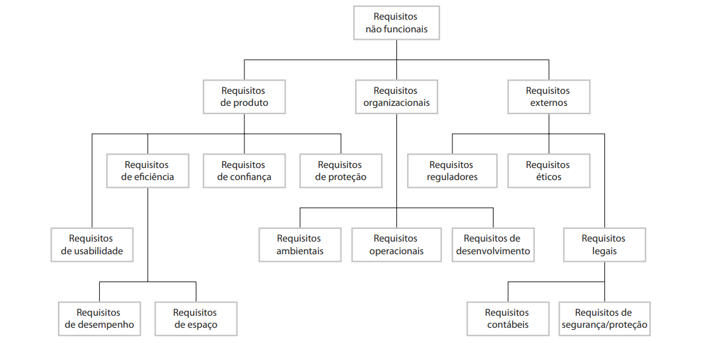
Fonte: Sommerville, 2016

&nbsp;&nbsp;&nbsp;&nbsp;Nessa direção, a seguir serão destacados os os requisitos não funcionais deste projeto de tal forma que todos estejam descritos quantitativamente, possibilitando a testagem de cada um.

Quadro 17 - Template Requisito Não Funcional

| **Código (RNF) + Número** |  |
|--|--|
| **Título** | Título do requisito não funcional |
| **Categoria** | Produto, Organizacional ou Externo |
| **Descrição** | Descrição detalhada do requisito, incluindo formas de medição |
| **Métrica** | Métrica de avaliação do requisito, crucial para testagem |

Fonte: Material produzido pelos autores (2023)

Quadro 18 - Requisito Funcional 1

| RNF01 |  |
|--|--|
| **Título** | **Tempo de atividade dos LEDs** |
| **Categoria** | Produto |
| **Descrição** | O tempo de acendimento do LED deve durar, minimamente, 1 minuto, caso não possa acompanhar o tempo de leitura da tag RFID |
| **Métrica** | Tempo do led aceso por tempo de leitura da tag RFID |

Fonte: Material produzido pelos autores (2023)

Quadro 19 - Requisito Funcional 2

| RNF02 |  |
|--|--|
| **Título** | **Acesso simultâneo de usuários** |
| **Categoria** | Produto |
| **Descrição** | O sistema de *dashboards* deve estar disponível para os colaboradores da Atvos durante as horas normais de trabalho, sendo 24 horas por dia e 7 dias por semana |
| **Métrica** | Tempo de disponibilidade do sistema de *dashboards* |

Fonte: Material produzido pelos autores (2023)

Quadro 20 - Requisito Funcional 3

| RNF03 |  |
|--|--|
| **Título** | **Forma de autenticação no sistema de gerenciamento (*dashboards*)** |
| **Categoria** | Organizacional |
| **Descrição** | Os usuários devem se autenticar no sistema com o e-mail organizacional da Atvos |
| **Métrica** | Credencial de acesso |

Fonte: Material produzido pelos autores (2023)

Quadro 21 - Requisito Funcional 4

| RNF04 |  |
|--|--|
| **Título** | **Controle dos dados**  |
| **Categoria** | Externos |
| **Descrição** | O sistema deve manter uma política de privacidade bem estabelecida adequando o controle dos dados em conformidade com a Lei Geral de Proteção de Dados (LGPD) |
| **Métrica** | Obrigações legais impostas pela LGPD |

Fonte: Material produzido pelos autores (2023)

Quadro 22 - Requisito Funcional 5

| RNF05 |  |
|--|--|
| **Título** | **Disponibilidade de Suporte Técnico**  |
| **Categoria** | Organizacional |
| **Descrição** | Deve haver uma equipe de suporte técnico disponível 24 horas por dia, 7 dias por semana, para lidar com problemas e solicitações de suporte dos usuários. |
| **Métrica** | Tempo médio de resposta da equipe de suporte técnico a solicitações de suporte. |

Fonte: Material produzido pelos autores (2023)

Quadro 23 - Requisito Funcional 6

| RNF06 |  |
|--|--|
| **Título** | **Desempenho do Sistema**  |
| **Categoria** | Produto |
| **Descrição** | O sistema deve ser capaz de processar um grande volume de dados simultaneamente sem afetar o tempo de resposta, garantindo tempos de carregamento rápidos para os usuários. |
| **Métrica** | O sistema deve manter um tempo médio de resposta de menos de 2 segundos, mesmo sob carga máxima. |

Fonte: Material produzido pelos autores (2023)

Quadro 24 - Requisito Funcional 7

| RNF07 |  |
|--|--|
| **Título** | **Tempo de Resposta do Usuário**  |
| **Categoria** | Produto |
| **Descrição** | O tempo de resposta do sistema para eventos de usuário deve ser inferior a 2 segundos. |
| **Métrica** | Tempo médio em segundos para o sistema responder a eventos de usuário. |

Fonte: Material produzido pelos autores (2023)

Quadro 25 - Requisito Funcional 8

| RNF08 |  |
|--|--|
| **Título** | **Tempo de Treinamento**  |
| **Categoria** | Organizacional |
| **Descrição** | O tempo médio necessário para que um novo usuário seja treinado e familiarizado com o sistema deve ser de no máximo 2 horas. |
| **Métrica** | Tempo médio em horas necessário para treinar um novo usuário. |

Fonte: Material produzido pelos autores (2023)

Quadro 26 - Requisito Funcional 9

| RNF09 |  |
|--|--|
| **Título** | **Tempo Médio para Falha**  |
| **Categoria** | Produto |
| **Descrição** | O sistema deve funcionar de forma contínua e estável, com um tempo médio entre falhas (MTBF) de pelo menos 1.000 horas. |
| **Métrica** | Tempo médio em horas entre falhas. |

Fonte: Material produzido pelos autores (2023)

Quadro 26 - Requisito Funcional 10

| RNF10 |  |
|--|--|
| **Título** | **Corrupção de Dados**  |
| **Categoria** | Produto |
| **Descrição** | A probabilidade de corrupção de dados em caso de falha do sistema deve ser inferior a 0,01%. |
| **Métrica** | Probabilidade de corrupção de dados em caso de falha. |

Fonte: Material produzido pelos autores (2023)

Quadro 27 - Requisito Funcional 11

| RNF11 |  |
|--|--|
| **Título** | **Backup e Recuperação de Dados**  |
| **Categoria** | Externo |
| **Descrição** | O sistema deve realizar, a cada 24 horas, backups dos dados e permitir a recuperação rápida em caso de falhas ou perda de dados, garantindo a continuidade do serviço. |
| **Métrica** | O sistema deve ser capaz de recuperar todos os dados em menos de 24 horas após uma falha. |

Fonte: Material produzido pelos autores (2023)

&nbsp;&nbsp;&nbsp;&nbsp;Por fim, os requisitos não funcionais supramencionados destacam as restrições e as especificações técnicas deste projeto, informando, sobretudo, métricas quantitativas para que cada especificação do projeto possa ser testada durante toda a fase de desenvolvimento.

### 3.3.4. Arquitetura da Solução

&nbsp;&nbsp;&nbsp;&nbsp;A solução proposta para a Atvos visa transformar a gestão de insumos e equipamentos por meio da incorporação da tecnologia IoT (*Internet of Things*). A arquitetura é composta por vários componentes interconectados, desde os dispositivos físicos no campo até a interface de usuário, passando por servidores em nuvem e servidores de aplicação. Cada componente desempenha um papel específico para atender aos requisitos funcionais e não funcionais estabelecidos. Nesse viés, a diagramação dessa arquitetura pode ser visualizada na figura a seguir (figura 19). Outrossim, para uma visualização mais detalhada de todas as partes da arquitetura - diagrama, módulo IoT e aplicação web - é recomendada a visualização [deste vídeo](https://youtu.be/iQJ85-MuJJ8).

Figura 19 - Diagrama da Arquitetura da Solução
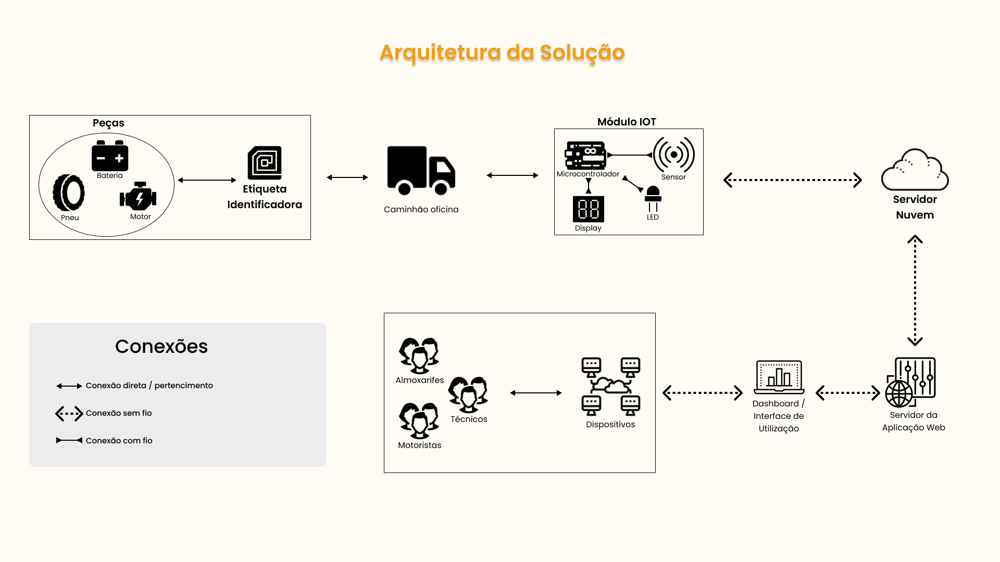
Fonte: Material produzido pelos autores (2023)

&nbsp;&nbsp;&nbsp;&nbsp;A interconexão entre peças, caminhão oficina, módulo IoT, servidores em nuvem e de aplicação web cria uma rede robusta que permite rastreamento preciso, alertas instantâneos e a geração de insights valiosos. A utilização eficiente do MQTT facilita a transmissão de dados entre os dispositivos, garantindo uma comunicação ágil e confiável.

**Componentes da Arquitetura:**

1. **Peças (Bateria, Pneu, Motor):**
   - Conexão Direta/Relacionamento com Tag RFID: Cada peça é identificada por uma etiqueta RFID para rastreamento preciso, permitindo o rastreamento individual das peças ao longo do ciclo operacional.
  
2. **Caminhão Oficina:**
   - Conexão Direta/Relacionamento com as Peças: O caminhão oficina carrega as peças do almoxarifado e possui conexão direta com elas para fins de rastreamento em tempo real, facilitando o transporte de peças e permitindo a atualização em tempo real do inventário no almoxarifado.

3. **Módulo IoT:**
   - Conexões com Fio: Composto por ESP32 (microcontrolador), RFID (sensor), LCD (display) e LEDs (que indicam status do processo).
   - Conexão Direta com Caminhão Oficina: O módulo IoT está conectado diretamente ao caminhão oficina para comunicação eficiente.
   - Serviço MQTT: Envia dados formatados para o servidor em nuvem por meio do broker MQTT na AWS.
   - Coleta dados em tempo real, identifica mudanças de estado e envia informações para o servidor na nuvem.

4. **Servidor em Nuvem:**
   - Broker MQTT na AWS: Recebe e transmite dados do sistema.
   - Conexão Sem Fio com Módulo IoT: Estabelece uma conexão sem fio para receber dados do módulo IoT.
   - Permite comunicação eficiente entre os dispositivos IoT e a aplicação web.
   
5. **Servidor da Aplicação Web:**
   - Acesso Rápido e Seguro: Fornece acesso seguro às informações operacionais.
   - Conexão Sem Fio com Servidor em Nuvem: Recebe dados do servidor em nuvem para exibição na interface web.
   - Facilita o acesso seguro e rápido às informações, gerenciamento de inventário, geração de relatórios e controle de acesso.

6. **Dashboard/Interface de Utilização:**
   - Conexão Sem Fio com Servidor de Aplicação Web: Recebe dados para exibição e interação com o usuário.
   - Oferece uma interface intuitiva para visualização de dados, cadastro de produtos, acompanhamento de chamados e pesquisa de localização de peças.

7. **Dispositivos (Notebooks/Tablets/Mobile):**
   - Interface de Utilização: Possibilita o acesso à solução por meio de conexão sem fio.
   - Permitem acesso remoto à solução, garantindo mobilidade e flexibilidade.
   
8. **Personas (Almoxarifado/Operador de Caminhão/Técnico):**
   - Conexão Sem Fio com Dispositivos: Cada persona se conecta aos dispositivos para interagir com a solução.
   - Diferentes usuários têm diferentes níveis de acesso e interação com a solução, garantindo segurança e controle de acesso.

**Justificativas para Requisitos Funcionais e Não Funcionais:**

**Requisitos Funcionais:**

- Rastreamento de Equipamentos e Alerta de Mudança de Estado:
  - A conexão direta entre peças, caminhão e módulo IoT garante o rastreamento preciso.
  - O MQTT possibilita a transmissão instantânea de alertas sobre mudanças de estado.

- Coleta e Transformação de Dados para MQTT:
  - O módulo IoT coleta dados e os formata para MQTT, assegurando eficiência na comunicação.

- Conexões Wi-Fi e Autenticação:
  - O módulo IoT e os servidores se conectam via Wi-Fi, atendendo aos requisitos de conectividade (conexões sem fio).
  - A autenticação no sistema de gerenciamento é realizada por meio de chaves de identificação.

- Dashboards e Visualizações:
  - Os servidores em nuvem e de aplicação web fornecem dashboards e visualizações para fácil acompanhamento através da conexão entre eles.

- Geração de Relatórios e Registro Automático:
  - Os dados coletados através do sensor serão enviados através da conexão com o servidor da nuvem, permitindo a geração de relatórios.
  - A comunicação entre módulo IoT e caminhão registra automaticamente a devolução de peças.

- Controle de Acesso e Auditoria:
  - A autenticação baseada em funções (RBAC) controla o acesso de acordo com as necessidades da persona.
  - A auditoria de acesso fornece histórico de atividades dos usuários na aplicação web.

**Requisitos Não Funcionais:**
- Tempo de Atividade dos LEDs: 
    - A arquitetura assegura o tempo de atividade necessário para monitoramento eficaz.
- Acesso Simultâneo: 
    - Arquitetura foi projetada para suportar eficientemente múltiplos acessos simultâneos.
- Controle de Dados: 
    - O fluxo dos dados foi estrategicamente estabelecido por conexões sem fio implementadas para garantir a integridade dos dados.
- Autenticação Segura: 
    - Mecanismos robustos de autenticação, como tela de login, garantem segurança no acesso aos dashboards.
- Tempo de Resposta e Treinamento: 
    - A arquitetura é otimizada para garantir tempos de resposta mínimos e um tempo de treinamento reduzido.

  &nbsp;&nbsp;&nbsp;&nbsp;Os requisitos não funcionais, desde o tempo de atividade dos LEDs até o desempenho do sistema e a disponibilidade de suporte técnico, foram considerados e endereçados na arquitetura, assegurando a eficiência operacional e a satisfação do usuário.

  &nbsp;&nbsp;&nbsp;&nbsp;A arquitetura técnica proposta atende as expectativas da Atvos, proporcionando uma solução sólida e inovadora para a gestão de ativos, promovendo eficiência operacional, segurança e tomada de decisões estratégicas embasadas em dados em tempo real.

### 3.3.5. Arquitetura do Protótipo

&nbsp;&nbsp;&nbsp;&nbsp;A solução proposta para a Atvos visa transformar a gestão de insumos e equipamentos por meio da incorporação da tecnologia IoT (*Internet of Things*). Nesse viés, foi desenvolvida, com o intuito de esclarecer o funcionamento do protótipo final, uma arquitetura baseada na visão de tecnologias. A seguir, há tanto a tabela com as tecnologias utilizadas quanto o diagrama da própria arquitetura. Outrossim, para uma visualização mais detalhada de todas as partes da arquitetura (diagrama em blocos) é recomendada a visualização [deste vídeo](https://youtu.be/Vcjnf1mF1bI).

#### Tabela de Componentes
Abaixo, temos a tabela de componentes que lista todas as tecnologias utilizadas e, de forma objetiva, indica a sua função dentro do projeto. 

Quadro 28 - Componentes do Sistema

| **Componente** | **Descrição** | **Tipo** |
|----------------|---------------|----------|
| ESP32 | Microcontrolador para processamento de dados e comunicação | Microcontrolador |
| Sensor RFID-RC522 | Sensor para identificação e rastreamento de peças e insumos | Sensor |
| Tags RFID | Etiquetas para rastreamento de itens | Sensor |
| Display LCD | Exibe informações de rastreamento e status do sistema | Apresentador de Informação |
| Led RGB | Indica o status do sistema e confirmações de operações | Atuador |
| AWS Core IoT | Broker MQTT para gerenciamento de mensagens | Broker |
| Conexão MQTT | Protocolo para comunicação sem fio entre hardware e broker | Conexão |
| Front-end (HTML, CSS, ReactJS, ApexChart JS) | Interface de usuário para visualização de dados | Interface |
| Back-end (NodeJS, AdonisJS) | Gerencia lógica de negócios e processamento de dados | Interface |
| Cliente MQTT (Python) | Facilita subscrição e publicação no broker MQTT | Cliente |
| PostgreSQL | Banco de dados para armazenamento de dados coletados | Banco de Dados |
| ElephantSQL | serviço de hospedagem de banco de dados PostgreSQL totalmente gerenciado | Banco de Dados |

Fonte: Material produzido pelos autores (2023)

#### Arquitetura - Visão de Tecnologias

&nbsp;&nbsp;&nbsp;&nbsp;A arquitetura do sistema IoT para gerenciamento de peças em oficinas móveis revela uma fusão sofisticada entre software e hardware, projetada para atender às demandas específicas de técnicos do cubo, almoxarifes e motoristas. Este ecossistema inovador é meticulosamente construído sobre uma base tecnológica diversificada, incorporando desde ambientes de desenvolvimento, como o Visual Studio Code e Arduino IDE, até frameworks robustos, como ReactJS e NodeJS. A coesão entre os elementos do software, como PostgreSQL, ElephantSQL, e AWS Core IoT, e os componentes de hardware, incluindo Esp32, sensores RFID, displays LCD e LEDs RGB, cria uma solução abrangente e intuitiva. Vamos explorar mais detalhadamente cada faceta dessa arquitetura, desde as linguagens de programação até a comunicação MQTT, desvendando como cada elemento contribui para a eficiência operacional e a experiência do usuário no ambiente dinâmico de oficinas móveis.

Figura 20 - Diagrama em Blocos
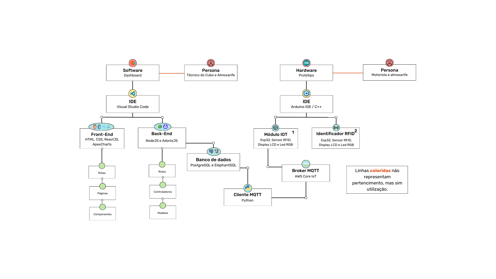
Fonte: Material produzido pelos autores (2023)

**Software (Utilização: Técnico do Cubo e Almoxarife):**

1. **IDE: VSCode**
   - *Descrição:* O Visual Studio Code (VSCode) é uma poderosa e extensível IDE utilizada para o desenvolvimento de software. Oferece recursos avançados, como realce de sintaxe, depuração e integração com sistemas de controle de versão.
   - *Função:* Permite a codificação eficiente e o gerenciamento de projetos relacionados ao software do sistema IoT.

2. **Front-end: ReactJS, HTML, CSS e ApexChartJS**
   - *Descrição:* O ReactJS é uma biblioteca JavaScript para construção de interfaces de usuário interativas. HTML e CSS são linguagens padrão para marcação e estilo web, enquanto o ApexChartJS é uma biblioteca para a criação de gráficos interativos.
   - *Função:* Desenvolve a interface do usuário do sistema IoT, proporcionando uma experiência amigável e informativa.
   
3. **Back-end: NodeJS e ExpressJS**

- *Descrição:* NodeJS é um ambiente de execução JavaScript assíncrono e ExpressJS é um framework web para NodeJS, simplificando o desenvolvimento de aplicativos web.
- *Função:* Controla a lógica de negócios, gerenciamento de rotas e interação com o banco de dados, garantindo uma comunicação eficiente entre o front-end e o hardware do sistema.

4. **Banco de Dados: PostgreSQL**
   - *Descrição:* O PostgreSQL é um sistema de gerenciamento de banco de dados relacional de código aberto, conhecido por sua confiabilidade e recursos avançados.
   - *Função:* Armazena dados importantes, como registros de operadores, peças e eventos do sistema.

5. **Servidor de Banco de Dados: ElephantSQL**
   - *Descrição:* ElephantSQL é um serviço de hospedagem de banco de dados PostgreSQL baseado em nuvem, simplificando a administração do banco de dados.
   - *Função:* Gerencia e hospeda o banco de dados PostgreSQL, garantindo acesso eficiente e seguro aos dados.

6. **Cliente MQTT: Python**
   - *Descrição:* Python é uma linguagem de programação de alto nível, e neste contexto, é utilizado como cliente MQTT para troca de mensagens.
   - *Função:* Facilita a comunicação entre o back-end e o broker MQTT, permitindo o envio e recebimento de mensagens para coordenação eficiente entre os componentes do sistema.

7. **Broker MQTT: AWS Core IoT (Conectado ao Módulo IoT)**
   - *Descrição:* O AWS Core IoT é um serviço da Amazon Web Services que facilita a comunicação entre dispositivos IoT de maneira segura e escalável.
   - *Função:* Gerencia a troca de mensagens entre os dispositivos de hardware (Esp32, Sensor RFID, Display LCD e LED RGB) e o back-end, garantindo uma comunicação confiável e segura.

**Hardware (Persona: Motorista e Almoxarife):**

1. **IDE: Arduino IDE**
   - *Descrição:* Arduino IDE é um ambiente de desenvolvimento integrado utilizado para programar os microcontroladores Arduino, como o Esp32.
   - *Função:* Permite a programação eficiente dos microcontroladores, definindo seu comportamento e interação com os demais componentes.

2. **Linguagem: C++**
   - *Descrição:* C++ é a linguagem de programação utilizada para programar o Esp32 e demais componentes do hardware.
   - *Função:* Define a lógica de operação dos microcontroladores, incluindo o processamento de dados dos sensores, controle dos LEDs RGB e interação com o sistema.

3. **Módulo IoT e Identificador RFID: Esp32, Sensor RFID, Display LCD e LED RGB**

**3.1. Esp32:**
   - *Descrição:* O Esp32 é um microcontrolador de baixo custo que combina conectividade WiFi e Bluetooth. Ele possui uma ampla gama de recursos, incluindo processador dual-core, memória flash, periféricos de E/S e suporte para protocolos de comunicação sem fio.
   - *Função:* O Esp32 atua como o cérebro do sistema IoT, controlando e coordenando as operações desde a ativação até o registro de operadores e peças. Ele gerencia a comunicação com outros componentes, como sensores RFID e displays LCD, além de fornecer conectividade sem fio para comunicação com o back-end.

**3.2. Sensor RFID:**
   - *Descrição:* O sensor RFID (Radio-Frequency Identification) é um dispositivo que utiliza tecnologia de radiofrequência para identificar tags RFID. As tags podem conter informações únicas que são lidas pelo sensor sem a necessidade de contato físico.
   - *Função:* O sensor RFID desempenha um papel crucial na identificação de operadores e peças. Ao ler as tags RFID, ele fornece dados que são processados pelo Esp32, permitindo o registro preciso de informações no sistema.

**3.3. Display LCD:**
   - *Descrição:* O Display LCD (Liquid Crystal Display) é um componente de saída que exibe informações visualmente por meio de pixels controlados eletronicamente. Pode exibir texto, gráficos e outras formas de informação.
   - *Função:* O display LCD tem a função de fornecer feedback visual durante o processo de registro. Ele exibe mensagens informativas para orientar o operador, como instruções para aproximar a tag RFID ou notificações de sucesso ou erro após o registro de operadores e peças.

**3.4. LED RGB:**
   - *Descrição:* Um LED RGB (Light Emitting Diode - Red, Green, Blue) é um dispositivo de iluminação que pode emitir luz em diferentes cores, dependendo do controle das intensidades de luz nas cores vermelha, verde e azul.
   - *Função:* Os LEDs RGB são utilizados para sinalizar visualmente o estado do sistema. Eles indicam diferentes estados, como a prontidão do sistema (azul), sucesso de registro (verde), falha no registro (laranja) e aguardo durante processamento (amarelo), fornecendo feedback instantâneo ao operador sobre o status do sistema.

**Conexões:**

1. *Conexões do Software:*
   - A comunicação entre o Front-end (ReactJS, HTML, CSS e ApexChartJS) e o Back-end (NodeJS e ExpressJS) ocorre por meio de solicitações HTTP, seguindo o modelo de desenvolvimento web RESTful.
   - O Back-end estabelece uma conexão com o Banco de Dados PostgreSQL hospedado no ElephantSQL para armazenar e recuperar dados de maneira eficiente.
   - O Cliente MQTT em Python comunica-se com o Broker MQTT AWS Core IoT para troca de mensagens assíncronas, facilitando a coordenação entre o software e o hardware.

2. *Conexões do Hardware:*
   - O Esp32, como módulo IoT, estabelece conexões com o Sensor RFID, Display LCD e LEDs RGB para controlar suas operações.
   - O Identificador RFID utiliza o Esp32 para ler dados do Sensor RFID, processar informações e acionar o Display LCD e LEDs RGB de acordo com o status do processo.
   - Conexões com fio, como barramentos de dados e energia, conectam os componentes do hardware, garantindo uma comunicação estável e confiável entre eles.
   - Conexões sem fio, como Wi-Fi, são estabelecidas entre o Esp32 e o Broker MQTT na AWS, permitindo a integração do hardware com o sistema back-end.

3. *Conexões Integradas:*
   - O Broker MQTT AWS Core IoT é central na comunicação, conectando o Cliente MQTT Python do software ao Módulo IoT (Esp32) no hardware. Isso possibilita a troca eficiente de mensagens entre as camadas de software e hardware.
   - A integração do Front-end com o Back-end é garantida por meio das rotas, páginas e componentes no ReactJS, estabelecendo uma interface coesa e responsiva para os usuários.

&nbsp;&nbsp;&nbsp;&nbsp;A arquitetura do sistema IoT para gerenciamento de peças em oficinas móveis é uma integração complexa de tecnologias, unindo eficientemente o mundo do software e do hardware. Ao adotar ferramentas como VSCode, PostgreSQL, ReactJS, Esp32 e AWS Core IoT, o sistema oferece uma solução robusta e intuitiva, atendendo às necessidades diversas das personas envolvidas no processo. A colaboração entre o software e o hardware resulta em uma experiência de usuário eficiente e confiável, simplificando as operações cotidianas em oficinas móveis.

### 3.3.6. Arquitetura Refinada da Solução

&nbsp;&nbsp;&nbsp;&nbsp;Após revisar cuidadosamente a arquitetura da solução e os diagramas apresentados, observou-se que não foram solicitadas mudanças pelos instrutores e orientadores nas sprints anteriores. A estrutura arquitetônica original continua a atender de maneira eficaz aos requisitos funcionais e não funcionais estabelecidos inicialmente.

&nbsp;&nbsp;&nbsp;&nbsp;Nenhuma recomendação para ajustes ou modificações foi levantada, indicando que a arquitetura existente permanece alinhada com os objetivos do projeto. Portanto, não foram realizadas alterações, e esta seção serve como evidência de que a arquitetura revisada mantém-se consistente com as diretrizes previamente estabelecidas.

## 3.4. Resultados	

### 3.4.1.Protótipo Inicial do Projeto

&nbsp;&nbsp;&nbsp;&nbsp;Para atender às metas estabelecidas pela Atvos, nossa proposta de solução visa revolucionar a forma como a empresa gerencia seus insumos e equipamentos. Incorporando tecnologia IoT, desenvolvemos uma solução abrangente que oferece monitoramento em tempo real ao longo de todo o ciclo operacional. Um componente essencial dessa solução é uma plataforma em nuvem, que processa, armazena e disponibiliza informações de maneira intuitiva para os gestores.

&nbsp;&nbsp;&nbsp;&nbsp;A fim de validar a eficácia e a funcionalidade da nossa solução, conduzimos uma série de testes representativos dos cenários operacionais da Atvos. A tabela a seguir detalha esses testes, apresentando os diferentes cenários, ações do usuário/equipamento, respostas esperadas, indicadores de status e descrições detalhadas. Esses testes têm como objetivo garantir que nossa solução atenda plenamente aos requisitos, proporcionando à Atvos uma gestão mais eficiente, segura e orientada por dados. Cada entrada na tabela representa um passo significativo na validação da implementação, contribuindo para a confiabilidade e desempenho da solução proposta.

| **#** | **Bloco** | **Componente de entrada** | **Leitura da entrada** | **Componente de saída** | **Leitura da saída** | **Descrição** |
|----------|----------|----------|----------|----------|----------|----------|
| 01 | RFID-RC522 | Aproximando tag RFID do sensor RFID-RC522 | RFID Detectado: fc886449 | LED Verde aceso, LED Vermelho apagado | LEDs fixos | Quando uma tag RFID é aproximada do sensor RFID-RC522, ele lê o UID e acende o LED Verde, apagando o LED Vermelho. |
| 02 | RFID-RC522 | Afastando tag RFID do sensor RFID-RC522 | Nenhum RFID detectado. | LED Vermelho aceso, LED Verde apagado | LEDs fixos | Quando uma tag RFID é afastada do sensor RFID-RC522, ele indica que nenhum RFID foi detectado, acendendo o LED Vermelho e apagando o LED Verde. |
| 03 | RFID-RC522 | Aproximando cartão RFID 1 do sensor RFID-RC522 | RFID Detectado: a3a6b81a | LED Verde aceso, LED Vermelho apagado | LEDs fixos | Quando um cartão RFID é aproximado do sensor RFID-RC522, ele lê o UID e acende o LED Verde, apagando o LED Vermelho. |
| 04 | RFID-RC522 | Afastando cartão RFID 1 do sensor RFID-RC522 | Nenhum RFID detectado. | LED Vermelho aceso, LED Verde apagado | LEDs fixos | Quando um cartão RFID é afastado do sensor RFID-RC522, ele indica que nenhum RFID foi detectado, acendendo o LED Vermelho e apagando o LED Verde. |
| 05 | RFID-RC522 | Aproximando cartão RFID 2 do sensor RFID-RC52 | RFID Detectado: 43682819 | LED Verde aceso, LED Vermelho apagado | LEDs fixos | Quando um cartão RFID é aproximado do sensor RFID-RC522, ele lê o UID e acende o LED Verde, apagando o LED Vermelho. |
| 06 | RFID-RC522 | Afastando cartão RFID 2 do sensor RFID-RC522 | Nenhum RFID detectado. | LED Vermelho aceso, LED Verde apagado | LEDs fixos | Quando um cartão RFID é afastado do sensor RFID-RC522, ele indica que nenhum RFID foi detectado, acendendo o LED Vermelho e apagando o LED Verde. |
| 07 | RFID-RC522 | Aproximando cartão RFID 3 do sensor RFID-RC52 | RFID Detectado: b3f0b61a | LED Verde aceso, LED Vermelho apagado | LEDs fixos | Quando um cartão RFID é aproximado do sensor RFID-RC522, ele lê o UID e acende o LED Verde, apagando o LED Vermelho. |
| 08 | RFID-RC522 | Afastando cartão RFID 3 do sensor RFID-RC522 | Nenhum RFID detectado. | LED Vermelho aceso, LED Verde apagado | LEDs fixos | Quando um cartão RFID é afastado do sensor RFID-RC522, ele indica que nenhum RFID foi detectado, acendendo o LED Vermelho e apagando o LED Verde. |

[Vídeo do Protótipo](https://youtube.com/shorts/Wh7VeTn19so?feature=share).

&nbsp;&nbsp;&nbsp;&nbsp;No vídeo, é apresentado de forma visual a interação do usuário/equipamento com a solução, destacando momentos-chave, como a ativação do equipamento IoT, o envio de dados para a plataforma em nuvem e as respostas esperadas em diferentes cenários operacionais. Além disso, o vídeo serve como um complemento essencial à tabela de testes, proporcionando uma compreensão mais holística da solução em ação.

### 3.4.2. Protótipo Físico do Projeto

&nbsp;&nbsp;&nbsp;&nbsp;A partir da validação do protótipo inicial, foi possível avançar para a próxima etapa do projeto, que consiste na implementação de um protótipo físico, com o objetivo de testar a integração entre os componentes.

&nbsp;&nbsp;&nbsp;&nbsp;Nesse viés, para viabilizar o funcionamento do protótipo, está sendo utilizado um banco de dados PostgreSQL hospedado na plataforma ElephantSQL, proporcionando um ambiente de armazenamento confiável e escalável. Paralelamente, foi desenvolvido um *broker* MQTT na AWS, encarregado de receber e transmitir os dados do sistema.

&nbsp;&nbsp;&nbsp;&nbsp;O banco de dados PostgreSQL, hospedado na plataforma [ElephantSQL](https://www.elephantsql.com/), desempenha um papel fundamental como repositório de informações críticas para o funcionamento do sistema. Ele armazena dados essenciais para a rastreabilidade e monitoramento de peças, insumos e informações de usuários, garantindo a precisão e integridade das informações. Essa estrutura permite o acesso rápido e seguro às informações relevantes para a operação do projeto, facilitando a obtenção de dados históricos, o gerenciamento de inventário e a identificação de padrões para tomada de decisões estratégicas.

&nbsp;&nbsp;&nbsp;&nbsp;Por outro lado, o *broker* MQTT na AWS atua como uma infraestrutura de comunicação, permitindo a troca eficiente e em tempo real de dados entre os dispositivos IoT e a aplicação web. Ele viabiliza a transmissão bidirecional dos dados coletados pelos dispositivos, possibilitando o monitoramento contínuo e a atualização em tempo real das informações na interface do usuário. Além disso, o *broker* MQTT assegura a comunicação segura e confiável entre os dispositivos e a aplicação web, garantindo a entrega e recebimento de dados precisos e oportunos, fundamentais para a operacionalização e funcionamento do sistema.

&nbsp;&nbsp;&nbsp;&nbsp;Para facilitar o entendimento acerca das funcionalidades do protótipo, a tabela a seguir elucida os cenários de testes considerados nessa etapa, de modo a detalhar a descrição, as pré-condições, os procedimentos de teste realizados, as pós-condições e algumas observações para cada teste. Os cenários de teste elaborados visam assegurar o pleno funcionamento e desempenho do sistema, abrangendo desde a conexão do microcontrolador ESP32 à rede Wi-Fi até a leitura e identificação de tags RFID.

**#** | **Descrição** | **Pré-condição** | **Procedimento de teste** | **Pós-condição** | **Observações**
|----------|----------|----------|----------|----------|----------|
|01| Conexão estabelecida com o Wi-fi, por meio do microcontrolador ESP32 | O microcontrolador precisa ter acesso a uma rede de Wi-Fi cuja senha e o nome da rede já estão previamente configurados. O LED RGB precisa estar acesa com a cor amarela. | O teste de conexão é realizado até que a conexão seja estabelecida | Caso a conexão seja estabelecida, a mensagem: **"Conecte sua credencial"** é exibida no display LCD e o LED acende na **cor azul**. | Enquanto o teste de conexão é realizado, a mensagem **"Acessando a rede Aguarde..."** é exibida |
|02| Conexão com o Wi-fi não estabelecida, por erros de sinal, credenciais ou qualquer outra interferência (como a ausência de uma antena). | O microcontrolador ESP32 precisa ter acesso a uma rede de Wi-Fi cuja senha e o nome da rede já estão previamente configurados. O LED RGB precisa estar acesa com a cor amarela. | O teste de conexão é realizado e, por algum erro de rede, sinal ou de configurações de credenciais da rede, a conexão não é estabelecida. | O display LCD informa: **"Acessando a rede Aguarde...**" e tenta novamente, mantendo o LED na cor amarela | |
|03| Leitura de tag RFID de **usuário existente** | É necessária uma tag RFID pré-cadastrada no banco de dados. O LED RGB precisa estar na cor azul. | Sensor RFID-RC522 realiza a leitura da tag vinculada ao cartão do usuário e busca no banco de dados se há algum cadastro com aquele RFID | A mensagem **"Bem vindo(a) (nome)"** é exibida, bem como o LED RGB muda para a cor verde e, após 2 segundos, para a cor vermelha, indicando a próxima etapa (cenário 5) | Quando o envio é realizado, o display LCD mostra: **"Credencial Enviada"** e, logo em seguida, **"Aguardando servidor..."**. Em ambos os casos, o LED fica aceso na cor amarela |
|04| Leitura de tag RFID de **usuário não existente** | É necessário que uma tag RFID não cadastrada no banco de dados seja aproximada do sensor RFID-RC522. O LED RGB precisa estar na cor azul. | Sensor realiza a leitura da tag vinculada ao cartão do usuário e busca no banco de dados se há algum cadastro com aquele RFID | A mensagem **"Credencial sem registro"** é exibida, mantendo o LED na cor azul | Quando o envio é realizado, o display LCD mostra: **"Credencial Enviada"** e, logo em seguida, **"Aguardando servidor..."** |
|05| Leitura de tag RFID de **item (peça) cadastrada** | Uma tag com um RFID cadastrado no banco de dados deve ser aproximada do sensor RFID-RC522, de modo que seja identificada e vinculada ao usuário que a identificou (caso de teste 3). O LED RGB precisa estar na cor vermelha. | Sensor realiza a leitura do RFID vinculado à peça aproximada e busca no banco de dados se há algum cadastro coerente | A mensagem **"(item) registrado(a)"** é exibida, com o auxílio da cor verde do LED | Antes da peça ser aproximada, a mensagem **"Aproxime a TAG do item"** é exibida no display e, logo em seguida, a mensagem **"Identificador enviado"** é exibida |
|06| Leitura de tag RFID de **item (peça) não cadastrada** | Uma tag com um RFID não cadastrado no banco de dados deve ser aproximada do sensor RFID-RC522, de modo que não possa ser identificada e vinculada ao usuário que a identificou. O LED RGB precisa estar na cor vermelha. | Sensor realiza a leitura do RFID vinculado à peça aproximada e busca no banco de dados se há algum cadastro coerente, de modo que não consegue encontrar nenhuma correlação com os dados do banco de dados | A mensagem **"Item sem registro"** é exibida, com o auxílio da cor laranja do LED | Antes da peça ser aproximada, a mensagem **"Aproxime a TAG do item"** é exibida no display e, logo em seguida, a mensagem **"Identificador enviado"** é exibida |
|07| Preenchimento de Tabela no Google Sheets via API do Google e Protocolo MQTT | O sistema está operacional, com o *broker* MQTT devidamente configurado e funcionando, assim como a conexão com a API do Google ativa e corretamente autenticada | Os dados coletados são formatados conforme as especificações da API do Google Sheets. O dispositivo envia os dados formatados utilizando o protocolo MQTT para o *broker* configurado na AWS. O *broker* recebe os dados enviados e os encaminha para a API do Google Sheets. A API do Google Sheets processa os dados recebidos e popula a tabela específica no documento designado, inserindo as informações em suas respectivas colunas. | A tabela no Google Sheets é atualizada com sucesso, refletindo as informações enviadas pelo dispositivo via MQTT, validando a integração entre a API do Google e o *broker* MQTT. | É essencial garantir que a formatação dos dados seja compatível com a estrutura da tabela no Google Sheets e que as permissões de escrita na planilha estejam corretamente configuradas para a API do Google. Além disso, verificações de conectividade e autenticação devem ser realizadas para garantir a transmissão e o registro adequado dos dados. |

&nbsp;&nbsp;&nbsp;&nbsp;A título de esclarecimento, no caso de um usuário cadastrado no banco de dados, cujo nome é Bruno e o RFID vinculado ao seu cartão de identificação é "fc886449" (conforme figura 21), se identificar no sistema IoT, aproximando o seu cartão do sensor, a mensagem **"Bem vindo Bruno"** deve ser exibida para o usuário, desde que o usuário tenha conexão com a internet (cenários 1 e 2) e esteja devidamente cadastrado e autorizado (cenários 3 e 4).

Figura 21 - Registro do usuário de teste (Bruno) no banco de dados
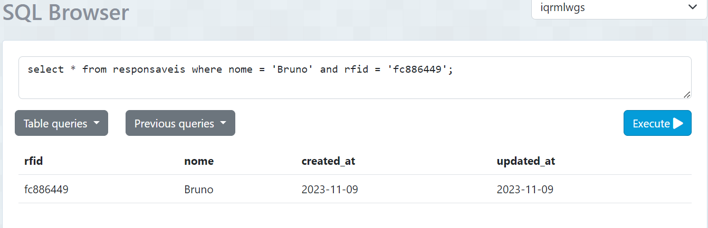
Fonte: Material produzido pelos autores (2023)

&nbsp;&nbsp;&nbsp;&nbsp;Nessa direção, caso o Bruno aproximasse uma peça com um RFID não registrado no banco de dados, a mensagem **"Item sem registro"** deve ser exibida. No entanto, se for uma pela cadastrada, supondo que seja, por exemplo, uma bateria, a mensagem deve ser **"Bateria registrado(a):"**. Ao aceitar a leitura, o servidor enviaria os dados para a planilha no Google Sheets, informando a data, a hora, o RFID e o tipo da peça lida pelo sensor.

&nbsp;&nbsp;&nbsp;&nbsp;A integração de cenários de testes no protótipo físico do projeto revela a funcionalidade e a resposta do sistema IoT a diversas situações. No caso específico do usuário Bruno, a interação bem-sucedida exibiria a mensagem de boas-vindas, demonstrando a correta identificação no sistema. A sinalização de peças registradas e não registradas, como a bateria, é crucial para a rastreabilidade e o controle do estoque. A conexão direta com o Google Sheets, por meio do *broker* MQTT, adiciona um passo importante para a documentação e o armazenamento de dados, demonstrando a funcionalidade prática do sistema. Este tipo de visualização dos cenários reforça a importância do protótipo, onde cada ação do usuário e resposta do sistema é testada e validada, permitindo a simulação de situações reais e garantindo a eficiência do projeto.

&nbsp;&nbsp;&nbsp;&nbsp;Para uma demonstração mais detalhada desses cenários, foi gravado um vídeo demonstrativo do protótipo físico do projeto, disponível publicamente neste [link](https://youtube.com/shorts/Oem9aMJOQh8).

### 3.4.3. Protótipo do Projeto com MQTT e I2C 

&nbsp;&nbsp;&nbsp;&nbsp;A priori, durante a terceira sprint do desenvolvimento deste projeto, o protótipo foi melhorado, tanto do ponto de vista das características físicas quanto das características online do sistema. Posto isso, tais mudanças refletem o amadurecimento do protótipo com a comunicação via protocolo MQTT (o qual será abordado posteriormente), bem como a adição de display LCD com protocolo I2C (abordado na sequência), desenvolvimento de um sistema web para visualização dos dados de forma agradável e a construção de um cliente MQTT para o preenchimento de uma tabela no Google Sheets e para consultas no banco de dados.

&nbsp;&nbsp;&nbsp;&nbsp;Nesse sentido, o display LCD com protocolo I2C foi adicionado ao protótipo com o objetivo de exibir informações relevantes para o usuário, como o status da conexão com a internet, o status da conexão com o *broker* MQTT, o status da conexão com a API do Google Sheets, o status da conexão com o banco de dados, o status da conexão com o servidor web, entre outros. Sendo assim, o protocolo I2C (*Inter-Integrated Circuit*) é um protocolo de comunicação serial síncrono que permite a troca de dados entre dispositivos eletrônicos. Ele é amplamente utilizado para conectar periféricos de baixa velocidade, como sensores, atuadores e displays LCD, a um microcontrolador ou microprocessador. No contexto do projeto, tal protocolo serviu para a conexão do display LCD com o microcontrolador ESP32.

&nbsp;&nbsp;&nbsp;&nbsp;Ainda, o protocolo MQTT (*Message Queuing Telemetry Transport*) é um protocolo de comunicação leve, **projetado para conectar dispositivos IoT a aplicativos em nuvem**. Ele é baseado no padrão de publicação/assinatura, no qual os dispositivos publicam mensagens em tópicos específicos e os aplicativos se inscrevem nesses tópicos para receber as mensagens. No contexto do projeto, o protocolo MQTT foi utilizado para a comunicação entre o microcontrolador ESP32 e o *broker* MQTT, que, por sua vez, encaminha as mensagens para a API do Google Sheets e para o servidor web.

&nbsp;&nbsp;&nbsp;&nbsp;Por conseguinte, o sistema web foi desenvolvido com o objetivo de visualizar os dados coletados pelo microcontrolador ESP32, de forma agradável e intuitiva. Para isso, até o presente momento, foi utilizado o framework ReactJS, que é uma biblioteca JavaScript de código aberto, utilizada para criar interfaces de usuário em páginas web. Nas etapas seguintes, o back-end do sistema será desenvolvimento por meio do framework Node.js, um ambiente de execução de códigos JavaScript, e Express.js, uma camada construída sobre o Node.JS que ajuda a gerenciar rotas, middleware, mecanismos de modelo e servidores de arquivos estáticos.

&nbsp;&nbsp;&nbsp;&nbsp;Ademais, para ampliar o entendimento dos avanços supracitados, abaixo segue uma tabela que elucida casos de testes (bem como os tópicos 3.4.1 e 3.4.2) do protótipo atual, destacando, sobretudo, a comunicação I2C e MQTT, tendo em vista que o sistema web será finalizado na sprint 4 (tópico seguinte, 3.4.4).

**#** | **Configuração do ambiente** | **Ação do usuário** | **Resposta esperada do sistema** 
|----------|----------|----------|----------|
| 01 | O protótipo físico precisa possuir acesso à rede de internet do usuário, bem como precisa conter: um display LCD, uma antena para conexão wi-fi e uma fonte de alimentação | Usuário liga a chave que inicia o circuito, concedendo energia ao microcontrolador | O microcontrolador se conecta à rede de internet do usuário e, enquanto tenta se conectar, informa no display LCD **"Acessando a rede Aguarde..."**. |
| 02 | O cliente MQTT - o qual fica "escutando" as transações de de informações - precisa estar em execução, de modo que consiga ter acesso (via wi-fi) ao *broker* MQTT | Administrador inicia o cliente MQTT, rodando ou configurando a execução irrestrita do cliente Python | O cliente se conecta à internet e, por meio de bibliotecas auxiliares, escuta as comunicações vindas dos sensores RFID para, futuramente, realizar consultas no banco de dados e preencher tabelas no Google Sheets |
| 03 | O banco de dados deve estar disponível irrestritamente para consultas SQL, o cliente MQTT precisa estar em execução e ambos precisam ter acesso à internet | Usuário executa uma ação que transmita dados (aproximação de tags RFID) | O cliente e o banco de dados se comunicam via consultas SQL para buscar informações, fazer validações e, até mesmo, cadastrar dados - a depender da ação executada pelo usuário |
| 04 | O protótipo físico precisa possuir um sensor RFID para a leitura de TAGs RFID dos **cartões de identificação de usuário** | Usuário insere um cartão com uma determinada tag RFID para ser identificado no sistema | O sensor realiza a leitura do cartão e, em sequência, envia os dados para o *broker* MQTT que, por sua vez, com o auxílio do cliente MQTT, busca o usuário no banco de dados, permitindo o acesso. Nesse ponto, o display LCD deve exibir: **"Bem-vindo(a) [Nome do usuário]"** |
| 05 | O protótipo físico precisa possuir um sensor RFID para a leitura de TAGS dos **cartões de identificação de peças** | Usuário aproxima uma peça (bateria, motor ou pneu) com uma determinada tag RFID para ser registrada sob sua responsabilidade | O sensor realiza a leitura da tag e, em sequência, envia os dados para o *broker* MQTT que, por sua vez, com o auxílio do cliente MQTT, busca a peça no banco de dados, registando-a sob a responsabilidade do usuário previamente autorizado. Nesse ponto, o display LCD deve mostrar **"Bateria/Pneu/Motor registrado(a)"** e, em seguida, informar que outra peça pode ser inserida. |
| 06 | Protótipo previamente conectado à internet e com todos os componentes necessários (todos os casos anteriores) | Usuário não autorizado insere cartão com tag RFID no sensor do protótipo | O sensor realiza a leitura do cartão e, em sequência, envia os dados para o *broker* MQTT que, por sua vez, com o auxílio do cliente MQTT, busca o usuário no banco de dados, negando o acesso por falta de permissão ou por não localizar o usuário. Nesse ponto, o display deve mostrar: **"Usuário não autorizado"** |

&nbsp;&nbsp;&nbsp;&nbsp;Nesse sentido, para facilitar a disposição de cabos de conexões, da fonte de alimentação, do LED RGB, da antena de conexão com wi-fi, do microcontrolador ESP32 e do sensor de RFID, o grupo produziu, em conjunto com a área técnica do Inteli, uma caixa personalizada para armazenar todos esses componentes, justamente para melhorar a experiência do parceiro (a Atvos) nas demonstrações de utilização do protótipo. Sendo assim, a figura abaixo (figura 22) exibe tal caixa com todos os componentes e um cartão simulando uma bateria.

Figura 22 - Protótipo físico na caixa personalizada
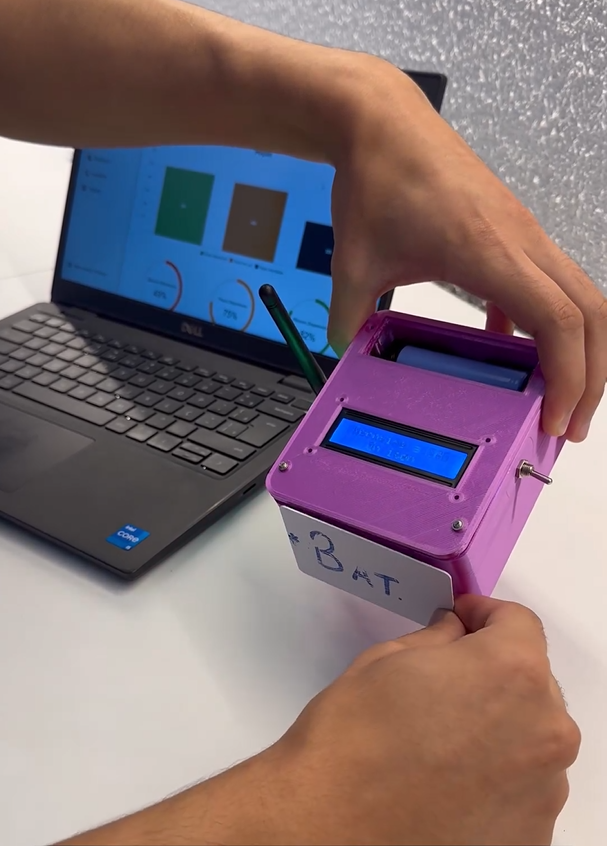
Fonte: Material produzido pelos autores (2023)

&nbsp;&nbsp;&nbsp;&nbsp;Além disso, para ressaltar o funcionamento do projeto, o vídeo a seguir foi gravado em parceria com a área de marketing do Inteli, com o intuito de demonstrar o uso do protótipo já com a sua "forma final" - na caixa supracitada. 

<video width="100%" height="300px" controls>
  <source src="../assets/video-prototipo.mp4" type="video/mp4">
</video>

Caso a reprodução acima falhe, o vídeo pode ser acessado clicando <a href="https://github.com/2023M4T10Inteli/grupo5/assets/86068797/d66cfe9d-e0c6-4f07-8e30-a8fc62b6cb38">aqui</a>

&nbsp;&nbsp;&nbsp;&nbsp;Destarte, para facilitar o entendimento dos componentes utilizados no protótipo demonstrado acima (através da imagem e do vídeo), a tabela a seguir elucida cada componente e sua responsabilidade no sistema.

**Nome** | **Função** |
|----------|----------|
| **Display LCD** | Por meio do protocolo I2C, o display mostra mensagens de forma simplificada aos usuários, visando a informação do status do sistema, como conexões sendo realizadas, acesso autorizado, registro de peças, entre outros. |
| **Bateria** | Fonte de alimentação para o microcontrolador. |
| **Interruptor** | Responsável por ligar ou desligar o sistema IoT. |
| **LED RGB** | Auxílio visual para o display LCD - cada cor significa uma mensagem (vide tópico 3.4.2 para o detalhamento de cada cor) |
| **Fios Jumper** | Conectam todos os componentes - desde o LED até o sensor RFID - com o microcontrolador ESP32 |
| **Sensor RFID** | Realiza a leitura de tags RFID e transmite tais informações para os devidos servidores, com o auxílio do microcontrolador. |

&nbsp;&nbsp;&nbsp;&nbsp;No que tange ao cliente MQTT citado no decorrer deste tópico, este foi desenvolvido por meio da linguagem de programação python, de modo que tal cliente tem a responsabilidade de estabelecer uma conexão segura com um servidor AWS - o *broker* MQTT. Esse servidor AWS gerencia a comunicação entre os dispositivos IoT, como o sensor de RFID, e permite a troca de mensagens entre eles. A figura abaixo (figura 23) exibe um trecho do código criado (disponível na pasta de códigos do repositório deste projeto - src/API/AlmoxarifadoAPÍ.ipynb).

Figura 23 - Cliente MQTT
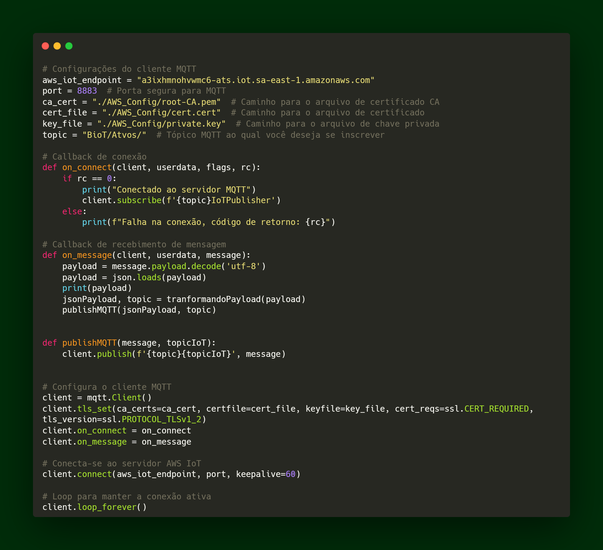
Fonte: Material produzido pelos autores (2023)

&nbsp;&nbsp;&nbsp;&nbsp;A configuração do cliente MQTT inclui informações como o endpoint do servidor AWS IoT, a porta segura para comunicação MQTT, e os certificados necessários para garantir a segurança na transmissão de dados. Além disso, o cliente está preparado para subscrever-se a um tópico específico, que é uma espécie de canal de comunicação no modelo MQTT. Quando conectado, o cliente aguarda mensagens neste tópico e executa ações específicas quando mensagens são recebidas.

&nbsp;&nbsp;&nbsp;&nbsp;Por fim, o código inclui funcionalidades relacionadas ao Google Sheets, como a adição de valores a uma planilha e a avaliação de consultas - data e hora de leituras das tags RFID. Essa integração permite a interação entre dados IoT e uma planilha online, proporcionando uma maneira de armazenar e analisar informações geradas pelos dispositivos IoT.

### 3.4.4. Protótipo Físico do Projeto (online)

&nbsp;&nbsp;&nbsp;&nbsp;A elaboração de um Diagrama de Modelagem Unificada (UML), ou Unified Modeling Language em inglês, é um processo de fundamental importância no desenvolvimento de software. Essa prática consiste em utilizar uma linguagem visual padronizada para projetar e documentar sistemas, abrangendo tanto os aspectos estruturais quanto os comportamentais, segundo o site "Lucidchart - O que é um diagrama UML?". A UML oferece uma notação gráfica que possibilita a representação clara e abrangente de diversos elementos de um sistema, tais como classes, objetos, componentes, relações e processos.

&nbsp;&nbsp;&nbsp;&nbsp;É importante ressaltar que a aplicabilidade da UML não se restringe a uma única fase do ciclo de vida do software, estendendo-se desde a concepção inicial até a implementação, testes e manutenção. Em cada etapa, os diagramas UML fornecem uma documentação visual que auxilia na análise, projeto e comunicação efetiva entre as partes interessadas.

&nbsp;&nbsp;&nbsp;&nbsp;Dessa forma, o emprego da UML não apenas contribui para a eficiência do desenvolvimento, mas também reduz a probabilidade de erros ao fornecer representações visuais abrangentes e compreensíveis. Em síntese, a UML é uma ferramenta versátil que promove a compreensão compartilhada e a eficácia no desenvolvimento de sistemas de software.

&nbsp;&nbsp;&nbsp;&nbsp;Em seguida, relacionando com o projeto em desenvolvimento em parceria com a Atvos, destaca-se uma vertente da UML, a qual é o Diagrama de Sequência, sendo utilizado para representar as interações entre os objetos ao longo do tempo, enfatizando a ordem cronológica das mensagens trocadas entre eles. Abaixo, segue as fotos das etapas de funcionamento do protótipo e da dashboard, que estão representados no diagrama.

Figura 24 - Sequência de Funcionamento do Protótipo

Fonte: Material produzido pelos autores (2023)

&nbsp;&nbsp;&nbsp;&nbsp; A sequência de fotos da figura 24 representam o módulo IoT em cada etapa do processo de registro de credencial e peça para transferência de responsabilidade.

Figura 25 - Sequência de Funcionamento da Dashboard

Fonte: Material produzido pelos autores (2023)

&nbsp;&nbsp;&nbsp;&nbsp; Já a sequência de fotos da figura 25 representam a dashboard em cada etapa do cadastro de um novo usuário no banco de dados. A lógica é a mesma para o cadastro de uma nova peça no sistema.

&nbsp;&nbsp;&nbsp;&nbsp;Para melhor entendimento do diagrama, adotamos retângulos para representar os objetos e círculos para representar os participantes, sendo colocados no topo do diagrama. Já as mensagens são mostradas por meio de setas. Uma vez que um objeto retorna uma informação, a seta é pontilhada.

#### Caso de teste 1:

Figura 26 - Diagrama de Sequência UML - Uso no Almoxarifado

Fonte: Material produzido pelos autores (2023)

&nbsp;&nbsp;&nbsp;&nbsp;O almoxarife e o funcionário do "Cubo" devem, ao final, ter informações sobre os ativos cadastrados e sobre o funcionário também cadastrado no sistema. Para isso, o almoxarife inicialmente liga o dispositivo IoT por meio do interruptor, que após seu acionamento, a luz de confirmação é acesa pelo led RGB. O mesmo, através de uma luz azul, retorna para o almoxarife o status de espera para realizar o cadastro da credencial ou peça ainda não registrada no sistema. Após isso, o almoxarife aproxima a Tag no leitor RFID para obter o ID da peça/credencial. Em seguida, este leitor envia o ID de tal peça/credencial aproximada para o ESP-32 que, posteriormente, encaminha as informações a serem mostradas ao display LCD. Este, então, retorna ao almoxarife o código do ID da peça/credencial.

&nbsp;&nbsp;&nbsp;&nbsp;Seguidamente, no dashboard disponibilizado, o almoxarife cadastra a peça/credencial para efetuar futuros registros de alocação de equipamentos. Este dashboard, então, assim como retorna ao almoxarife o cadastro realizado e demais cadastros existentes, ele também exibe ao funcionário do Cubo informações do novo cadastro.

&nbsp;&nbsp;&nbsp;&nbsp;Em sequência, o almoxarife aproxima sua credencial no sensor RFID, que envia as informações da credencial ao ESP-32. Neste momento, por meio do led RGB, a luz de status é acesa e, caso tenha um registro bem sucedido, uma luz verde é exibida. Além disso, o ESP-32 envia o status atual do processo para o display LCD, que retorna ao almoxarife o status de sucesso de registro. Outro ponto, é que o ESP-32 encaminha as informações/dados de credencial ao Broker MQTT. Este, por sua vez, envia informações solicitadas pela requisição do Cliente MQTT. Na sequência, o Cliente MQTT encaminha resposta da requisição ao dashboard, que exibe informações das peças cadastradas para o almoxarife e também mostra ao funcionário do Cubo as informações do funcionário cadastrado.

&nbsp;&nbsp;&nbsp;&nbsp;Por fim, muito similar ao processo acima, o almoxarife aproxima a Tag da peça/equipamento no sensor RFID, que envia as informações do ativo ao ESP-32. Neste momento, por meio do led RGB, a luz de status é acesa e, caso tenha um registro bem sucedido, uma luz verde é exibida. Além disso, o ESP-32 envia o status atual do processo para o display LCD, que retorna ao almoxarife o status de sucesso de registro. Outro ponto, é que o ESP-32 encaminha as informações/dados da peça ao Broker MQTT. Este, por sua vez, envia informações solicitadas pela requisição para o Cliente MQTT. Na sequência, o Cliente MQTT encaminha resposta da requisição ao dashboard, que exibe informações das peças cadastradas para o almoxarife e também mostra ao funcionário do Cubo as informações da peças cadastradas.

- #### Caso de erro (Diagrama de Sequência 1):

Figura 27 - Diagrama de Sequência UML - Caso de Erro no Almoxarifado

Fonte: Material produzido pelos autores (2023)

&nbsp;&nbsp;&nbsp;&nbsp;Aqui, é importa_nte citar o possível caso de erro e toda sua estrutura dentro deste diagrama de sequência. Neste caso, o almoxarife aproxima a Tag da peça/credencial no sensor RFID, que envia as informações do ativo ao ESP-32. Neste momento, por meio do led RGB, a luz de status é acesa e, caso tenha um registro falho, uma luz laranja começa a piscar. Além disso, o ESP-32 envia o status atual do processo para o display LCD, que retorna ao almoxarife o status de erro de registro. Outro ponto, é que o ESP-32 encaminha as informações/dados do erro ao Broker MQTT. Este, por sua vez, envia informações solicitadas pela requisição do Cliente MQTT. Na sequência, o Cliente MQTT encaminha resposta da requisição ao dashboard, que exibe informações do erro de cadastrado para o almoxarife e também mostra ao funcionário do Cubo as informações do erro no cadastrado. O funcionário do Cubo, então, realiza o contato direto com o almoxarife para solucionar o erro no cadastro.

#### Caso de teste 2:

Figura 28 - Diagrama de Sequência UML - Uso no Caminhão Oficina

Fonte: Material produzido pelos autores (2023)

&nbsp;&nbsp;&nbsp;&nbsp;O operador do caminhão oficina e o funcionário do "Cubo" devem, ao final, ter informações sobre os ativos cadastrados e sobre o funcionário também cadastrado no sistema. Para isso, o operador do caminhão inicialmente liga o dispositivo IoT por meio do interruptor, que após seu acionamento, a luz de confirmação é acesa pelo led RGB. O mesmo, através de uma luz azul, retorna para o operador o status de espera para registro da credencial.

&nbsp;&nbsp;&nbsp;&nbsp;Após isso, o operador aproxima a credencial no sensor RFID, que envia as informações da credencial ao ESP-32. Neste momento, por meio do led RGB, a luz de status é acesa e, caso tenha um registro bem sucedido, uma luz verde é exibida. Além disso, o ESP-32 envia o status atual do processo para o display LCD, que retorna ao operador o status de sucesso de registro. Outro ponto, é que o ESP-32 encaminha as informações/dados de credencial ao Broker MQTT. Este, por sua vez, envia informações solicitadas pela requisição do Cliente MQTT. Na sequência, o Cliente MQTT encaminha resposta da requisição ao dashboard, que exibe informações das peças cadastradas para o operador do caminhão e também mostra ao funcionário do Cubo as informações do funcionário cadastrado.

&nbsp;&nbsp;&nbsp;&nbsp;Por fim, muito parecido ao processo acima, o operador aproxima a Tag da peça/equipamento no sensor RFID, que envia as informações do ativo ao ESP-32. Neste momento, por meio do led RGB, a luz de status é acesa e, caso tenha um registro bem sucedido, uma luz verde é exibida. Além disso, o ESP-32 envia o status atual do processo para o display LCD, que retorna ao operador do caminhão oficina o status de sucesso de registro. Outro ponto, é que o ESP-32 encaminha as informações/dados da peça ao Broker MQTT. Este, por sua vez, envia informações solicitadas pela requisição para o Cliente MQTT. Na sequência, o Cliente MQTT encaminha resposta da requisição ao dashboard, que exibe informações das peças cadastradas para o operador e também mostra ao funcionário do Cubo as informações da peças cadastradas.
 
- #### Caso de erro (Diagrama de Sequência 2):

Figura 29 - Diagrama de Sequência UML - Caso de Erro no Caminhão Oficina

Fonte: Material produzido pelos autores (2023)

&nbsp;&nbsp;&nbsp;&nbsp;Aqui, é importante citar o possível caso de erro e toda sua estrutura dentro deste diagrama de sequência. Neste caso, o operador do caminhão aproxima a Tag da peça/credencial no sensor RFID, que envia as informações do ativo ao ESP-32. Neste momento, por meio do led RGB, a luz de status é acesa e, caso tenha um registro falho, uma luz laranja começa a piscar. Além disso, o ESP-32 envia o status atual do processo para o display LCD, que retorna ao operador o status de erro de registro. Outro ponto, é que o ESP-32 encaminha as informações/dados do erro ao Broker MQTT. Este, por sua vez, envia informações solicitadas pela requisição do Cliente MQTT. Na sequência, o Cliente MQTT encaminha resposta da requisição ao dashboard, que exibe informações do erro de cadastrado para o operador do caminhão e também mostra ao funcionário do Cubo as informações do erro no cadastrado. O funcionário do Cubo, então, realiza o contato direto com o operador para solucionar o erro no cadastro.

&nbsp;&nbsp;&nbsp;&nbsp;O uso criterioso desses diagramas para mapear interações e processos em diferentes cenários - seja no contexto do almoxarifado ou do caminhão oficina - evidencia a utilidade prática da UML para clarificar fluxos de trabalho e facilitar a resolução de problemas. Essa estratégia não apenas melhora a compreensão das funcionalidades e do fluxo de informações do sistema IoT, mas também aprimora a comunicação entre os membros da equipe. Além disso, a capacidade de visualizar tanto os processos bem-sucedidos quanto os cenários de erro por meio dos diagramas contribui para uma melhor preparação e resposta rápida a quaisquer desafios que possam surgir.
 
&nbsp;&nbsp;&nbsp;&nbsp;Em suma, a integração da UML neste projeto IoT exemplifica o papel vital da modelagem visual na engenharia de software, destacando-se como uma prática fundamental para o sucesso no desenvolvimento de sistemas complexos e interativos.

### 3.4.5. Protótipo Final do Projeto

Figura 30 - Diagrama de Sequência da Dashboard e do Protótipo Finalizados

Fonte: Material produzido pelos autores (2023)

&nbsp;&nbsp;&nbsp;&nbsp;A figura 30 acima representa o diagrama de funcionamento completo do sistema IoT, incluindo etapas de processo tanto do dispositivo físico quanto da dashboard. O diagrama final é inteiramente baseado no diagrama de sequência UML, representado nas figuras 26 até 29. Após revisar minuciosamente os conteúdos do diagrama de sequência UML, concluiu-se que nenhuma mudança seria necessária, além de nenhum ajuste ter sido solicitado pelos orientadores e instrutores na sprint anterior, o que confirma ainda mais a eficácia, a funcionalidade e a simplicidade da modelagem visual do projeto. 

&nbsp;&nbsp;&nbsp;&nbsp;A representação desse sistema está estruturada em duas partes principais: o cadastro de credenciais e a visualização do painel de controle, e o registro de transferência de responsabilidade executado no módulo IoT.

&nbsp;&nbsp;&nbsp;&nbsp;Na primeira parte, o indivíduo encarregado do cadastro de credenciais e equipamentos no sistema, que pode ser o almoxarife ou o operador do caminhão de oficina, acessa a dashboard utilizando suas credenciais de login. Uma vez logado, ele obtém acesso à tela principal, que possui informações cruciais, como o número total e a classificação das peças, bem como a disponibilidade dessas peças por tipo. Além da tela principal, o utilizador da dashboard consegue visualizar o cadastro de funcionários ativos no campo, cada um com sua respectiva função e seu status atual. Para cadastrar um novo usuário, o operador utiliza um módulo IoT responsável pela leitura do ID de Tags RFID, representado pelo quadro 1.5, para obter o ID da credencial RFID e vinculá-lo a um funcionário específico. 

&nbsp;&nbsp;&nbsp;&nbsp;Na segunda fase, o operador responsável pela remoção de itens do almoxarifado ou do caminhão de oficina utiliza sua credencial previamente cadastrada no sistema para registrar a retirada de peças. Esse processo é efetuado de maneira simplificada: o operador aproxima sua credencial do módulo IoT para iniciar o registro de retirada das peças. Para cada item removido, o funcionário aproxima a Tag RFID anexada a cada equipamento de forma sequencial, e após o desligamento do módulo, o registro é completado e disponibilizado para visualização na dashboard.

&nbsp;&nbsp;&nbsp;&nbsp;Dessa forma, o diagrama de sequência do sistema apresenta um panorama completo e funcional do sistema IoT, destacando sua eficiência e simplicidade no gerenciamento de peças e credenciais. Esse sistema não só facilita o controle de inventário e a administração de funcionários, mas também otimiza o processo de retirada e registro de equipamentos, garantindo uma operação mais ágil e segura.

&nbsp;&nbsp;&nbsp;&nbsp;Por fim, para tornar mais clara a visualização do protótipo como um todo, é recomendado que [este vídeo](https://youtu.be/kgizoHEILio) seja assistido, uma vez que demonstra todo o fluxo do diagrama acima de forma visual e objetiva.

### 3.4.6 Testes de Usabilidade

&nbsp;&nbsp;&nbsp;&nbsp;O teste de guerrilha, uma metodologia ágil de experimentação, é uma ferramenta crucial na validação de projetos, proporcionando insights valiosos sobre a eficácia de implementações e identificando desafios práticos. No contexto do projeto IoT desenvolvido pelo grupo BIOT Solutions em colaboração com a Atvos, realizou-se um teste de guerrilha no Instituto de Tecnologia e Liderança (Inteli) em São Paulo, conduzido pela professora Júlia Stateri, no dia 13 de dezembro de 2023. O público-alvo consistiu em alunos do 4° módulo da faculdade, visando avaliar a usabilidade do sistema em um ambiente acadêmico, exploramos os seguintes parâmetros de aplicação definidos para abranger diversas funcionalidades:

1. Ler o RFID da peça a ser cadastrada
2. Cadastrar a peça pela aplicação web
3. Ler o RFID do usuário a ser cadastrado
4. Cadastrar o usuário pela aplicação web
5. Utilizar o módulo físico para se identificar
6. Utilizar o módulo físico para registrar responsabilidade de peças

**Problemas Detectados e Resultados Obtidos:**

&nbsp;&nbsp;&nbsp;&nbsp;Durante os testes, os resultados foram em sua maioria satisfatórios. Dos 6 alunos que realizaram cada parâmetro, todos foram bem-sucedidos, exceto na tarefa "Utilizar o módulo físico para se identificar.", em que um único aluno enfrentou dificuldades de usabilidade, pois o sistema não identificou corretamente o usuário. Após uma análise imediata, identificou-se que o cliente MQTT não estava configurado corretamente com o banco de dados. Assim, problema foi corrigido no momento, demonstrando a importância de testes práticos para identificar e solucionar problemas em tempo real.

**Próximos Passos e Conclusão:**

&nbsp;&nbsp;&nbsp;&nbsp;Considerando os resultados dos testes, os próximos passos incluirão uma revisão aprofundada da integração entre o cliente MQTT e o banco de dados. Além disso, será implementada uma análise de usabilidade mais abrangente para garantir que todas as funcionalidades sejam intuitivas para os usuários.

&nbsp;&nbsp;&nbsp;&nbsp;Dessa forma, o teste de guerrilha revelou-se uma ferramenta valiosa para identificar falhas em tempo real, proporcionando insights cruciais para o aprimoramento contínuo do projeto. A documentação completa do teste, presente numa tabela detalhada, está disponível [aqui](https://docs.google.com/spreadsheets/d/1JlHLEcyRyYsgqu0By6ZqK8lufJcSQr7Lp9WciJ9uk00/edit#gid=700059903). Este processo de avaliação prática se mostrou essencial para garantir a eficácia e confiabilidade do sistema, fortalecendo o desenvolvimento conjunto entre BIOT Solutions e Atvos.

# 4. Possibilidades de Descarte

&nbsp;&nbsp;&nbsp;&nbsp;A elaboração do MVP para o projeto da Atvos envolveu a seleção cuidadosa de materiais, cujo descarte requer uma atenção especial tanto por razões de sustentabilidade quanto por obrigações legais, conforme orienta a Política Nacional de Resíduos Sólidos (Lei nº 12.305/2010) do Brasil. O processo de descarte responsável é essencial para mitigar impactos ambientais negativos, como a contaminação do solo e da água, e para alinhar-se com as regulamentações ambientais.

&nbsp;&nbsp;&nbsp;&nbsp;O descarte apropriado de componentes eletrônicos e baterias, em particular, é crucial. Estes materiais podem conter substâncias prejudiciais que, se não manuseadas corretamente, podem causar danos significativos aos ecossistemas e à saúde pública. Além disso, a reciclagem desses materiais é vital para reduzir a demanda por recursos naturais, apoiando os princípios da economia circular e da sustentabilidade.

&nbsp;&nbsp;&nbsp;&nbsp;A conformidade legal é outro aspecto fundamental do descarte de materiais eletrônicos. A disposição inadequada desses itens pode levar a sanções legais, enfatizando a importância de seguir as regulamentações ambientais rigorosas que regem o descarte de eletrônicos e baterias.

&nbsp;&nbsp;&nbsp;&nbsp;Nesse viés, o grupo BIOT Solutions, por meio desta documentação de possibilidades de descarte, visa contribuir com a empresa parceira Atvos, adequando-se às leis e ao cuidado com o meio ambiente. É importante considerar que os produtos utilizados na solução proposta serão usados em caminhões que atuam em solos de plantação e cultivo, o que adiciona um risco de contaminação. Portanto, é essencial que o descarte seja feito de maneira consciente e alinhada às atividades da Atvos.

&nbsp;&nbsp;&nbsp;&nbsp;Destarte, o processo de descarte apropriado, para além de ajudar na preservação ambiental, é algo previsto pela lei de número 12.305, a qual vigora desde 2010, segundo a empresa Vertown (2023), especialista na área. Sendo assim, tal lei estabelece que as empresas precisam de um processo de logística reversa eficiente. Este processo, por sua vez, representa as ações de coleta e restituição de resíduos sólidos ao setor empresarial.

&nbsp;&nbsp;&nbsp;&nbsp;Sendo assim, a lei afirma que os principais produtos que fomentai a necessidade do processo de logística reversa são: agrotóxicos, seus resíduos e embalagens; pilhas e baterias (**usadas nesta solução**); pneus e lâmpadas; óleos lubrificantes, seus resíduos e embalagens; produtos eletroeletrônicos e seus componentes (**usados nesta solução**). Portanto, tendo em vista que a solução do grupo envolve produtos nocivos ao meio ambiente (quando descartados de forma inadequada), a seguir há o detalhamento desses componentes e, na sequência, há uma tabela informativa sobre métodos de descartes, tempo de vida útil e outras informações relevantes.

&nbsp;&nbsp;&nbsp;&nbsp;Os seguintes componentes foram usados na solução física do protótipo entregue à Atvos pelo grupo:

- **Display LCD 16x2 com módulo I2C:** Utilizado para a interface de usuário, mostrando informações do sistema. Composto de cristais líquidos, vidro, plástico e circuitos eletrônicos.
- **Bateria de Lítio ICR18650 3,7V 2700mAH:** Fornece energia ao sistema. Composta de lítio, cobalto, grafite, e materiais plásticos e metálicos para a embalagem.
- **Suporte para a bateria (plástico):** Mantém a bateria fixa e segura no lugar. Feito de plástico resistente.
- **Chave Alavanca 2 posições - MTS 102 (metal):** Utilizada para controlar funções específicas do protótipo. Composta principalmente de metais.
- **LED RGB (ânodo comum ou cátodo comum):** Indica status ou alertas. Feito de semicondutores e plástico.
- **Suporte para LED (metal):** Fixa o LED no lugar. Feito de metal.
- **Parafusos M2 e M3 (metal):** Utilizados para montagem mecânica do protótipo. Feitos de aço ou outros metais.
- **Conectores barra de pinos 1x40 fêmea 180°:** Usados para conexões elétricas. Feitos de metal e plástico.
- **Fios Jumper Macho-Macho e Macho-Fêmea (plástico e cobre):** Conexões elétricas entre componentes. Compostos de cobre e isolamento plástico.
- **Sensor RFID:** Usado para identificação e rastreamento. Composto de microchip e antena, geralmente encapsulados em plástico.
- **Microcontrolador ESP32:** Coração do sistema, controla as operações e processa dados. Chip de silício com placa de circuito impresso de fibra de vidro e cobre.
- **Antena WiFi:** Permite a comunicação sem fio. Feita de metal e plástico.
- **Placa de Circuito Impresso (PCB):** Base para montagem de componentes eletrônicos. Composta de fibra de vidro, cobre e outros metais.
- **Case feita em impressão 3D:** Protege e acomoda os componentes. Feita de plástico, geralmente ABS ou PLA.
- **Protoboard:** Usada para prototipagem. Feita de plástico com inserções metálicas.

## Tabela de Materiais e Diretrizes de Descarte

Quadro 29 - Diretrizes de Descarte

| Componente | Materiais | Método de Descarte | Vida Útil Estimada |
|-------------------------------------|--------------------------------------------------|-----------------------------------------------------------------|--------------------------------------------------------------|
| **Microcontrolador ESP32** | Silício, fibra de vidro, cobre | 1. Levar a um centro de coleta seletiva para eletrônicos. 2. Desmontagem e separação de componentes para reciclagem especializada.| 5-10 anos, dependendo do cuidado no manuseio e condições ambientais. |
| **Display LCD 16x2 com módulo I2C** | Vidro, plástico, metais | 1. Entregar em pontos de coleta de eletrônicos. 2. Desmontagem para reciclagem de vidro e metais. | 5-8 anos, com uso adequado e proteção contra impactos e umidade. |
| **Bateria de Lítio ICR18650** | Lítio, metais, plástico | 1. Descartar em pontos de coleta específicos para baterias. 2. Processo de neutralização de lítio e reciclagem de metais. | 2-3 anos, com uso regular e recargas adequadas. |
| **Suporte para bateria** | Plástico | 1. Reciclar em pontos de coleta de plástico. 2. Triagem para reutilização ou reciclagem conforme o tipo de plástico. | Durabilidade alta, vida útil condicionada pelo componente que suporta (neste caso, a bateria). |
| **Chave Alavanca 2 posições - MTS 102** | Metal, plástico | 1. Descartar em pontos de coleta de resíduos mistos ou eletrônicos. 2. Separação de metal e plástico para reciclagem apropriada. | Mais de 10 anos, se não exposto a condições severas. |
| **LED RGB** | Vidro, metal, semicondutores | 1. Descartar em pontos de coleta de eletrônicos. 2. Desmontagem e reciclagem separada de vidro, metais e semicondutores. | Mais de 50.000 horas de uso se operado em condições ideais e sem sobrecargas elétricas. |
| **Suporte para LED** | Metal | 1. Reciclar em pontos de coleta de metal. 2. Fundição para reutilização do metal. | Durabilidade alinhada ao LED que suporta, geralmente alta sob condições normais de uso. |
| **Parafusos M2 e M3** | Metal | 1. Reciclar em pontos de coleta de metal. 2. Fundição para reutilização ou reciclagem do metal. | Vida útil extremamente longa, exceto em casos de corrosão severa. |
| **Conectores barra de pinos 1x40 fêmea 180°** | Metal, plástico | 1. Descartar em pontos de coleta de resíduos mistos ou eletrônicos. 2. Desmontagem e separação de metal e plástico para reciclagem. | 5-10 anos, dependendo da frequência de conexão/desconexão. |
| **Fios Jumper Macho-Macho e Macho-Fêmea** | Plástico, cobre | 1. Descartar em pontos de coleta de resíduos eletrônicos. 2. Separação de cobre e plástico para reciclagem. | 3-5 anos, dependendo do cuidado no manuseio e armazenamento. |
| **Sensor RFID** | Plástico, metal, circuitos eletrônicos | 1. Descartar em pontos de coleta de eletrônicos. 2. Desmontagem e reciclagem de componentes eletrônicos, metais e plástico. | 5-10 anos, com uso adequado e sem danos físicos. |
| **Antena WiFi** | Metal, plástico | 1. Descartar em pontos de coleta de resíduos mistos ou eletrônicos. 2. Separação e reciclagem de metal e plástico. | 4-6 anos, com uso e armazenamento adequados. |
| **Placa de Circuito Impresso (PCB)** | Fibra de vidro, cobre, outros metais   | 1. Descartar em pontos de coleta de eletrônicos. 2. Reciclagem especializada de fibra de vidro e metais. | 10-15 anos, com uso cuidadoso e proteção contra elementos corrosivos. |
| **Case feita em impressão 3D** | Plásticos diversos | 1. Reciclar em locais que aceitem o tipo de plástico usado. 2. Análise para reutilização ou reciclagem do plástico. | Vida útil variável, geralmente alinhada à durabilidade dos componentes que protege. |
| **Protoboard** | Plástico, metal | 1. Descartar em pontos de coleta de resíduos eletrônicos. 2. Desmontagem e separação de metal e plástico para reciclagem apropriada. | Vida útil de 5-10 anos, dependendo do cuidado no uso e armazenamento. |

Fonte: Material produzido pelos autores (2023)

&nbsp;&nbsp;&nbsp;&nbsp;Para reiterar, o descarte responsável desses materiais é fundamental para proteger o meio ambiente e garantir a conformidade legal. A adoção de práticas de descarte conscientes reflete o compromisso da nossa organização com a sustentabilidade e a responsabilidade social, além de contribuir para a preservação dos recursos naturais e a proteção da saúde pública. A título de enfatização, o tópico a seguir elucida o porquê os componentes acima apresentam risco e precisam ser descartados corretamente.

## Impacto Ambiental dos Componentes Eletrônicos

&nbsp;&nbsp;&nbsp;&nbsp;A escolha cuidadosa de materiais durante a concepção do protótipo MVP da solução da BIOT Solutions reflete a preocupação com a sustentabilidade e o respeito às regulamentações ambientais. No entanto, é crucial compreender os potenciais impactos ambientais dos diversos componentes eletrônicos utilizados no projeto. Para isso, com base numa notícia publicada pelo portal Neo Mondo, bem como o artigo escrito pela empresa referência em Logística reversa no Brasil (Sete Ambiental), os tópicos abaixo esclarecem o risco de cada componente da tabela supracitada.

- Microcontrolador ESP32: O microcontrolador, composto por silício, fibra de vidro e cobre, pode ser nocivo devido à presença de metais pesados em sua composição. O descarte inadequado pode levar à contaminação do solo e da água, causando danos à fauna e flora locais.

- Display LCD 16x2 com módulo I2C: Este componente, contendo vidro, plástico e metais, apresenta riscos ambientais significativos. O vidro e os metais podem causar danos ao solo se descartados sem o devido tratamento, enquanto o plástico pode contribuir para a poluição de longa duração.

- Bateria de Lítio ICR18650: As baterias de lítio contêm substâncias tóxicas, como o próprio lítio e metais pesados. O descarte inadequado pode resultar na liberação dessas substâncias no meio ambiente, causando contaminação do solo e água, com impactos adversos na saúde humana e ambiental.

- Suporte para Bateria: Embora feito de plástico, o suporte para bateria pode representar um risco se descartado de maneira inadequada, contribuindo para a poluição por plásticos, que é uma preocupação global.

- Chave Alavanca 2 posições - MTS 102: A presença de metais e plásticos nesta chave destaca a importância do descarte apropriado. A disposição inadequada pode resultar na liberação de metais no ambiente, causando danos aos ecossistemas locais.

- LED RGB: Apesar de sua eficiência energética, o LED RGB pode conter materiais como metais e semicondutores, que podem ser prejudiciais se liberados no meio ambiente. O descarte responsável é crucial para evitar a contaminação.

- Suporte para LED: O suporte metálico para o LED, se descartado inadequadamente, pode contribuir para a poluição por metais pesados, prejudicando a qualidade do solo e da água.

- Parafusos M2 e M3: Mesmo sendo pequenos, os parafusos podem conter metais que, se liberados no meio ambiente, podem causar contaminação e impactos adversos nos ecossistemas.

- Conectores Barra de Pinos 1x40 fêmea 180°: A presença de metais e plásticos neste componente destaca a importância do descarte responsável para evitar a poluição por metais e plásticos de longa duração.

- Fios Jumper: Os fios jumper, compostos por plástico e cobre, podem representar riscos ambientais se descartados inadequadamente. O cobre, em particular, pode causar contaminação do solo.

- Sensor RFID: Este sensor, contendo plástico, metal e circuitos eletrônicos, pode ser nocivo se descartado sem o devido tratamento. Os circuitos eletrônicos podem conter substâncias tóxicas.

- Antena WiFi: A presença de metais e plásticos na antena destaca a importância do descarte adequado para evitar a contaminação por metais e plásticos.

- Placa de Circuito Impresso (PCB): As placas de circuito impresso, contendo fibra de vidro, cobre e outros metais, são conhecidas por conterem substâncias perigosas. O descarte inadequado pode resultar em danos ambientais significativos.

- Case feita em Impressão 3D: A variabilidade dos plásticos usados no case ressalta a necessidade de reciclagem adequada para evitar a poluição por plásticos de diferentes composições.

- Protoboard: Apesar de sua durabilidade, a protoboard, composta por plástico e metal, pode representar um risco se descartada inadequadamente, contribuindo para a poluição por materiais diversos.

&nbsp;&nbsp;&nbsp;&nbsp;O cuidado no descarte desses componentes é essencial para preservar o meio ambiente, evitando contaminações e impactos negativos. A conformidade com as leis ambientais e a busca por métodos de reciclagem adequados são passos cruciais na redução do impacto ambiental desses produtos eletrônicos.

# 5. Conclusões e Recomendações

&nbsp;&nbsp;&nbsp;&nbsp;O projeto desenvolvido pela BIOT Solutions em parceria com a Inteli para a Atvos demonstra um compromisso notável com a resolução dos desafios apresentados e a realização dos objetivos propostos. A abordagem adotada, centrada na criação de uma solução abrangente para o rastreamento de insumos, materiais e equipamentos, revela uma compreensão profunda das necessidades específicas do parceiro.

&nbsp;&nbsp;&nbsp;&nbsp;A implementação do MVP atendeu com sucesso aos requisitos funcionais e não funcionais estabelecidos, fornecendo uma série de benefícios tangíveis para a Atvos. O aprimoramento da rastreabilidade, a prevenção de desvios e roubos, a eficiência operacional e a disponibilidade de um histórico para tomada de decisões estratégicas são elementos fundamentais alcançados pelo sistema.

&nbsp;&nbsp;&nbsp;&nbsp;A arquitetura cuidadosamente projetada, envolvendo a utilização de tags RFID, a integração de dispositivos IoT, a comunicação eficiente entre os componentes e a implementação de servidores na nuvem, reflete a sofisticação técnica da solução. A incorporação de uma interface web intuitiva, acessível por diversos dispositivos, contribui para a usabilidade e flexibilidade do sistema.

&nbsp;&nbsp;&nbsp;&nbsp;Além disso, o processo de operação do sistema destaca a simplicidade e eficácia na interação das personas com a solução. O uso de feedbacks visuais através de LEDs e mensagens no display LCD simplifica a experiência do usuário, garantindo uma operação fluida e intuitiva. Todas as instruções para o funcionamento completo e eficaz desse processo foram descritas no manual de instruções, assim, recomendamos que leiam atentamente cada seção desenvolvida.

&nbsp;&nbsp;&nbsp;&nbsp;Diante disso, o projeto da BIOT Solutions atende aos objetivos que foram proposto no TAPI, entregando uma solução robusta e alinhada às necessidades específicas apresentadas. O sistema desenvolvido resolve os problemas apresentados pelo parceiro e proporciona uma base sólida para futuras inovações e melhorias contínuas na gestão de insumos e logística. Este projeto representa não apenas uma conquista técnica, mas um avanço significativo na eficiência operacional e estratégica para a Atvos.

&nbsp;&nbsp;&nbsp;&nbsp;Por fim, destacamos que uma área fundamental para futuras melhorias é o aprimoramento da conectividade e a implementação de sistemas de redundância de rede. A confiabilidade na transmissão de dados é crucial para o funcionamento ininterrupto do sistema de rastreamento de ativos. Recomendamos a exploração de tecnologias emergentes como 5G, Wi-Fi 6, e LPWAN (Low-Power Wide-Area Network) para garantir uma conectividade mais rápida e robusta. Além disso, a implementação de soluções de redundância, como conexões de backup e sistemas de failover automáticos, assegurará a continuidade operacional mesmo em casos de falhas de rede. Isso não só aumentará a eficiência e a confiabilidade do sistema, mas também minimizará potenciais interrupções, garantindo uma gestão de ativos mais eficaz e contínua. A conectividade aprimorada também facilitará a integração de mais dispositivos IoT no futuro, expandindo as capacidades e a escala do sistema.

# 6. Referências

[1] AgTechs: conheça as empresas que estão revolucionando o agronegócio. Summit Agro Estadão. São Paulo, 20 julho 2023. Disponível em: https://summitagro.estadao.com.br/tendencias-e-tecnologia/agtechs-conheca-as-empresas-que-estao-revolucionando-o-agronegocio/. Acesso em 12 novembro 2023.

[2] ATVOS. Sobre a Empresa. Atvos. Disponível em: https://atvos.com/a-empresa/sobre-a-empresa/. Acesso em: 12 novembro 2023.

[3] BRASIL. Lei nº 13.709, de 14 de agosto de 2018. Dispõe sobre a proteção de dados pessoais e altera a Lei nº 12.965/2014 (Marco Civil da Internet). Diário Oficial da União, Brasília, DF, 15 ago. 2018.

[4] CARDOSO, Bruno. As 5 forças de Porter: tudo o que você precisa saber para começar a aplicar. Resultados digitais, 2022. Disponível em: https://resultadosdigitais.com.br/agencias/as-cinco-forcas-de-porter/. Acesso em 12 novembro 2023.

[5] LUGÃO, Priscilla. Jornada do usuário: o que é, como montar e ferramentas. PM3, 2023. Disponível em: https://www.cursospm3.com.br/blog/as-diferentes-estruturas-da-jornada-do-usuario. Acesso em 12 novembro 2023.

[6] O que é Bill of Materials (BOM), para que serve e como usar na manufatura. Tecnicon Sistemas Gerenciais, 2022. Disponível em: https://www.tecnicon.com.br/blog/534-O_que_e_Bill_of_Materials_BOM_para_que_serve_e_como_usar_na_manufatura. Acesso em 12 novembro 2023.

[7] PEREIRA, Daniel. Canvas da Proposta de Valor. O Analista de Modelos de Negócios, 2019. Disponível em: https://analistamodelosdenegocios.com.br/canvas-da-proposta-de-valor/. Acesso em 12 novembro 2023.

[8] POSTIGO, Miguel Orellana. Processo de Especificação de Arquitetura ODP Aplicado no Gerenciamento de Facilidades. Tese (Mestrado em Engenharia) - Escola Politécnica, Universidade de São Paulo. São Paulo, 2011.

[9] SIQUEIRA, André. Persona: o que é, como definir e por que criar uma para sua empresa [+ exemplos práticos e um gerador]. Resultados digitais, 2022. Disponível em: https://resultadosdigitais.com.br/marketing/persona-o-que-e/. Acesso em 12 novembro 2023. 

[10] SOMMERVILLE, Ian. Engenharia de Software. 9. ed. São Paulo: Pearson Education do Brasil, 2016.

[11] VOLPATO, Bruno. Tudo sobre a análise SWOT: o que é, como fazer e template para baixar. Resultados digitais, 2022. Disponível em: https://resultadosdigitais.com.br/marketing/analise-swot/. Acesso em 12 novembro 2023.
